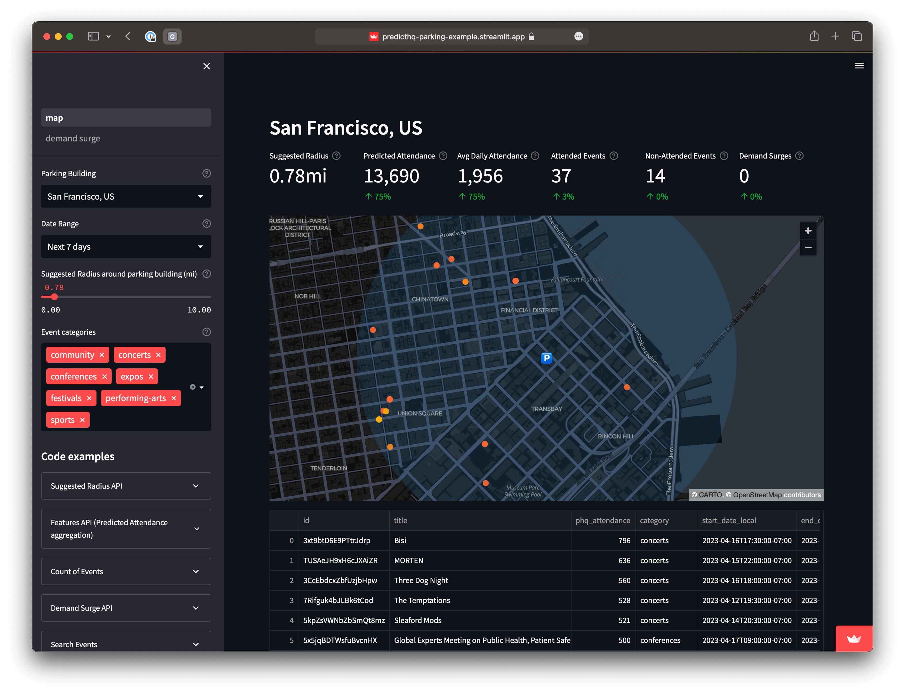

# API Quickstart

#### What you need:

1. A PredictHQ account - [sign up for free to get started](https://signup.predicthq.com/).
2. An API Access Token.

## Create an access token

Read a more in-depth guide to [creating a new API Client and Token](https://www.predicthq.com/support/how-to-create-an-api-token) or follow the basic steps below:

1. Log into Control Center and visit the [API Clients](https://control.predicthq.com/clients) page.
2. Select "New Client" and fill in the required information.
3. Make sure to keep a copy of your new Client Secret as this cannot be shown to you again.
4. Use the new Client Secret to create a new Token.
5. Make sure to keep a copy of your new API Token as this cannot be shown to you again.

Now you can use the new API Access Token in the `Authorization` header of your API requests as in the example below:

```python
import requests

response = requests.get(
    url="https://api.predicthq.com/v1/events/",
    headers={
      "Authorization": "Bearer $ACCESS_TOKEN",
      "Accept": "application/json"
    },
    params={
        "q": "taylor swift"
    }
)

print(response.json())
```

## Streamlit Demo Apps

To demonstrate how quick and easy it is to build extremely powerful apps using our APIs, we put together some Streamlit demos. All the code is available on GitHub and we encourage you to take the code, modify it, and use your own locations of interest to demo our APIs internally to your team or to simply better understand our technology.

* [Parking Business Demo App](https://predicthq-parking-example.streamlit.app/) _**or**_ [get the code from GitHub](https://github.com/predicthq/streamlit-parking-demo).
* [Accommodation Business Demo App](https://predicthq-accommodation-example.streamlit.app/) _**or**_ [get the code from GitHub](https://github.com/predicthq/streamlit-accommodation-demo).
* [Restaurant Business Demo App](https://predicthq-restaurant-example.streamlit.app/) _**or**_ [get the code from GitHub](https://github.com/predicthq/streamlit-restaurant-demo).

<figure><figcaption></figcaption></figure>

## Explore the API

For more detailed info on each of our APIs, please visit the relevant page:

<table data-view="cards"><thead><tr><th></th><th></th><th data-hidden></th><th data-hidden data-card-target data-type="content-ref"></th></tr></thead><tbody><tr><td><strong>Events API</strong></td><td>Full real-world event information</td><td></td><td><a href="../api/events/">events</a></td></tr><tr><td><strong>Broadcasts API</strong></td><td>Full broadcast (Live TV) information.</td><td></td><td><a href="../api/broadcasts/">broadcasts</a></td></tr><tr><td><strong>Features API</strong></td><td>Aggregated daily-level features ready for use by ML models.</td><td></td><td><a href="../api/features/">features</a></td></tr><tr><td><strong>Beam API</strong></td><td>Decomposition and correlation engine.</td><td></td><td><a href="../api/beam/">beam</a></td></tr><tr><td><strong>Demand Surge API</strong></td><td>Identify abnormal increases in predicted attendance around your location.</td><td></td><td><a href="../api/demand-surge/">demand-surge</a></td></tr><tr><td><strong>Suggested Radius API</strong></td><td>Takes the guesswork out of working out a suitable radius around your location when searching for events.</td><td></td><td><a href="../api/suggested-radius/">suggested-radius</a></td></tr><tr><td><strong>Saved Locations API</strong></td><td>Get insights about your locations.</td><td></td><td><a href="../api/saved-locations/">saved-locations</a></td></tr><tr><td><strong>Loop API</strong></td><td>Manage Loop Links and enable submitting events and feedback.</td><td></td><td><a href="../api/loop/">loop</a></td></tr><tr><td><strong>Places API</strong></td><td>Geonames place data.</td><td></td><td><a href="../api/places/">places</a></td></tr></tbody></table>


Did you know - [Control Center](https://control.predicthq.com/) uses the same APIs you have access to. One of the easiest ways to learn how to use our APIs is to see it in action in Control Center.

