# Getting Started with Forecasts API

## Overview

The Forecasts API delivers fast, accurate, and scalable demand forecasts—powered by the real-world events that impact your business. Whether you’re starting from scratch or augmenting an existing model, our event-driven forecasting approach improves accuracy, unlocking significant ROI and cutting development time by months.

This API provides ready-to-use, event-optimized forecasts for your business, embedding the impact of sports, concerts, school holidays, and more directly into the forecast output. There’s no need to source or model event effects separately—we handle it for you.

Why Use It?

* Event-aware by default — real-world events are built into every forecast
* Industry-specific performance — designed for demand planners, revenue managers, and ops teams
* Faster and more affordable than building your own system

PredictHQ’s Forecasts API is the only event-driven, fully automated forecasting solution available—built to get you to accurate forecasts without the complexity.

## Forecasting Workflow

```mermaid
flowchart LR
    A[Create Saved Location] --> B[Define Model]
    B --> C[Upload Initial Demand]
    C --> D[Train Model]
    D --> E[📈 Forecast]
```

### Prepare Your Data

### Create a Model

### Retrieve Forecast

## Understanding the Output

## Tips for Better Forecasts

To get the most accurate results from the Forecasts API, your input data needs to reflect meaningful demand patterns over time. Here are key tips to improve forecast performance and reliability:

* Include enough history: At least 18 months of daily demand helps the model learn seasonal and event-driven patterns.
* Keep it consistent: Submit clean, continuous daily data—no smoothing, gaps, or placeholder values.
* Avoid over-segmentation: Low-volume or highly granular series often perform worse. Aggregate where possible.
* Watch out for tiny values: Very small but non-zero demand can distort percentage-based metrics like MAPE.
* Exclude outliers if needed: Remove early COVID-19 disruptions or other non-repeating anomalies if they don’t reflect current demand.

For more detailed recommendations, see the [Troubleshooting Guide](troubleshooting-guide-for-forecasts-api.md).

## Troubleshooting

If your forecasts aren’t meeting expectations, don’t worry—there are several common reasons why accuracy might be lower than expected. We’ve put together a dedicated [Troubleshooting Guide](troubleshooting-guide-for-forecasts-api.md) to help you identify and resolve these issues.

The guide covers topics like:

* What to do if your forecast accuracy is poor (e.g. noisy or low-volume data)
* Why not enough history can reduce model performance
* How overly fine-grained series can lead to weak signals
* When to remove early COVID-19 disruptions from your dataset

We also have a guide on [understanding forecast accuracy metrics](understanding-forecast-accuracy-metrics.md) (MAPE, MAE, RMSE) meaningfully.


Before tweaking your inputs or retrying, we strongly recommend reviewing the troubleshooting guide—it can save a lot of time and guesswork.


## Next Steps

* [Forecasts API Reference](../../../api/forecasts/)
* [Understanding Forecast Accuracy Metrics](understanding-forecast-accuracy-metrics.md)
* [Troubleshooting Guide for Forecasts API](troubleshooting-guide-for-forecasts-api.md)

