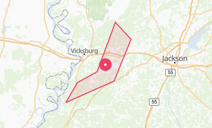
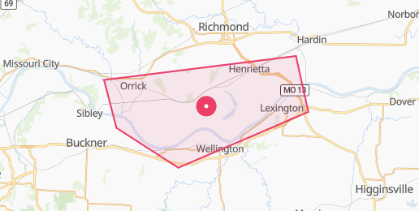
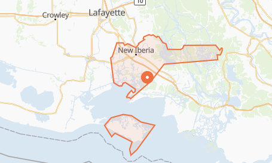
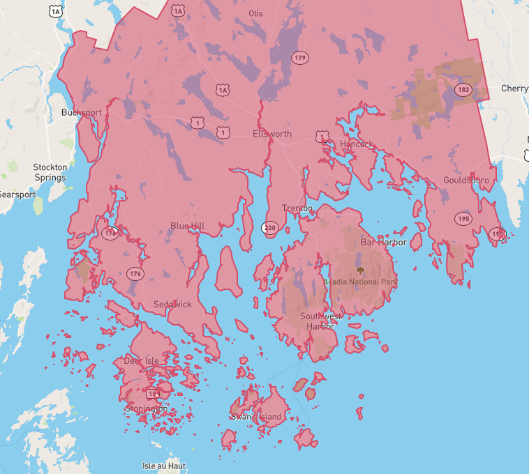
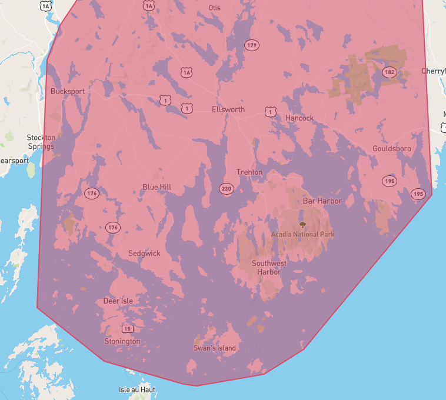

# Overview

Geographic information for an event describes where the event is located and the geographic area impacted. This page introduces geographic information available in events:

<table><thead><tr><th width="346">Field</th><th>Description</th></tr></thead><tbody><tr><td><code>location</code></td><td>Latitude and longitude coordinates of the event's location.</td></tr><tr><td><code>geo</code></td><td>Geometric data for the area impacted by the event.</td></tr><tr><td><code>place_hierarchies</code> and <code>scope</code></td><td>Place where the event is located.</td></tr></tbody></table>

Events also have the `formatted_address` field for [venue entities](../../predicthq-data/entities.md) with the street address of an event where it is present.

## **Points and Areas**

Point events' locations are represented by latitude, longitude coordinates. An example is this [MLB game](https://events.predicthq.com/events/97iX53YAGnCwF9TGx3) located at 37.7785951,-122.38926979999997.

Area events impact a geographic area such as a region, or an entire country. For example, [Christmas Day in the United Kingdom](https://events.predicthq.com/events/KmzdXpxZEq9M), is a country-wide public holiday.

Area events can be represented by a polygon. The example image shows this [flood warning](https://events.predicthq.com/events/24gdWYbR9M7DzJBVdY) for several rivers in Mississippi, USA.

<figure><figcaption></figcaption></figure>

Our APIs offer spatial search parameters to discover all events that impact your locations of interest.

## Basic Location

The `location` field's value contains coordinates in [GeoJSON](https://geojson.org/) order: `[longitude, latitude]`.

For a point event, its `location` coordinates are where the event occurs. This may be the location of a venue. For example, a [San Francisco Giants MLB game at Oracle Park](https://events.predicthq.com/events/97iX53YAGnCwF9TGx3) has the location value `[-122.38926979999997, 37.7785951]`, which corresponds to the address of Oracle Park, 24 Willie Mays Plaza.

For an area event, its `location` coordinates are the center of the area where the event occurs. For example, a nation-wide public holiday in the USA, such as [Thanksgiving Day](https://events.predicthq.com/events/gEkxDPqErD5n), has the location value `[ -95.712891, 37.09024 ]` which is the centroid of the Geonames Place for the country of USA.

Area events cover either a Geonames Place, as in the Thanksgiving Day example above, or a specific geographic area bounded by a geometry (polygon). The next section details geometries and polygons, additional geometric data available in the `geo` field for area events.

## GeoJSON

The `geo` field contains geometry information about an event's location in [GeoJSON](https://geojson.org/) format. Point events will have a Point-type geometry, with the coordinates of the event's location (same as the `location` field). Area events may have Polygon or MultiPolygon-type geometries representing the specific area impacted by the event.

Where an area event has a Point-type geometry, it means the event applies to the Geonames Place of the event.

```json
{
  "count": 1,
  "results": [
    {
      "id": "268aCtdaPgDJNurMeP",
      "title": "Flood Warning",
      "geo": {
        "geometry": {
          "type": "Polygon",
          "coordinates": [
            [
              [-94.15, 39.1599999],
              [-94.17, 39.220000000000006],
              [-93.86, 39.25000000000001],
              [-93.84, 39.18000000000001],
              [-94.05, 39.11000000000001],
              [-94.15, 39.1599999]
            ]
          ]
        }
      }
// other fields omitted...
```

The example event snippet is a [flood warning in Missouri](https://events.predicthq.com/events/268aCtdaPgDJNurMeP). The GeoJSON data in the `geo.geometry` field can be plotted using tools that accept GeoJSON such as [geojson.io](https://geojson.io/). All our events with a Polygon or MultiPolygon will display the geometry's shape when viewed in [Control Center](https://control.predicthq.com/search/events/268aCtdaPgDJNurMeP) or our [Public Event page](https://events.predicthq.com/events/268aCtdaPgDJNurMeP). A plot of the flood warning event's geometry is shown below.

<figure><figcaption></figcaption></figure>

Below is an example of an [event with a MultiPolygon geometry](https://events.predicthq.com/events/8qbpLh7PDjK3Crpj6b); you can see it has two polygons for one event.

<figure><figcaption></figcaption></figure>

We provide examples and code snippets to plot polygons in a Jupyter notebook in our [Severe-Weather Events Data Exploration](../events-api-guides/severe-weather-events-data-science-guides.md) notebook.

### Simplified Polygons

Our raw polygon sources can have extremely detailed geometries which result in large GeoJSON filesizes. Polygons of this nature aren't practical to use for individual events either in the PredictHQ API or a customer's data lake. The complexity of such polygons often result from capturing geographic features that aren't relevant for practical use cases in determining the impact of an event (for example small bodies of water, or small unpopulated islands off a coast).

For this reason, we may pre-process polygons to simplify them to reduce the number of points. This results in smoothing out the shape while retaining the key boundaries of the geographic area of impact.

In the example images, the first polygon is part of a raw polygon before simplification; the second is after simplification. The original GeoJSON data contained about 18000 coordinate points (the JSON data for this alone is around 700kb) to accurately outline individual offshore land masses.

<figure><figcaption><p>Raw polygon before simplification</p></figcaption></figure>

<figure><figcaption><p>Polygon after simplification</p></figcaption></figure>
