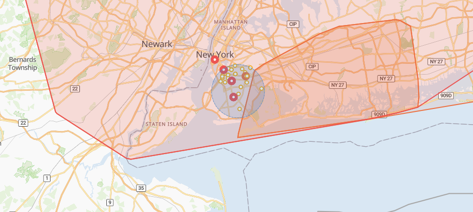

# Searching by Location

Performing a radial search using our Events API's `within` parameter is a common way to find events that impact your locations of interest. See our guide on [radial searches](https://docs.predicthq.com/start/categories/#radial-search) and the [within search parameter](https://docs.predicthq.com/resources/events/#param-within).

Which events are returned by a radial search depends on their location and geometry type. The image below shows the result of the example radial search performed in [Control Center](https://control.predicthq.com/search/events/map?category=public-holidays,observances,politics,conferences,expos,concerts,festivals,performing-arts,sports,community,daylight-savings,airport-delays,severe-weather,disasters,terror,academic\&place.scope=6252001\&active.gte=2020-08-06\&active.lte=2020-09-05\&state=active\&within=4mi%4040.6441,-73.9393): A 4-mile radius around a point in Brooklyn, New York, USA - the search area is the blue circle.

| LOCATION AND GEOMETRY TYPE                       | RADIAL SEARCH MATCHING CRITERION                                                                                                                                                                                                                                                                                                                                                                     |
| ------------------------------------------------ | ---------------------------------------------------------------------------------------------------------------------------------------------------------------------------------------------------------------------------------------------------------------------------------------------------------------------------------------------------------------------------------------------------- |
| Point event with Point geometry                  | Returned if their point falls within the specified radius. In the image below, matching point events are the dots within the blue circle.                                                                                                                                                                                                                                                            |
| Area event with Polygon or MultiPolygon geometry | Returned if any part of the polygons intersect with the specified radius. In the image below, matching events with polygons intersect with the blue circle.                                                                                                                                                                                                                                          |
| Area event with Point geometry                   | Returned if the radial search location (the provided lat,lon coordinates regardless of radius) is a child place of the area event's place. In the image below, the dot outside the blue circle is an area event without a polygon. This event covers all of New York City, and since the radial search's location is in Brooklyn, a child place of New York City, this area event was returned also. |

<figure><figcaption></figcaption></figure>

We recommend that if you are looking for events around a location like a store, hotel, or other bricks and mortar location, you use a radial search (a [`within`](https://docs.predicthq.com/resources/events/#param-within) query) to find events that impact you.

In order to set your radius we recommend using the [Suggested Radius API](https://docs.predicthq.com/resources/suggested-radius). Call the Suggested Radius API and supply the latitude and longitude of the location and use that radius to look for events around a location. The Suggested Radius API is powered by a machine learning model that looks at factors like population density, the events around a location, the customer’s industry, and many other factors to determine the ideal radius.

You can also search for events occurring, in particular, Geonames Places using the [`place.scope`](https://docs.predicthq.com/resources/events/#param-place) parameter with Place ids. In our [Severe-Weather Events Data Engineering notebook](https://docs.predicthq.com/datascience/severe-weather-events), we provide code examples to find Place ids for your locations of interest.\
