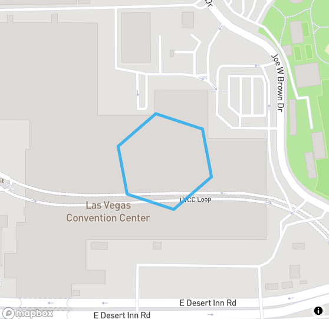

# Find Events by Placekey

You can do the following with the Placekey filter:

* Match on an entire Placekey to see all events at that specific location. This can be useful when you want to search for events at a venue. E.g. `placekey=222-22t@5yv-j89-g6k`
* Match address without POI name – This is a query for only an address (the first three digits in the What part along with the Where part); not the POI name. E.g. `https://api.predicthq.com/v1/events?placekey=222@5yv-j89-g6k`
* Match on the full @Where part of Placekey to find events nearby. This returns events where the “@Where” part of Placekey matches but the What part may be different. This will return events within the H3 level 10 hex used by Placekey, which covers approximately a 63-meter radius around the location (see the [Placekey whitepaper](https://docs.placekey.io/Placekey\_Technical\_White\_Paper.pdf) for more on H3 hexes). E.g. `https://api.predicthq.com/v1/events?placekey=@5yv-j89-g6k`
* Or perform a partial match on the @Where part of Placekey to find nearby events within a larger area. By a partial match we mean instead of including the entire 9 characters of the @Where part of Placekey you can match on 5 or more characters to include a large area. See [joining POI and non-POI datasets](https://www.placekey.io/tutorials/joining-poi-and-non-poi-datasets-with-placekey). E.g. match the first 7 characters: `https://api.predicthq.com/v1/events?placekey=@5yv-j89-g`

## Exact Match

For this example, we will find events happening at Las Vegas Convention Center in July 2023. This query gives you all events happening at this specific venue but not nearby events.

<figure><figcaption><p>Placekey example for the Las Vegas Convention Center</p></figcaption></figure>

```python
import requests

response = requests.get(
    url="https://api.predicthq.com/v1/events/",
    headers={
      "Authorization": "Bearer $ACCESS_TOKEN",
      "Accept": "application/json"
    },
    params={
        "placekey" : "222-224@5yv-j8d-3qz",
        "active.gte" : "2023-07-01",
        "active.lte" : "2023-07-31",
        "sort" : "rank"
    }
)

print(response.json())
```

A snippet of the results is shown below:

```json
{
  "count": 15,
  "results": [
    {
      "id": "DzxBJGFXGwKZgRaSRx",
      "title": "Cosmoprof North America",
      "entities": [
        {
          "entity_id": "RKUCrNLMi3Rm7RaMDx3UC4",
          "name": "Las Vegas Convention Center",
          "type": "venue",
          "formatted_address": "3150 Paradise Road\nLas Vegas, NV 89109\nUnited States of America"
        },
        ...
      ],
      "geo": {
        "geometry": {
          "coordinates": [
            -115.15183100000002,
            36.1307069
          ],
          "type": "Point"
        },
        "placekey": "222-224@5yv-j8d-3qz"
      },
      ...
    },
    ...
  ]
}
```

## Partial Match

Often, events nearby a location can have an impact on your demand. The distance from your location will depend on the type of business—for example, people may travel further to an event when staying in a hotel versus how far people may travel from an event to a restaurant— and the nature of the location also matters (e.g. urban or more rural). To find events nearby a location match on the `@Where` part of Placekey.

To find events very close to a location, match the full 9 characters of the `@Where` part of the Placekey that will find events very close to that location. Matching on the full `@Where` part of Placekey is like finding events within a 63-meter radius. In fact, it’s a hexagon with an edge length of 66 meters on average but it’s similar to drawing a circle with a 63-meter radius.

To find events that are further away match the first x characters of `@Where` from left to right. So, matching on the full 9 characters is similar to a 63-meter radius, matching on the first 8 characters of the `@Where` part gives a maximal distance of 443 meters, matching on the first 7 characters encompasses a larger distance, and so on.&#x20;

See the [Placekey documentation ](https://docs.placekey.io/Placekey\_Technical\_White\_Paper.pdf)on “The structure of a Placekey”. The table with the “Length of shared prefix” and the “Maximal distance (meters)” gives you the approximate size of the H3 hex you get when you match the first X characters of the `@Where` part of Placekey. The minimum number of characters you can use when matching on the `@Where` part is 5. See also [Joining POI and non-POI datasets with Placekey](https://www.placekey.io/tutorials/joining-poi-and-non-poi-datasets-with-placekey). See the image below where you can see smaller hexes encompassed in larger hexes.

<figure><figcaption></figcaption></figure>

Typically for looking at events around a location, we'd recommend looking at the first 6 to 9 characters of Placekey, depending on how large of an area you want to look at.

For example, the query below looks at events around 40 W 23rd St, New York, NY 10010 using the first 7 characters of the `@Where` part of Placekey:

```python
import requests

response = requests.get(
    url="https://api.predicthq.com/v1/events/",
    headers={
      "Authorization": "Bearer $ACCESS_TOKEN",
      "Accept": "application/json"
    },
    params={
        "placekey" : "@627-s8h-v",
        "active.gte" : "2023-07-01",
        "active.lte" : "2023-07-31",
        "sort" : "rank"
    }
)

print(response.json())
```

A snippet of the results is shown below:

```json
{
  "count": 36,
  "results": [
    {
      "id": "88DqYDERmjC5F9iPCH",
      "title": "Anika",
      "entities": [
        {
          "entity_id": "35bsvV3dQeZuzAjZ4Eg4U52",
          "name": "Anika",
          "type": "person"
        },
        {
          "entity_id": "WcWW8e8hpnzXcKuTn9Zc9B",
          "name": "Gramercy Theatre",
          "type": "venue",
          "formatted_address": "127 East 23rd Street\nNew York, NY 10010\nUnited States of America"
        }
      ],
      "geo": {
        "geometry": {
          "coordinates": [
            -73.98502910000002,
            40.7397259
          ],
          "type": "Point"
        },
        "placekey": "zzw-22j@627-s8h-v2k"
      },
      ...
    },
    ...
  ]
}
```

One thing to be aware of is that nearby hexagons may have codes that are not very similar. This occurs when Placekey grid cells are near the edges of larger (i.e., lower resolution) hexagons in H3’s spatial hierarchy. This can mean that sometimes using the first x characters of a Placekey will not result in getting all nearby events.

To account for all events around a radius, see “All neighboring hexes'' in the [Joining POI ](https://www.placekey.io/tutorials/joining-poi-and-non-poi-datasets-with-placekey)tutorial. Or you could convert Placekeys to a latitude and longitude and use a radius query to find nearby events with the [within parameter](https://docs.predicthq.com/resources/events/#search-events) on the events API. Use `Placekey_to_geo` in the [Placekey Python library](https://github.com/Placekey/placekey-py) to convert a Placekey to latitude and longitude.

## Find Events Near a Location in Snowflake

PredictHQ’s Events data shared through [Snowflake Secure Data Sharing](https://docs.predicthq.com/start/snowflake) includes Placekey, as a separate column, reflecting the physical location where the event is held. There are a few approaches you could take to use this column when it comes to joining your dataset in Snowflake.

You can simply join PredictHQ’s event tables with your data on the entire Placekey column. This makes sense if your POI data consists of venues where events can be held. If you want to find events happening near the location of your POI locations, you need to join your data with PredictHQ’s Event tables on a [substring](https://docs.snowflake.com/en/sql-reference/functions/substr.html) of the @where part of the Placekey column.

The example below joins a sample PredictHQ Event table on Snowflake that includes Placekey information as a column with SafeGraph “Global Places Sample” POI data (see [SafeGraph data examples](https://www.safegraph.com/data-examples)). In this example, we are trying to perform an Inner Join between the restaurant in the SafeGraph table AND the PredictHQ Events happening nearby. We would only be using the first 7 characters (excluding the hyphens) of the @Where part of the Placekey column for this Inner Join. This results in all possible matches between the restaurants and PredictHQ Events nearby them.&#x20;

This query should be repurposed with minimal change to be used in other relational data warehouses other than Snowflake.

```sql
-- Selecting from PredictHQ’s New York Sample Attended Events data 
-- Creating two new columns inside a CTE that have the first 7 characters (excluding the hyphens) of the Placekey column's @Where part
with new_york_attended_events_with_place_key as (
    select
        *,
        SPLIT_PART(Placekey, '@', -1) as place_key_where,
        LEFT(SPLIT_PART(Placekey, '@', -1), 9) as phq_place_key_where_first_7_chars
    from
        marketplace.predicthq.new_york_attended_events
    where
        placekey is not null
),
 
-- Selecting all the store locations from SafeGraph Global Places Q3 2022
-- Creating two new columns inside a CTE that have the first 7 characters (excluding the hyphens) of the Placekey column's @Where part
safegraph_resturant_stores as (
    select
        *,
        SPLIT_PART(Placekey, '@', -1) as place_key_where,
        LEFT(SPLIT_PART(Placekey, '@', -1), 9) as safegraph_place_key_where_first_7_chars
    From marketplace.safegraph.safegraph_global_places_sample_q3_2022 
)
 
-- Inner joining between PredictHQ’s Events and Safegraph’s Restaurant Locations on the new columns containing the first 7 characters of the Placekey’s @Where part
select
    *
from
    safegraph_resturant_stores as safegraph
    inner join new_york_attended_events_with_place_key phq_events on phq_events.phq_place_key_where_first_7_chars = safegraph.safegraph_place_key_where_first_7_chars
order by
    phq_events.phq_place_key_where_first_7_chars;
```


**Use Snowflake to get Placekeys for your address data**

See [this article ](https://www.snowflake.com/blog/how-infutor-uses-the-placekey-external-function-to-extend-the-power-of-snowflake/)for details on how to use an External Function in Snowflake to get a Placekey for an address. If you have a data set in Snowflake where you have a lot of address data and you want a structured way to join it with events data and/or POI data you can use this functionality to set a Placekey for all your records. You can then use the information outlined in this article to match events and Placekey data.

