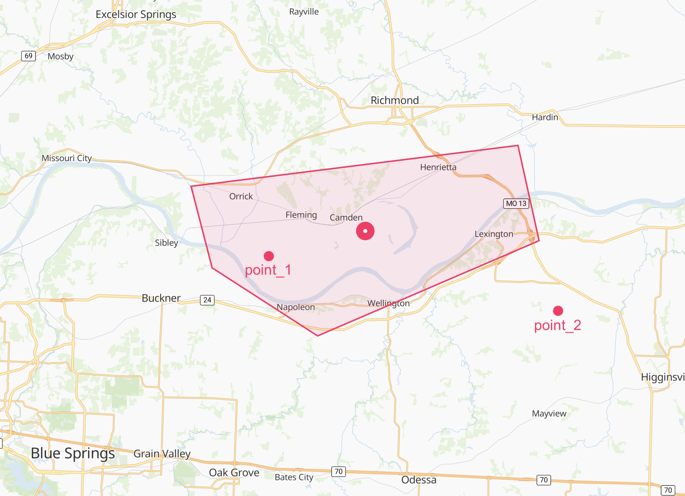

# Working with Polygons

Our Events API uses polygons data in the `geo.geometry` field when [searching](overview.md) to provide you with spatially relevant results. Once you have events with polygons, you can use them in your own systems. To do so, your systems will need to support GeoJSON and provide geospatial functionality.

Many datastores support GeoJSON and geospatial queries:

* [Snowflake](https://docs.snowflake.com/en/sql-reference/data-types-geospatial.html)
* [Amazon Redshift](https://docs.aws.amazon.com/redshift/latest/dg/geospatial-overview.html)
* [Elasticsearch](https://www.elastic.co/guide/en/elasticsearch/reference/current/geo-shape.html)[Kibana](https://www.elastic.co/guide/en/kibana/current/maps.html)
* [Azure Cosmos DB](https://docs.microsoft.com/en-us/azure/cosmos-db/sql/sql-query-geospatial-intro)
* [MongoDB](https://docs.mongodb.com/manual/geospatial-queries/)

## Using polygons with offline event data

So far on this page, we have provided details on how to use our API to query for events with `geo` data (including polygons) that impact a given location. This section provides details for customers wanting to download our events' and do a geospatial operation on their polygons in the `geo` field. These operations could include filtering which polygons are impacting an area based on an offline sample of data or visualize them inside a Jupyter notebook. This section could be useful depending on what you're trying to do with the `geo` data, for instance, if you are a Data Scientists performing R\&D the following instructions might come in handy. You can always use our [data exporter](https://www.predicthq.com/support/getting-started-with-data-exporter) to bulk download events data to CSV or JSONL format.

There are many tools and libraries available to help you process and visualize our polygon events. We have some examples in our [Data Exploration notebook](../events-api-guides/severe-weather-events-data-science-guides.md) notebook which use [GeoPandas](https://geopandas.org/) and [Folium](https://python-visualization.github.io/folium/) libraries in Python to analyze and visualize polygons from our Severe-Weather Events.

You can use [Shapely](https://github.com/Toblerity/Shapely) to parse the event's geometry field and load it as a sheply object. In the following example, we would take a sample event with polygon and load it's geometry field into a shapely Polygon. We also go through this example in our severe-weather datascience docs, so please check out [Appendix 2: Parsing geojson with Shapely](../events-api-guides/severe-weather-events-data-science-guides.md) if you prefer a more interactive example.

```python
from shapely.geometry import shape


event = {"id": "268aCtdaPgDJNurMeP",
         "title": "Flood Warning",
         "geo": {
           "geometry": {
            "type": "Polygon",
            "coordinates": [
              [
                [-94.15, 39.1599999],
                [-94.17, 39.220000000000006],
                [-93.86, 39.25000000000001],
                [-93.84, 39.18000000000001],
                [-94.05, 39.11000000000001],
                [-94.15, 39.1599999]
              ]
            ]
            }
          }
          # other fields omitted...
        }

# retrieving event's geojson field
event_geojson = event['geo']['geometry']

# parsing the geojson object using shape from shapely
parsed_polygon = shape(event_geojson)

# print the shapely polygon object
print(parsed_polygon)

>> POLYGON ((-94.15000000000001 39.1599999, -94.17 39.22000000000001, -93.86 39.25000000000001, -93.84 39.18000000000001, -94.05 39.11000000000001, -94.15000000000001 39.1599999))
```

Shapely has great built-in features, such as `intersects` which we would use to check if a given point (lat, lon) is inside the polygon:

```python
from shapely.geometry import Point

# Define point_1 adn point_2 in (lon, lat) format with shapely's Point
point_1 = Point(-94.096, 39.165)
point_2 = Point(-93.819, 39.131)

# Checked whether the point_1 intersects with event's polygon
parsed_polygon.intersects(point_1)
>> True

# Checked whether the point_2 intersects with event's polygon
parsed_polygon.intersects(point_2)
>> False
```

As you can see in the picture below, `point_1` is inside the polygon but `point_2` is not:

<figure><figcaption></figcaption></figure>


Coordinate Reference Systems

Both our API and Shapely use World Geodetic System 1984 (WGS84 also called [EPSG:4326](https://epsg.io/4326)) to represent coordinates in a Polygon or Point object by default. If you want to do more complicated GeoSpatial operations on these coordinates beyond what we have discussed here, you might need to project these objects from WGS84 to another Coordinate Reference Systems (CRS) that fits your purpose.

