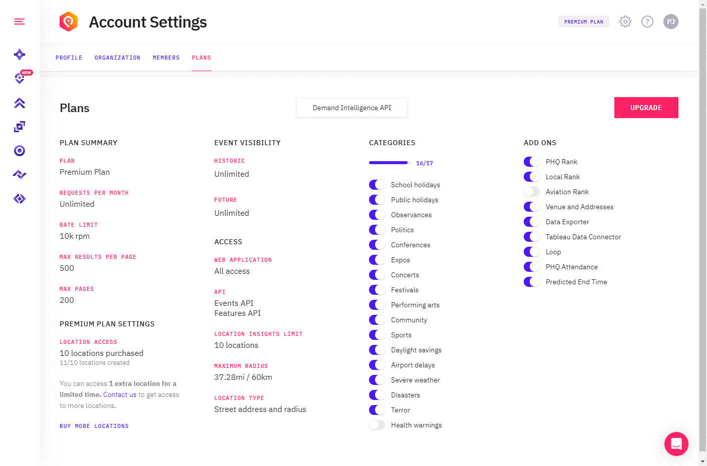

# Working with Location-Based Subscriptions

You can purchase access to PredictHQ's events in different ways. You can purchase access to geographic areas like cities, states, or countries. Or you can purchase access to a number of locations to get access to specific business locations. Business locations include stores, hotels, restaurants, parking garages, offices, or any other type of location you can think of.

Under the hood, location-based access uses latitude, longitude, and radius to control what you can access. In the UI you can enter a street address for a business location and the product will find the latitude and longitude for that location and set a [suggested radius](https://docs.predicthq.com/resources/suggested-radius) and save the location with those details.

You can purchase location-based access if you have a number of business locations across a region, country, or multiple countries that you want access to but you don't need access to larger geographic areas like cities, states, or countries. For example, you may have a hotel chain with 300 hotels across the US in 20 different states spread between smaller towns and bigger cities. You can purchase location-based access for 300 hotels rather than buying access to full cities or entire states. The same could apply to a chain of restaurants, parking locations, retail stores, or any other business locations.

This guide provides details on how to use PredictHQ APIs when you have purchased location-based access instead of access to larger geographic areas.

The summary of how to use our APIs with location-based access is as follows:

* Use the [Location Insights feature](https://www.predicthq.com/support/category/location-insights) Control Center web application or our [Saved Locations API](https://docs.predicthq.com/resources/saved-locations) to create saved locations for each of your business locations
* To access events you then use our [Events API](https://docs.predicthq.com/resources/events#search-events) and call it using the `saved_location.location_id` filter to access events for your locations. Alternatively, you can also access events using the `/events` call in the [Saved Locations API](https://docs.predicthq.com/resources/saved-locations) (see Get a list of events for a location).
* If you add or delete locations ensure you update the location\_id values used to query the API.

This guide is focused on using the APIs. You can also use our Control Center web application to manage and access locations. See the documentation on [Control Center](https://www.predicthq.com/support) for more details.

### How to see the Number of Locations I have Access to?

Within Control Center on the [plans page](https://control.predicthq.com/settings/plans/api) or in the location insights view you can see how many locations you have purchased and how many you have used.

If you add more locations than you have purchased you will have access to the additional locations for a limited time and will need to upgrade your subscription to purchase more or remove the locations you added. The PredictHQ team will contact you to discuss options.

<figure><figcaption></figcaption></figure>

## How to use the APIs with Location-based Access

### Setting Up Your Locations

You will have a list of locations for your business. Such as a list of addresses for your stores. The first stage is to find the latitude and longitude (lat/long) of each store. Once you have done that you can create Saved Locations for each using the API.

For example, you could create a file that has a list of lat/longs and names for each store and run a script over the file to create saved locations for each.

See the [Saved Locations API documentation](https://docs.predicthq.com/resources/saved-locations). To upload a list of locations do the following:

1. Find the lat/long of each location
2. Call the [Suggested Radius API](https://docs.predicthq.com/resources/suggested-radius) for each store to find the radius to use
3. Call the [Create Saved Locations](https://docs.predicthq.com/resources/saved-locations) endpoint (POST /saved-locations) to create a location with the lat/long and radius you have for the location
4. Store the `location_id` return for the location

This process only needs to be performed when you initially load in your locations or if locations change (such as a store closes or a new store opens).

### Fetching Events for Your Locations

Once you have uploaded your locations you will have a list of `location_id`'s for each location. To get the latest events for each location you can call the Events API with the `saved_location.location_id` filter to get back events for the location.

Example fetching events using a Saved Location ID:

```python
import requests

response = requests.get(
    url="https://api.predicthq.com/v1/events/",
    headers={
      "Authorization": "Bearer $ACCESS_TOKEN",
      "Accept": "application/json"
    },
    params={
        "saved_location.location_id": "sFlb8HlsLa1j-S4UDEMEkQ"
    }
)

print(response.json())
```

You can of course use [other filters in the Events API](https://docs.predicthq.com/resources/events#search-events) to further filter down the response. [Use paging](https://docs.predicthq.com/api/requests) to handle multiple pages of results.

Alternatively, you can also access events using the `/events` call in the [Saved Locations API](https://docs.predicthq.com/resources/saved-locations) (see Get a list of events for a location). To get a list of events for a location make the following call with the location\_id `GET /saved-locations/<location_id>/insights/events`. E.g. `GET /saved-locations/0b6ZrOnTdB2Y7k4zC_9qBg/insights/events`.

See the example below:

```python
import requests

response = requests.get(
    url="https://api.predicthq.com/v1/saved-locations/sFlb8HlsLa1j-S4UDEMEkQ/events",
    headers={
      "Authorization": "Bearer $ACCESS_TOKEN",
      "Accept": "application/json"
    },
    params={
        "date_range_type": "next_90d",
        "category": "public-holidays,sports",
        "sort": "-start"
    }
)

print(response.json())
```

You can then use the events or store them in your data store. Ensure you keep events refresh as events are dynamic and can change such as be cancelled, postponed, move locations, change dates, and so on. See [Keeping Data Updated](https://docs.predicthq.com/guides/staying-updated).

For example, you may write code to loop over your list of locations and retrieve updated events for each and update your data store.

Note if you have location-based access you need to supply a value for this filter. If you do not supply a value then the API will return an error.
