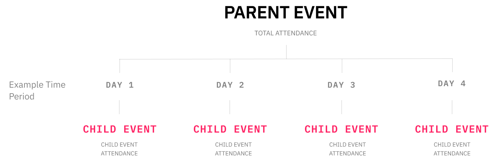
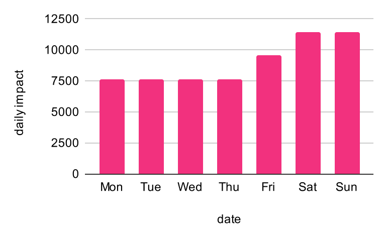
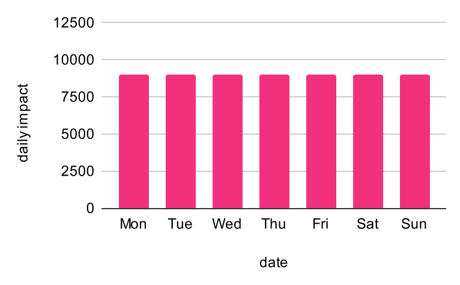
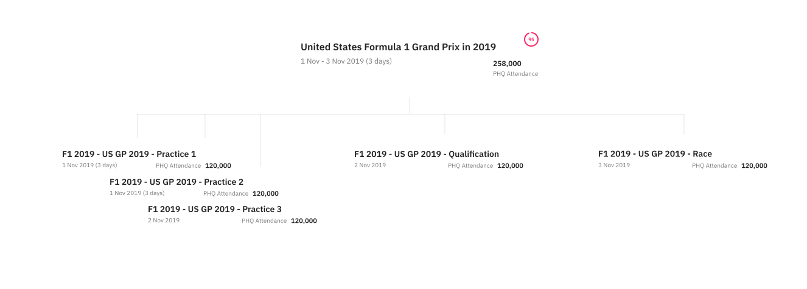
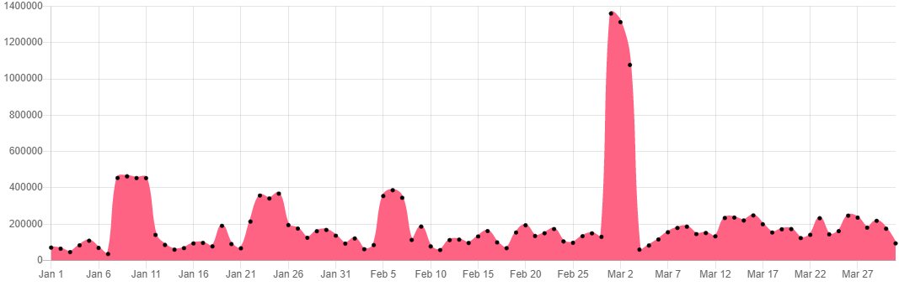
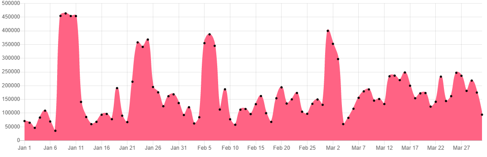

# Working with Multi-day and Umbrella Events

PredictHQ’s events data includes events of different duration, from events that may be less than an hour-long to events that can last more than a week. For our [7 attended event categories](https://www.predicthq.com/intelligence/data-enrichment/event-categories), we expose the actual or predicted attendance for events in our phq\_attendance field. The [phq\_attendance](https://docs.predicthq.com/resources/events/#prop-phq\_attendance) field works slightly differently for different categories. For many categories, it is the total attendance for an event over its full duration. For other categories (like conferences), it reflects the daily attendance.

For example, the phq\_attendance for a big event like the [2019 Tour de France](https://events.predicthq.com/events/fXHXPzTVW5K9ZWxFnb) is 12,000,000 which represents the total attendance for the full duration of 22 days. It is not the daily attendance. The daily attendance for that event is closer to 545,000 people. To avoid overcounting attendees for multi-day events, phq\_attendance must be adjusted to the daily level (if not already).

PredictHQ also handles cases where one event (child) belongs to another (parent). This type of event is called an Umbrella event. Umbrella events are often multi-day events but can also be single-day events with multiple sessions if the same attendees are expected, for example the games of a rugby sevens tournament. When looking at daily attendance or event counts it’s important to use either parent events or child events, but not both.

<figure><figcaption></figcaption></figure>

## Multi-Day Events

### Handling Attendance for Multi-Day Events

The [Features API](https://docs.predicthq.com/start/features-api) has advanced logic for handling multi-day events. For some categories, phq\_attendance is the daily attendance. For categories that have multi-day events, such as festivals, community events, expos, and sports, there is additional logic for how phq\_attendance is distributed to each day. We encourage customers to use the Features API to find aggregations on attendance like the sum of daily attendance.

Below is an example of how phq\_attendance might be distributed for a golf tournament. This is a multi-day sports event so the phq\_attendance of 63,000 is the total attendance across the full duration. The daily attendance is not evenly distributed across the week as higher attendance is expected on the weekend.The Features API deals with distributing attendance across each day and takes into account uneven distributions.

<figure><figcaption></figcaption></figure>

However, if you still need to calculate daily attendance manually please see the details in the section below. For example, if you download events data into a data lake and calculate features on top of the data lake then you will need to handle multi-day events attendance.

### **Using phq\_attendance for Multi-Day Events**

Our definition of multi-day events is: events that take place across more than one day, i.e. overlap on more than one calendar day, while single-day events take place within one day, i.e. start and end on the same calendar day.

For the categories below, dividing phq\_attendance by the total number of days is the simplest logic to adopt. More refined logic is to give each day the correct weighting to account for days with more expected attendance (typically between Thursday - Sunday).

For example below is an event with phq\_attendance of 63,000 that has a 7 day duration. Dividing the attendance equally would result in the following daily attendance.

<figure><figcaption></figcaption></figure>

<table><thead><tr><th width="184">Category</th><th>Using phq_attendance</th></tr></thead><tbody><tr><td>Concerts</td><td>Reflects daily attendance. These events tend to be 1 day or less.</td></tr><tr><td>Performing Arts</td><td>Reflects daily attendance. These events tend to be 1 day or less.</td></tr><tr><td>Conferences</td><td>Reflects daily attendance, not total attendance. Use the same phq_attendance for each day.</td></tr><tr><td>Expos</td><td>Divide phq_attendance by the total number of days. Friday, Saturday, and Sunday have greater attendance and can be given a slightly higher weight.</td></tr><tr><td>Sports</td><td>Divide phq_attendance by the total number of days. Friday, Saturday, and Sunday as well as the final day have greater attendance and can be given a slightly higher weight.</td></tr><tr><td>Festivals</td><td>Divide phq_attendance by the total number of days. Friday, Saturday, and Sunday have greater attendance and can be given a slightly higher weight.</td></tr><tr><td>Community</td><td>Divide phq_attendance by the total number of days. Friday, Saturday, and Sunday have greater attendance and can be given a slightly higher weight.</td></tr></tbody></table>

## Umbrella Events (beta)

Umbrella events refer to the case where we have a parent event that contains one or more child events. For example, the [United States Formula 1 Grand Prix in 2019](https://events.predicthq.com/events/w7dYyrFwTUQGYE6euv) has child events for [the qualification](https://events.predicthq.com/events/hZ5fGHaxHKgJTBpqyQ), 3 practice events, [a concert](https://events.predicthq.com/events/N4LWVHvicH5YiCHQKe) that occurs at the Grand Prix, and the [actual race event](https://events.predicthq.com/events/5uRg7CqGu7DTtu4Rfk) (there are 12 child events in total). The parent event is for the entire Grand Prix that runs from the 1st of November to the 3rd of November 2019. Both the parent and child events are part of the wider Umbrella event.

Child events are indicated by the presence of the [parent\_event](https://docs.predicthq.com/resources/events/#prop-parent\_event) field. Child events will have a parent\_event\_id in this field indicating the id of the parent event. For example, the Formula 1 race child event is 5uRg7CqGu7DTtu4Rfk and the Formula 1 parent event is w7dYyrFwTUQGYE6euv. The Formula 1 race child event has the following parent event info:

```json
{
  "id": "5uRg7CqGu7DTtu4Rfk",
  "parent_event": {
    "parent_event_id": "w7dYyrFwTUQGYE6euv"
  },
  "title": "Formula 1 2019 - United States Grand Prix 2019 - Race",
  "category": "sports",
  ...
}
```


In the current release of Umbrella events you cannot yet find the child event IDs of a parent event via the API. This feature will be supported in a future release.


### **Why Umbrella Events Matter**

When using attended events in demand forecasting, a common approach is to look at the total attendance for events around a location per day. If you don’t take into account Umbrella events you can end up double-counting the attendance of the parent events and the attendance of the child events which leads to incorrect, inflated attendance figures and can reduce the accuracy of your forecasts.

Looking at the earlier [US F1 Grand Prix in 2019](https://events.predicthq.com/events/w7dYyrFwTUQGYE6euv) example, the parent event spanning 3 days has a phq\_attendance of 258,000. If you were to divide the attendance of the parent event by 3 you get a daily attendance of 86,000. The actual race event running for around 3 hours on the 3rd of November has a phq\_attendance of 120,000. Therefore, if you count the race event and the daily attendance for the parent event you’ll get 86,000 + 120,000 = 206,000, which is more than the real attendance on the 3rd. So you will overcount the attendance.

<figure><figcaption></figcaption></figure>


In this example the child event attendance is different from the parent attendance divided by the number of days. Child event attendance may sometimes reflect more detailed attendance on the individual days of an event.


Another example of why you should use Umbrella events can be seen when looking at the daily attendance for events in Las Vegas in 2019. In the example below there is the [World Rugby Sevens tournament](https://events.predicthq.com/events/iKKgf8suq5D5w89boJ) from the 1st of March 2019 to the 3rd of March 2019. The parent event is for the entire tournament and there are many child events for individual games and rounds in the tournament. By not accounting for Umbrella events you get a massive spike in attendance at that time. A peak of 1.4 million is seen around the 2nd of March because both the parent event and child events are being counted.

<figure><figcaption><p>Example showing attendance being counted multiple times due to not handling Umbrella Events</p></figcaption></figure>

Once you take into account Umbrella events and remove double counting, the real attendance on that day is closer to 400,000.

<figure><figcaption><p>Example showing correct attendance due to correct handling of Umbrella Events</p></figcaption></figure>

### **Using the Parent Filter in the Events API for Umbrella Events**

See the documentation on the [parent filter](https://docs.predicthq.com/resources/events/#param-parent) for umbrella events.

You can use this filter with the events API to only get parent events or only retrieve child events from the Events API.

Note that in the API **parent** events includes events that have child events and also events without any child events. So, for the API filter parent events also include non-umbrella events. **Child** events are defined as only those events that have a link to a parent event.

### **Definitions**

* **Parent event** - Spans the full duration of an event and may have child events as part of it. Many parent events will be multi-day events such as the Olympics, a Formula 1 weekend, or a multi-day festival. These events will have a parent event for the whole event - like an event for the entire 2020 Olympic Games in Tokyo. Other examples include an event for the entire US Formula 1 or a rugby sevens tournament.
* **Child events** - Individual events that are part of a parent event. For example, day 1 of the 2020 Olympic Games or the “Men’s 100m finals” in the Olympic Games. Or the Formula 1 qualification and practice events. All of these are examples of child events.
