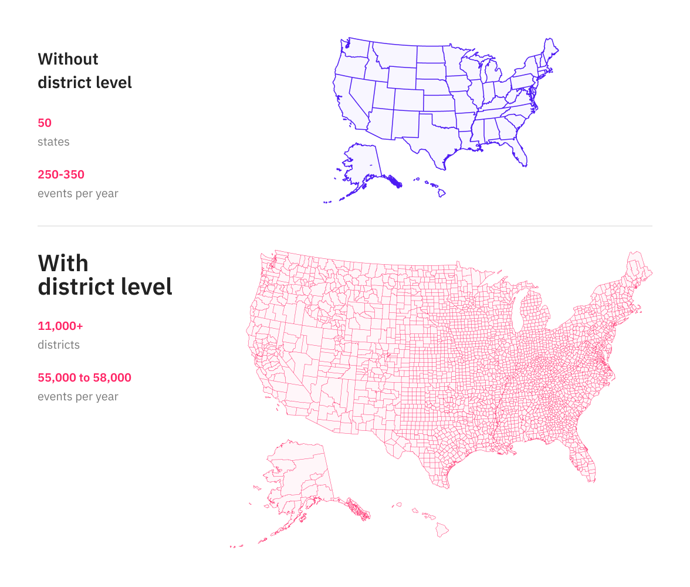

# Non-Attendance-Based Events

## Categories

**Note**: All Public Holidays, Observances, and School Holidays events contain polygon information. Polygon information is returned on the `geo` field. See our [guide to polygons](../../guides/geolocation-guides/overview.md) for more details.

### Public Holidays

A holiday generally established and recognized by law when most businesses and schools are closed. E.g. most countries celebrate New Year’s Day on January 1st.

#### **Labels**

Labels for a public holiday event provide more information about the holiday. The most common 5 labels are:

1. `holiday-national`: When the day is celebrated on a country level, e.g. the entire country was celebrating [Martin Luther King Jr. Day](https://control.predicthq.com/search/events/rXRfgke2wuD2zv55H7) on Jan 18, 2021
2. `holiday-local-common`: When the holiday is celebrated in only some regions of the country. E.g. only 5 out of 13 provinces and territories of Canada ([British Columbia](https://control.predicthq.com/search/events/KAojdY57MdQqYKYJvf), [Alberta](https://control.predicthq.com/search/events/joBsZRtPMSCPaD9sTQ), [Ontario](https://control.predicthq.com/search/events/zG3Egb83333QcyviRL), [New Brunswick](https://control.predicthq.com/search/events/KoTZox2GDtA4nx3CBR), and [Saskatchewan](https://control.predicthq.com/search/events/uhTw7zBFdZjdPDSJHb)) celebrate Family Day on the first Monday in February.
3. `holiday-local`: When the holiday is region-specific, e.g. only Texas state celebrates [Texas Independence Day](https://control.predicthq.com/search/events/kjqFBZH2qbzrswecDv) on Mar 2, 2021
4. `holiday-religious`: When the holiday is celebrated for a religious reason, e.g. there are about 44 countries that celebrate [Eid al-Adha](https://control.predicthq.com/search/events/pYQSFxFcYgJJdzo3uc) Day
5. `holiday-christian`: When the holiday is Christian related, e.g. [Corpus Christi](https://control.predicthq.com/search/events/3768MLSMzkSPo6HPjQ).

#### Date & Time

<table><thead><tr><th width="224.33333333333331">Date &#x26; Time Fields</th><th width="154" align="center">Availability</th><th>Notes</th></tr></thead><tbody><tr><td>Start date</td><td align="center">Yes</td><td></td></tr><tr><td>End date</td><td align="center">No</td><td>Same as the start date. A public holiday event is a single-day event. There are no multi-day events under the public-holidays category. The holiday will break into individual days if it’s celebrated over multiple days, e.g. there are 4 days off in Japan during the New Year period, the four corresponded records are: <a href="https://control.predicthq.com/search/events/rxdV0A0GKg16">December 31 Bank Holiday</a>, <a href="https://control.predicthq.com/search/events/8fuH3RGXNfmVs2UGAm">New Year's Day</a>, <a href="https://control.predicthq.com/search/events/bwJoHe5AtFZpRHWQ9j">January 2 Bank Holiday</a>, <a href="https://control.predicthq.com/search/events/M4bAQVNwHuv3qwTsvd">January 3 Bank Holiday</a></td></tr><tr><td>Start time</td><td align="center">No</td><td></td></tr><tr><td>End time</td><td align="center">No</td><td></td></tr><tr><td>Timezone</td><td align="center">No</td><td></td></tr></tbody></table>

Note: datetime is used with the local timezone. E.g. New York is celebrating New Year’s Day on January 1st EST, while San Francisco is also celebrating New Year’s Day on January 1st but in PST.

#### Location

Public holidays have a scope that is at the area level. The scope is either at the region or country level. The latitude and longitude is pointing to the center of the region or country.

#### Entities

Public holidays have event group entities available.

#### Ranking

**PHQ Rank**

* National holidays or common local holidays have a PHQ Rank of 90 to indicate the popularity/impact on the country
* Local holidays have a PHQ Rank of 70 as there is less impact on the area compared to a national holiday.

**Local Rank**

Public holidays events have no Local Rank available as they impact an entire area instead of a specific point

**PHQ Attendance**

Public holidays have no PHQ Attendance available as the rank/impact only reflect its influence on the area, instead of the number of people are celebrating this holiday.

### School Holidays

School holiday events represent the general date range in an area where the schools are closed for the term/semester break. E.g. [Easter School Holidays](https://control.predicthq.com/search/events/tbZtoYD9mnArGQs5RW) in Bavaria, Germany is from March 27th, 2021 to April 11th, 2021.

**Note**: The School holidays category covers the holiday dates in primary schools and secondary schools. School holidays for higher education institutions are under the [Academic Events](attendance-based-events.md#academic) category.

**LABELS**

All school holidays events have both `school` and `holiday` labels. Some events may have an `estimated` label when there is no date available from the official source but a pattern from the previous years can be used to estimate the holiday dates.

#### Date & Time

<table><thead><tr><th width="216.33333333333331">Date &#x26; Time Fields</th><th width="137" align="center">Availability</th><th>Notes</th></tr></thead><tbody><tr><td>Start date</td><td align="center">Yes</td><td>The weekend before a school holiday is included if the school holiday starts on a Sunday or Monday</td></tr><tr><td>End date</td><td align="center">Yes</td><td>The weekend after a school holiday is included if the holiday ends on a Friday or Sunday</td></tr><tr><td>Start time</td><td align="center">No</td><td></td></tr><tr><td>End time</td><td align="center">No</td><td></td></tr><tr><td>Timezone</td><td align="center">No</td><td></td></tr></tbody></table>

Note: Datetime is used with the local timezone.

#### Location

School holiday is an area event, it scopes to either locality, localadmin, county, region or country level, i.e. majority schools in that region commence break in that period. For example, school holidays in the United States are scoped to the county level, e.g. [Clark County School District - Spring Break](https://events.predicthq.com/events/G9dAga9g8vcacTgmB9) while school holidays in New Zealand are scoped to the country level which means we have one school holiday for the entire country, e.g. [Spring School Holidays](https://control.predicthq.com/search/events/SPVWqTnhTqry2rLDvf). School holidays in the UK are scoped to either region, county, or the local council (localadmin) level.

The latitude and longitude is pointing to the center of the region or country.

<table><thead><tr><th width="287">Geo-scope Level</th><th>Countries</th></tr></thead><tbody><tr><td>Country</td><td>Azerbaijan, Monaco, Bulgaria, Liechtenstein, Brazil, Latvia, Moldova, Bosnia and Herzegovina, Sweden, Hungary, Mexico, Ukraine, Vietnam, South Korea, Japan, Croatia, New Zealand, Turkey, Slovakia, Russia, Greece, Lithuania, United Arab Emirates, Hong Kong, Serbia, Armenia, Taiwan, Malta, Republic of Ireland, Iceland, Albania, Finland, Montenegro, Kosovo, Fiji, Belarus, Estonia, Kazakhstan, Slovenia, Thailand, Israel, Poland, Singapore, Cyprus, India, Romania, Switzerland, Andorra, Portugal, Czech, Malaysia, Belgium, Indonesia, Denmark, North Macedonia, Georgia</td></tr><tr><td>Region</td><td>Netherlands, Spain, Luxembourg, Sweden, South Africa, Austria, Australia, Italy, France, Norway, Germany, Canada, China, United Arab Emirates</td></tr><tr><td>County</td><td>United States</td></tr><tr><td>Region/County/Local-admin</td><td>United Kingdom</td></tr></tbody></table>

#### School Holidays in the United Kingdom

Our school holidays data goes to a more granular detailed level for the United Kingdom than for other countries. Our school holidays data includes local council level school holidays for England, Wales, North Ireland and Scotland.


**Note**

Our school holidays granularity changed in September 2021 to move from the country level for England, Wales, Scotland and Northern Ireland to the local council level.


For the granular school holiday data for the United Kingdom we have historic data from September 2017 to the present day. School holidays are updated every week.

We have events for 212 school districts in the UK including 157 districts for England. For the UK per year we have the following number of events:

* 1200-1300 events per School Period (E.g. Sep 2021 - June 2022),
* 1400-1500 events per Year (E.g. 2021 covers part of both the 2020-2021 and 2021-2022 school periods)

Here are some examples of the school holidays for the United Kingdom:

* [Nottinghamshire - Summer Half Term Holidays for 2018](https://events.predicthq.com/events/EfdV6SwVXSAb4NFoYE)
* [Bristol - Spring Holidays for 2019](https://events.predicthq.com/events/8dV2ArT6rYjYT9r3YB)
* [Swindon - Spring Holidays for 2020](https://events.predicthq.com/events/9a6672HwVphSkWLNuM)
* [Northern Ireland - Winter Holidays for 2018](https://events.predicthq.com/events/DBWg3Pr9hGfVPppYBv)
* [Cardiff - Summer Holidays for 2019](https://events.predicthq.com/events/3ScDNL4SENDGjxZr5x)
* [Glasgow - Autumn Half Term Holidays for 2020](https://events.predicthq.com/events/7wVaYTguF8K7qzwyKk)

To find school holidays that impact your location you can use the standard features of our events API - as follows:

* You can perform a lat/lon and radius search using the within parameter on the API. For this find the lat/lon of your location such as a store, hotel or any other location. Search for events around that location - such as 5 kilometers around a location in Leeds.
* You can use the places parameter in the events API to find events impacting a geographic location - for example all events impacting Bristol or all events impacting Kent.
* Alternatively, if you are downloading the data into a data lake you can use our location scopes from the place\_hierarchies field with the [places hierarchy endpoint](../../../api/places/get-place-hierarchies.md) to retrieve events that impact a geographic location.

See also the [FAQs for district-level school holidays](non-attendance-based-events.md#faqs-for-district-level-school-holidays)

#### School Holidays in the United States

Our school holidays data goes to a more granular detailed level for the United States (US) than for other countries. School holidays are defined at a district level for the US. See our [school holidays category page](https://www.predicthq.com/intelligence/data-enrichment/event-categories/school-holidays) for an overview of our school holidays data.

There are around 98,469 public schools in the US in around 13,000 school districts. We provide school holidays at a school district level for the US. We have approximately 55,000 - 58,000 school holiday events per year.

For the district school holiday data for the US we have historic data from September 2018 to the present day. School holidays are updated every week. For school holidays before September 2018 they are shown at the state level.


**Note**

Our school holidays granularity changed in October 2021 to move from the state level to the district level.


<figure><figcaption></figcaption></figure>

We rank our school holidays based on student numbers in the school district.

Here are some examples of the school holidays for the United States:

* [New York City School District - Christmas Break](https://events.predicthq.com/events/3W5n3HjxNnV6VVqiH5)
* [Chicago Public Schools - Summer Break](https://events.predicthq.com/events/EJqeXqBWMYhEW2sDXs)
* [Miami-Dade County Public Schools - Christmas Break](https://events.predicthq.com/events/9JUxNe7qv5QB6un23m)
* [Clark County School District - Spring Break](https://events.predicthq.com/events/G9dAga9g8vcacTgmB9)
* [Broward County Public Schools - Thanksgiving Break](https://events.predicthq.com/events/J7qZdCiQPGMjCMEkWy)
* [Prince William County Public Schools - Fall Break](https://events.predicthq.com/events/7bNtEWAe6Mke2eZ7BZ)

To find school holidays that impact your location you can use the standard features of our events API and Control Center to find events that impact your location - as follows:

* You can perform a lat/lon and radius search using the within parameter on the API. For this find the lat/lon of your location such as a store, hotel or any other location. Search for events around that location - such as 5 kilometers around a location in Leeds.
* You can use the places parameter in the events API to find events impacting a geographic location - for example all events impacting Bristol or all events impacting Kent.
* You can search in Control Center for a location (this uses the places parameter behind the scenes) to find school holidays for a location.
* Alternatively, if you are downloading the data into a data lake you can use our location scopes from the place\_hierarchies field with the [places hierarchy endpoint](../../../api/places/get-place-hierarchies.md) to retrieve events that impact a geographic location.

#### FAQs for district-level school holidays

These Frequently asked questions apply to district level school holidays (for the US and UK):

1. **Does the data include private school holidays as well?** The data set does not cover private schools. Private schools select their own calendars and are not necessarily governed by school district dates. That being said, some private schools might follow similar calendars.
2. **Does the data recognize if school holidays are changed due to covid-based government decisions?** The data will recognize changes as soon as possible. The events have an update date/time on them so we fetched updates based on these dates. We update events weekly.
3. **What date range does the event signal? Are there start and end times to the school holiday?** The date range is the total length of the event. That being said, if the school holidays start on a Sunday or Monday, the weekend before that school holiday is included in the total event time. The same applies to the end date. The weekend after a school holiday is included if the holiday ends on a Friday or Sunday.
4. **What location is given to the event?** A school holiday is an area event, it scopes to either locality, county, region, or country level. For example, school holidays in the United States are scoped to the district level which means we have school holidays per district while school holidays in New Zealand are scoped to the country level which means we have one school holiday for the entire country, e.g. [Spring School Holidays.](https://control.predicthq.com/search/events/SPVWqTnhTqry2rLDvf) School holidays in the UK are scoped to the local council level. The latitude and longitude are pointing to the center of the country, region, county, or locality.
5. **Teacher Only Days -** We do not currently include teacher-only days.

#### Geoscoping

The places hierarchy information for school holidays is geoscoped as described in our [geographic info guide](../../guides/geolocation-guides/overview.md). These events can have multiple hierarchies if they are close to a major hierarchy (within a radius of 50km). This means for example school holidays in Surrey will have a scope for Surrey and a scope for Greater London as they are near Greater London.

If you use the `place.scope` parameter and query for Greater London in this example you will get holidays for Surrey too. To limit your search to only London look for areas within London (below Greater London).

#### Entities

School holidays have no entities available

#### Ranking

**PHQ Rank**

School holidays for the United Kingdom (from September 2017) and the United States (from September 2018) are ranked based on student numbers. The rank is based on a logarithmic scale to convert student numbers at the local authority level to a PHQ rank value.

All school holidays for other countries and from the US and UK before the time periods stated above have a PHQ Rank of 90 to indicate the general impact on the region.

**Local Rank**

For the United Kingdom (from September 2017) and US (from September 2018) school holidays, local rank is calculated by applying a linear transformation to the student percentage of the local authority. The student percentage is calculated by dividing the student numbers of a local authority by its total population.

School holidays events for other countries, and from the US and UK before the time periods stated above, have no Local Rank available as they do not have student numbers attached.

**PHQ Attendance**

PHQ Attendance for School holidays for the United Kingdom (from September 2017) and the United States (from September 2018) is based on student numbers for the school district. E.g. If the Bristol school district has 66,000 students in 2019 then we would show phq\_attendance as 66,000.

School holidays for the rest of the world, and from the US and UK before the time periods stated above, have no PHQ Attendance available as the rank/impact only reflect its influence on the area, instead of a number of people are on school holiday during that period.

### Observances

An Observance is a day that is recognized nationally or internationally, usually set by a major organization or government to commemorate a public health or ethical cause of importance on a national or international level. E.g. [Mother’s Day](https://control.predicthq.com/search/events/XLGbVwXCopCg2rnN89), [New Year’s Eve](https://control.predicthq.com/search/events/9sHnCzcaMEK3tRu9Wr), [World Cancer Day](https://control.predicthq.com/search/events/3jHMpFmP4Q5NEjGxMj), etc

**Labels**

Labels for an observance event provide more information about the event. The most common 5 labels are:

1. `observance-season`
   * When the observance marks the seasonal change: [June Solstice](https://control.predicthq.com/search/events/dV6eJatmAjBpT9dwAf), [March Equinox](https://control.predicthq.com/search/events/kKqJaTbuZhRvZVkQLv), [September Equinox](https://control.predicthq.com/search/events/bPsTpsswkpRfGq73Fu), [December Solstice](https://control.predicthq.com/search/events/5eVGwA82bfPEMdHXrM).
   * 227 countries observed the above four types of events.
2. `holiday-religious`: When observing a religious holiday mostly celebrated in other cultures but not a major trend among the local population. E.g. Eid al-Fitr is celebrated as a [religious public holiday](https://control.predicthq.com/search/events/rasnhTdtREXDVNb5aF) in Muslim countries and is [observed](https://control.predicthq.com/search/events/aY7JYozjyDx35umEwG) in other countries.
3. `holiday-christian`: When observing a Christian-related holiday, e.g. [Epiphany](https://control.predicthq.com/search/events/cMjzGaEAKnCWLTG4Lc).
4. `observance-united-nations`:
   * The United Nations created international days to promote global awareness and action on some issues. For example, March 22 is[ World Water Day](https://control.predicthq.com/search/events/NDj4W65XpbLLeA9kPu).
   * The United Nations also observes anniversaries of key events in its history. E.g. May 8th is [Time of Remembrance and Reconciliation for Those Who Lost Their Lives during the Second World War](https://control.predicthq.com/search/events/nLoWsBHWpVrHuW5FcC).
5. `holiday-hebrew`: When observing a Hebrew-related holiday, e.g. many countries observe [Tu Bishvat](https://control.predicthq.com/search/events/FRgcTikSuwrJixHDdL).

#### Date & Time

<table><thead><tr><th width="231.33333333333331">Date &#x26; Time Fields</th><th width="136" align="center">Availability</th><th>NOTES</th></tr></thead><tbody><tr><td>Start date</td><td align="center">Yes</td><td></td></tr><tr><td>End date</td><td align="center">No</td><td>Same as the start date. An observance event is a single-day event. There are no multi-day events under the observance category. It will break into individual days if it’s celebrated over multiple days, e.g. the Saturday in the Easter weekend is recognized as Holy Saturday, with the following Sunday is Easter Sunday in Canada</td></tr><tr><td>Start time</td><td align="center">No</td><td></td></tr><tr><td>End time</td><td align="center">No</td><td></td></tr><tr><td>Timezone</td><td align="center">No</td><td></td></tr></tbody></table>

Note: Datetime is used with the local timezone E.g. Boston is celebrating Valentine’s Day on February 14th EST, while Los Angeles is also celebrating Valentine’s Day on February 14th but in PST.

#### Location

An Observance is an area event, it scopes to either region or country level, i.e. the whole country or region is observing this day. The latitude and longitude is pointing to the center of the region or country.

#### Entities

Observances have event group entities available.

#### Ranking

**PHQ Rank**

* **Rank 80-90** observances are widely observed and typically associated with consumer spending on gifts, travel, and festivities. Examples include [Valentine's Day](https://control.predicthq.com/search/events/x957f7DyXpeCubLpWH) and [Christmas Eve](https://control.predicthq.com/search/events/AtVVBpX4bkXhLDNjBa).
* **Rank 60-79** observances are mostly religious observances, national days, independence days, or cultural and historical dates which have a wide impact. Examples include [Constitution Day](https://control.predicthq.com/search/events/PmW2kvCVoxQ3AHgAZS) and [Ganesh Chaturthi](https://control.predicthq.com/search/events/N22YXJKJlGwL).
* **Rank 40-59** observances include observances with the potential for increased localized economic activities such as awareness days, smaller historical observances, and regional celebrations. Examples include [Queensland Day](https://control.predicthq.com/search/events/4CJKDjxdQb5RCyckrN) and [National Indigenous Peoples Day](https://control.predicthq.com/search/events/AYd5LmshmHX5zjjc4k).
* **Rank 20-39** observances generally do not have widespread commercialization, public holidays, or significant consumer behavior changes associated with them. Examples include [September Equinox](https://control.predicthq.com/search/events/wjjJldkg0jGj) and [World Bicycle Day](https://control.predicthq.com/search/events/Bkgr5cvHLa8ZEGNUbT).

**Local Rank**

Observance events have no Local Rank available as they impact an entire area instead of a specific point.

**PHQ Attendance**

Observances have no PHQ Attendance available as the rank/impact only reflects its influence on an area, rather than a specific amount of attendees at a specific location.

### Politics

Politics events include the main dates of elections and referendums around the world.

**Note** the politics category currently does not cover physically attended events to do with politics such as rallies and debates.

**LABELS**

This category is classified into two buckets with the following labels used to identify the type of events.

1. **Election**: The date when the `parliament` or `president` election occurs.
2. **Referendum**: The `referendum` date in the country.

#### Date & Time

<table><thead><tr><th width="207.33333333333331">Date &#x26; Time Field</th><th width="136" align="center">Availability</th><th>NOTES</th></tr></thead><tbody><tr><td>Start date</td><td align="center">Yes</td><td>Politics events have only a start date available.</td></tr><tr><td>End date</td><td align="center">No</td><td></td></tr><tr><td>Start time</td><td align="center">No</td><td></td></tr><tr><td>End time</td><td align="center">No</td><td></td></tr><tr><td>Timezone</td><td align="center">No</td><td></td></tr></tbody></table>

Note: Datetime is used with the local timezone.

#### Location

Politics events scope to a country level. For example [Election for the President of the United States of America](https://control.predicthq.com/search/events/U9Q6MExfzBmwgjAXBE) in the United States. The latitude and longitude point to the center of the covered area. The place scope will identify the full area of coverage.

#### Entities

Politics events have event group entities available.

#### Ranking

**PHQ Rank**

Politics events have PHQ Rank available. It considers the number of registered voters and turnout in a certain area.

**Local Rank**

Politics events have no Local Rank available as they impact an entire country instead of a specific point.

**PHQ Attendance**

Politics events have no PHQ Attendance available as the rank/impact only reflects the influence in the country, rather than a specific amount of attendees at a specific location.

### Daylight Savings

Daylight savings is the schedule date when daylight savings start or ends in an area.

**LABELS**

All daylight savings events are labelled `daylight-savings`. The only two types of daylight savings events are: daylight savings begins and daylight savings ends

#### Date & Time

<table><thead><tr><th width="221.33333333333331">Date &#x26; Time Field</th><th width="143" align="center">Availability</th><th>Notes</th></tr></thead><tbody><tr><td>Start date</td><td align="center">Yes</td><td>Daylight events have only a start date available.</td></tr><tr><td>End date</td><td align="center">No</td><td></td></tr><tr><td>Start time</td><td align="center">No</td><td></td></tr><tr><td>End time</td><td align="center">No</td><td></td></tr><tr><td>Timezone</td><td align="center">No</td><td></td></tr></tbody></table>

Note: Datetime is in UTC

#### Location

Daylight savings is an area event, it scopes to either region or country level, i.e. the whole country or region starts or ends daylight savings on this day. The latitude and longitude is pointing to the center of the region or country.

#### Entities

Daylight savings events have event group entities available.

#### Ranking

**PHQ Rank**

All daylight savings events have a PHQ Rank of 30.

**Local Rank**

Daylight savings events have no Local Rank available as they impact an entire area.

**PHQ Attendance**

Daylight savings events have no PHQ Attendance available.
