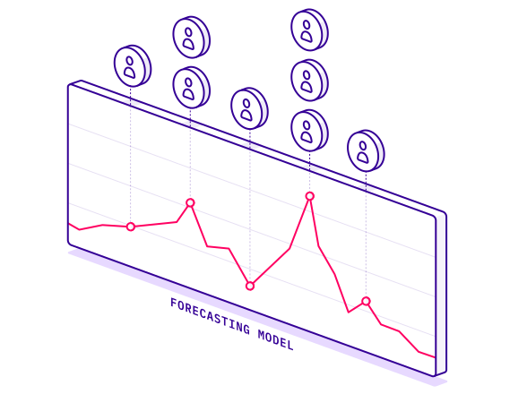

# Workforce Optimization

Until PredictHQ, labor optimization aligned with event-based demand prediction was impossible to perform effectively or at scale.

<figure><figcaption></figcaption></figure>

Our customers across the food and beverage, travel, retail, and accommodation industries are driving exceptional customer experiences by ensuring their businesses are ready for any surge.

By using events data you can ensure you roster more staff for busy times or reduce staff numbers when there is less demand. For industries like restaurants, this can make all the difference in terms of having a profitable day. As events are a big driver of demand they can be used to determine your busy days and adjust workforce levels accordingly.

* No code: [**Using PredictHQ** ](https://www.predicthq.com/support/category/control-center-and-account-settings)[**Web application**](https://www.predicthq.com/support/category/control-center-and-account-settings) (Control Center) - Use basic event impact data and trends to inform your manual pricing updates.
* [**API enrichment, analysis, and visualization in Power BI** ](../guides/tutorials/connect-and-build-events-data-in-power-bi.md)- Integrate PredictHQ data with your Power BI dynamic pricing workflows.&#x20;
* [**Update machine learning models with predictive event data**](../guides/tutorials/improving-demand-forecasting-models-with-event-features.md) - Automatically and dynamically update your pricing by integrating PredictHQ data directly into your demand forecasting models.
* Build a custom demand calendar (Coming soon)

[Legion relies on PredictHQ to help retailers eliminate labor inefficiencies](https://www.predicthq.com/customers/legion)

<figure><figcaption></figcaption></figure>
