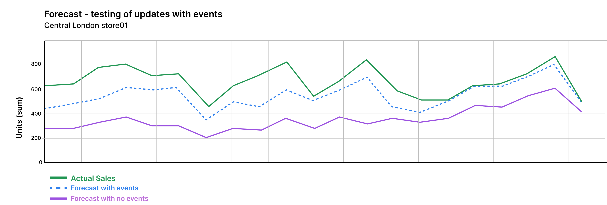
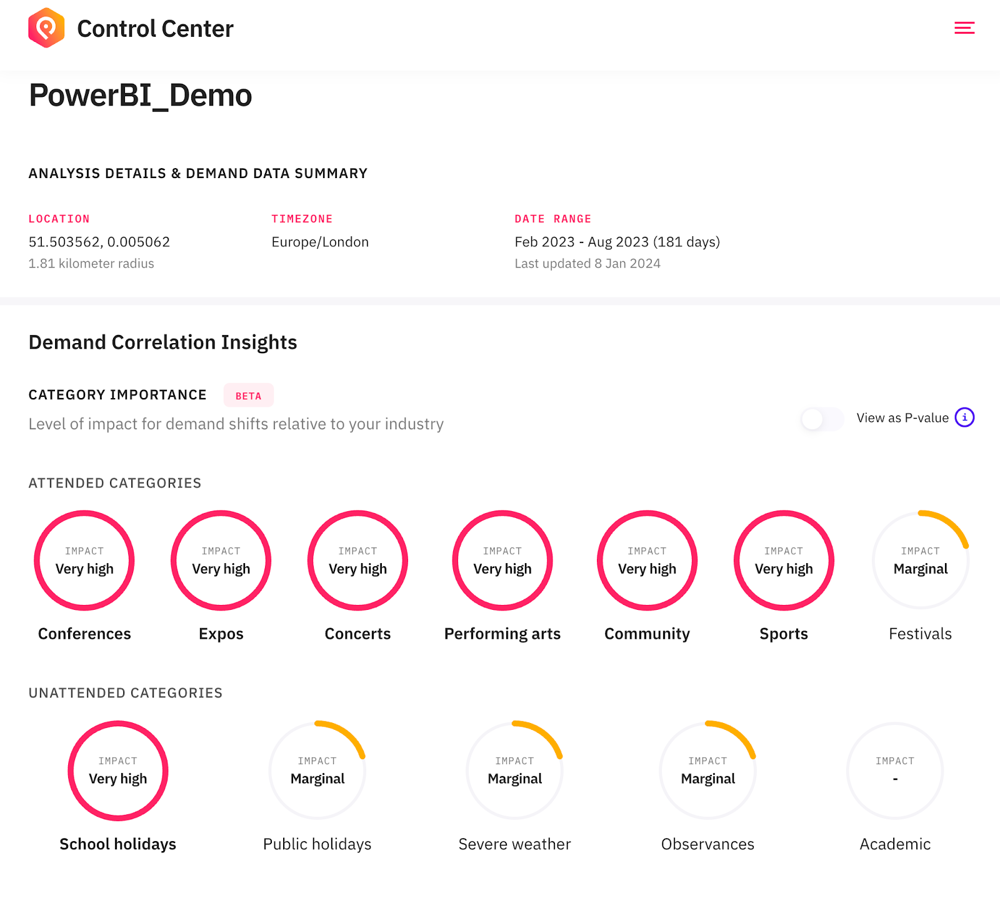

# Dynamic Pricing

From missing out on increased revenue to losing operational efficiency and even customers due to poor customer experiences, many accommodation, parking, travel, and retail vendors and service providers are painfully aware of demand fluctuations. Most companies won’t realize a demand surge is taking place until 30-50% of availability or stock has been snapped up.

<figure><figcaption></figcaption></figure>

Businesses from these industries often use PredictHQ data to fuel their sales forecasts, dynamic pricing, and business operations in advance. We have created guides for our most common use cases. We’ll start with using PredictHQ data for dynamic pricing examples by industry:

Accommodation &#x26; Hospitality

To implement PredictHQ data to inform dynamic pricing for your accommodation or hospitality business, review the options below:

* **No code:** Use Control Center, the PredictHQ web application, to unlock demand data weeks and months in advance to inform your manual pricing updates. [Read more](https://www.predicthq.com/support/see-total-daily-event-impact-in-control-center) about Event Trends.
* **Business Intelligence (BI) tools:** Integrate PredictHQ data with your Power BI or Tableau (or other analytics tool) dynamic pricing workflows. See the [Power BI Tutorial ](../guides/tutorials/using-event-data-in-power-bi.md)and [Tableau Tutorial](../guides/tutorials/using-event-data-in-tableau.md).
* **Load event data to your warehouse:** Take PredictHQ API data and load it into a data warehouse. [Read tutorial](../guides/tutorials/loading-event-data-into-a-data-warehouse.md).
* **Machine learning models:** Automatically and dynamically update your pricing by integrating PredictHQ data directly into your demand forecasting models. [Read tutorial. ](../guides/tutorials/improving-demand-forecasting-models-with-event-features.md)

**Getting Started**

1. Quick [filters](../guides/industry-specific-event-filters.md) for accommodation and hospitality:
   1. Relevant Event Categories: `concerts`, `conferences`, `expos`, `festivals`, `performing-arts`
   2. Location Type: `Center Point & Radius`
   3. Minimum PHQ Rank: 35

**Example in Practice**

PredictHQ helps its customers master predictability with the smartest and largest event impact data stream, which can drive dynamic pricing planning and operations quickly, efficiently, and at scale.

Analyzing Demand and Pricing Adjustments

Accommodation providers find it useful to overlay room price data with event impact data and use that to help guide pricing adjustments. In the dashboard below, daily room price data is shown alongside the total number of people attending events in San Francisco. Based on this you can look for peak days and surges in demand and adjust pricing accordingly. Follow the [Power BI tutorial](../guides/tutorials/using-event-data-in-power-bi.md) or [Tableau Tutorial](../guides/tutorials/using-event-data-in-tableau.md) to integrate event data into your BI tools.

On February 24, attendance at local events reached over 590,000—significantly higher than on other days. This demand surge or peak impacts business operations. In response, a hotel owner adjusted the room price from $230 to $310. This adjustment might be done in a different application.

Pricing Strategies

Overlaying event data with business data provides a simple way to pinpoint when price adjustments are needed. For a more advanced approach, machine learning models can suggest or automatically update pricing, enhancing responsiveness to market changes.

See [How Hoteliers Achieved a 10% RevPar Increase with HQ revenue](https://www.predicthq.com/customers/hqrevenue).

Leisure and Travel

To implement PredictHQ data to inform dynamic pricing for your leisure and travel business, review the options below:

* **No code:** Use Control Center, the PredictHQ web application, to unlock demand data weeks and months in advance to inform your manual pricing updates. [Read more](https://www.predicthq.com/support/see-total-daily-event-impact-in-control-center) about Event Trends.
* **Business Intelligence (BI) tools:** Integrate PredictHQ data with your Power BI or Tableau (or other analytics tool) dynamic pricing workflows. See the [Power BI Tutorial ](../guides/tutorials/using-event-data-in-power-bi.md)and [Tableau Tutorial](../guides/tutorials/using-event-data-in-tableau.md).
* **Load event data to your warehouse:** Take PredictHQ API data and load it into a data warehouse. [Read tutorial](../guides/tutorials/loading-event-data-into-a-data-warehouse.md).
* **Machine learning models:** Automatically and dynamically update your pricing by integrating PredictHQ data directly into your demand forecasting models. [Read tutorial](../guides/tutorials/improving-demand-forecasting-models-with-event-features.md).&#x20;

**Getting Started**

1. Quick [filters](../guides/industry-specific-event-filters.md) for leisure and travel:
   1. Relevant Event Categories: `public holidays`, `performing-arts`, `conferences`, `conferences`, `community`
   2. Location Type: `City`
   3. Minimum PHQ Rank: 30

With PredictHQ's products and data, businesses in the leisure and travel sector gain insights into demand fluctuations well in advance. This allows them to optimize their pricing strategy effectively and make informed decisions that boost profitability while catering to the dynamic needs of travelers and event-goers.

Retail

To implement PredictHQ data to inform dynamic pricing for your retail business, review the options below:

* **No code:** Use Control Center, the PredictHQ web application, to unlock demand data weeks and months in advance to inform your manual pricing updates. [Read more](https://www.predicthq.com/support/see-total-daily-event-impact-in-control-center) about Event Trends.
* **Business Intelligence (BI) tools:** Integrate PredictHQ data with your Power BI (or other analytics tool) dynamic pricing workflows. See the [Power BI Tutorial ](../guides/tutorials/using-event-data-in-power-bi.md)and [Tableau Tutorial](../guides/tutorials/using-event-data-in-tableau.md).
* **Load event data to your warehouse:** Take PredictHQ API data and load it into a data warehouse. [Read tutorial](../guides/tutorials/loading-event-data-into-a-data-warehouse.md).
* **Machine learning models:** Automatically and dynamically update your pricing by integrating PredictHQ data directly into your demand forecasting models. [Read tutorial. ](../guides/tutorials/improving-demand-forecasting-models-with-event-features.md)

**Getting Started**

1. Quick [filters](../guides/industry-specific-event-filters.md) for retail:
   1. Relevant Event Categories: `public holidays`, `performing-arts`, `community`, `conferences`, `festivals`
   2. Location Type: `Center Point & Radius`
   3. Minimum PHQ Rank: 50

In the retail industry, failing to recognize demand fluctuations can lead to missed revenue opportunities and operational challenges, much like in the transportation and parking sectors. Imagine a major retail chain facing significant events like Black Friday, Christmas, or even local festivals. Sales could spike dramatically, increasing by 50% to 100% above normal levels during these periods.

Dynamic pricing is a pivotal strategy in harnessing these surges effectively.

**Example in Practice**

If you have a demand forecast for your retail stores you can integrate events into your forecast to increase accuracy and improve your dynamic pricing. To add events to your ML forecast see the [demand forecasting tutorial](https://docs.predicthq.com/getting-started/guides/tutorials/improving-demand-forecasting-models-with-event-features).&#x20;

Below is an example where a retail customer performed some R\&D and tested how their forecast changed when they added events. This is an example of a location in London. You can see a significant improvement with the addition of events to the forecast making forecasting demand a lot closer to actual demand. Click on the image below to expand it.

_Run a Beam analysis to find how events impact you_

When you are considering updating a demand forecast you need to figure out which event-based machine learning features to add to your forecast. To do this you can analyse your locations in our [demand analysis tool](https://www.predicthq.com/support/beam-overview) (Beam). To do this upload your demand data into Beam for a set of locations and create a group for your analyses. For a retail customer, you may upload the number of units sold per day for your products and perform a Beam analysis.&#x20;

Below is an example of a feature importance analysis - click to enlarge:

The Beam [feature impotrance results](https://www.predicthq.com/support/viewing-the-category-importance-notebook-in-beam) will then show you which categories have the largest impact on your demand. You can use the Beam output to find the most impactful ML features to add to your forecasting using the "[View ML Features](https://www.predicthq.com/support/feature-importance-with-beam-find-the-ml-features-to-use-in-your-forecast)" option or the Beam API. Then follow the [forecasting guide](https://docs.predicthq.com/getting-started/guides/tutorials/improving-demand-forecasting-models-with-event-features) to add these features to your forecast using the [Features API](https://docs.predicthq.com/getting-started/guides/features-api-guides/increase-accuracy-with-the-features-api).

_Add ML features to your forecast_

Following on from the example above this customer found that concerts (phq\_attendance\_concerts), sports (phq\_attendance\_sports), festivals (phq\_attendance\_festivals), conferences (phq\_attendance\_conferences), public holidays (phq\_rank\_public\_holidays), and observances (phq\_rank\_observances) were the most impactful. They updated their forecast to use these features and saw a significant forecast improvement. Having a more accurate forecast allowed them to improve their dynamic pricing and this increased revenue for their stores.

Transportation &#x26; Parking

To implement PredictHQ data to inform dynamic pricing for your parking or transportation business, review the options below:

* **No code:** Use Control Center, the PredictHQ web application, to unlock demand data weeks and months in advance to inform your manual pricing updates. [Read more](https://www.predicthq.com/support/see-total-daily-event-impact-in-control-center) about Event Trends.
* **Business Intelligence (BI) tools:** Integrate PredictHQ data with your Power BI (or other analytics tool) dynamic pricing workflows. See the [Power BI Tutorial ](../guides/tutorials/using-event-data-in-power-bi.md)and [Tableau Tutorial](../guides/tutorials/using-event-data-in-tableau.md).
* **Load event data to your warehouse:** Take PredictHQ API data and load it into a data warehouse. [Read tutorial](../guides/tutorials/loading-event-data-into-a-data-warehouse.md).
* **Machine learning models:** Automatically and dynamically update your pricing by integrating PredictHQ data directly into your demand forecasting models. [Read tutorial. ](../guides/tutorials/improving-demand-forecasting-models-with-event-features.md)

**Getting Started**

1. Quick [filters](../guides/industry-specific-event-filters.md) for transportation:
   1. Relevant Event Categories: `public holidays`, `performing-arts`, `conferences`, `conferences`, `community`
   2. Location Type: `City`
   3. Minimum PHQ Rank: 30
2. Quick [filters](../guides/industry-specific-event-filters.md) for parking:
   1. Relevant Event Categories: `public holidays`, `community`, `concerts`, `expos`, `performing-arts`
   2. Location Type: `Center Point & Radius`
   3. Minimum PHQ Rank: 35

**Example in Practice**

Consider a scenario where a city hosts a major sports championship and a large concert in the same week, or several small events over a weekend that collectively draw large crowds. This can lead to a significant surge in demand for transportation and parking, potentially doubling or tripling usual levels. Effectively capitalizing on these surges requires adopting dynamic pricing strategies.

Integrating Event Data

Many organizations use spreadsheets to manage pricing. To integrate PredictHQ's event data to your dynamic pricing, check out [connecting-to-predicthq-apis-with-microsoft-excel.md](../guides/tutorials/connecting-to-predicthq-apis-with-microsoft-excel.md "mention"). Follow this tutorial to connect event data for your location to Excel, ensuring it is automatically updated.

Analyzing Demand and Setting Prices

With parking inventory data in Excel, operators can compare the total attendees of nearby events against available parking spaces. For instance, the chart below shows the total daily attendance from local events (blue line) alongside parking bookings (orange line). Examining upcoming events for the next month helps adjust pricing based on anticipated demand.

.png>)

On days like February 24th—coinciding with events such as the [San Francisco Chinese New Year Parade](https://events.predicthq.com/events/DGCqwsuA8vGgAfRNB5), [Chinatown Community Street Fair](https://events.predicthq.com/events/CrUsXRVXWaDDNbBQcR), the [Noise Pop](https://events.predicthq.com/events/DUEqiDG2U3e3yqm9Mh) festival among others—demand surges create a "perfect storm". In response, operators increase parking rates to accommodate the expected full capacity. All event details are available in the spreadsheet and can be accessed by filtering down to specific days.

Pricing Adjustments

This approach enables operators to proactively adjust pricing and accommodate expected full capacities. By analyzing past trends and upcoming events, operators can optimize pricing to maximize revenue and manage capacity effectively. This is a simple way to get event data into your tools and to easily use it for day-to-day operations.

Learn how [ParkMobile uses intelligent event data to boost parking reservations](https://www.predicthq.com/customers/parkmobile).

