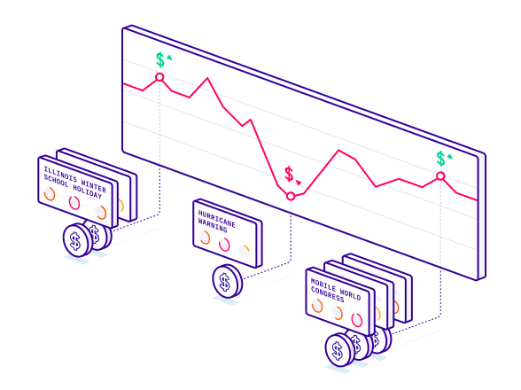

# Dynamic Pricing

<figure><figcaption></figcaption></figure>

From missing out on increased revenue to losing operational efficiency and even customers due to poor customer experiences, many accommodation, parking, travel, and retail vendors and service providers are painfully aware of demand fluctuations. Most companies won’t realize a demand surge is taking place until 30-50% of availability or stock has been snapped up.

Our customers from these industries often use PredictHQ data to fuel their sales forecasts, dynamic pricing, and business operations in advance. We have created guides for our most common use cases. We’ll start with using PredictHQ data for dynamic pricing examples by industry:

Accommodation &#x26; Hospitality Dynamic Pricing Tutorials

To implement PredictHQ data to inform dynamic pricing for your accommodation business, review the guides for this use case below:

* **No code**: [Using PredictHQ ](https://www.predicthq.com/support/category/control-center-and-account-settings)[Web application](https://www.predicthq.com/support/category/control-center-and-account-settings) (Control Center) - Use basic event impact data and trends to inform your manual pricing updates.
* \*Most Popular\* **API enrichment, analysis, and visualization in Power BI** - Integrate PredictHQ data with your Power BI dynamic pricing workflows. (Coming soon)
* [**Update machine learning models with predictive event data**](../guides/tutorials/improving-demand-forecasting-models-with-event-features.md) - Automatically and dynamically update your pricing by integrating PredictHQ data directly into your demand forecasting models.

PredictHQ helps its customers master predictability with the smartest and largest event impact data stream, which can drive dynamic pricing planning and operations quickly, efficiently, and at scale.

See [How Hoteliers Achieved a 10% RevPar Increase with HQ revenue](https://www.predicthq.com/customers/hqrevenue).

Leisure and Travel

To implement PredictHQ data to inform dynamic pricing for your Leisure and Travel business, review the guides for this use case below:

* **No code**: [Using PredictHQ Web application](https://www.predicthq.com/support/category/control-center-and-account-settings) (Control Center) - Use basic event impact data and trends to inform your manual pricing updates.

<!---->

* \*Most Popular\* **API enrichment, analysis, and visualization in Power BI** - Integrate PredictHQ data with your Power BI dynamic pricing workflows. (Coming soon)

<!---->

* [**Update machine learning models with predictive event data**](../guides/tutorials/improving-demand-forecasting-models-with-event-features.md) - Automatically and dynamically update your pricing by integrating PredictHQ data directly into your demand forecasting models.

With PredictHQ's products and data, our Leisure and Travel customers gain insights into these demand fluctuations well in advance. This allows them to optimize their pricing strategy effectively and make informed decisions that boost profitability while catering to the dynamic needs of travelers and event-goers.

Transportation &#x26; Parking

To implement PredictHQ data to inform dynamic pricing for your parking and transportation business, review the guides for this use case below:

* **No code**: [Using PredictHQ Web application](https://www.predicthq.com/support/category/control-center-and-account-settings) (Control Center) - Use basic event impact data and trends to inform your manual pricing updates.

<!---->

* **API enrichment, analysis, and visualization in Power BI** - Integrate PredictHQ data with your Power BI dynamic pricing workflows. (Coming soon)

<!---->

* [**Update machine learning models with predictive event data**](../guides/tutorials/improving-demand-forecasting-models-with-event-features.md) - Automatically and dynamically update your pricing by integrating PredictHQ data directly into your demand forecasting models.

Consider a scenario where a city is scheduled to host a major sports championship and a large music concert in the same week. Or maybe there is a cluster of small events all happening on the same weekend that in aggregate are going to bring in a lot of people into the same part of the city. You might observe a dramatic increase in demand for transportation and parking services, potentially doubling or even tripling compared to normal levels.

To capitalize on surges like this effectively, adopting dynamic pricing strategies becomes crucial.

[ParkMobile uses intelligent event data to boost parking reservations](https://www.predicthq.com/customers/parkmobile)

Retail

In the retail industry, failing to recognize demand fluctuations can lead to missed revenue opportunities and operational challenges, much like in the transportation and parking sectors. Imagine a major retail chain facing significant events like Black Friday, Christmas, or even local festivals. Sales could spike dramatically, increasing by 50% to 100% above normal levels during these periods.

Dynamic pricing is a pivotal strategy in harnessing these surges effectively.

#### Retail Dynamic Pricing Guides

To implement PredictHQ data to inform dynamic pricing for your retail business, review the guides for this use case below:

* **No code**: [Using PredictHQ Web application](https://www.predicthq.com/support/category/control-center-and-account-settings) (Control Center) - Use basic event impact data and trends to inform your manual pricing updates.

<!---->

* \*Most Popular\* **API enrichment, analysis, and visualization in Power BI** - Integrate PredictHQ data with your Power BI dynamic pricing workflows. (Coming soon)

<!---->

* [**Update machine learning models with predictive event data**](../guides/tutorials/improving-demand-forecasting-models-with-event-features.md) - Automatically and dynamically update your pricing by integrating PredictHQ data directly into your demand forecasting models.

