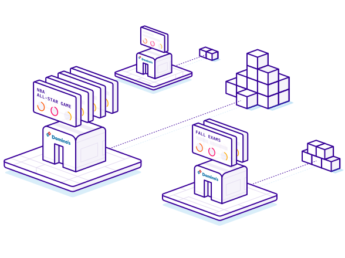

# Inventory Management

Maintaining lean supply chains and appropriate inventory levels drives cost savings and maximizes sales. Understanding how events impact demand will help you do both, better.&#x20;

<figure><figcaption></figcaption></figure>

When events drive high demand and demand surges, if you are not prepared, this means you will not have sufficient stock levels to account for the high demand. Similarly, sometimes events may reduce demand for your stores or products. This can happen if people are traveling away from a location for an event or are attending an event instead of buying products.

Typically with inventory management customers are looking to prevent stockouts and overstocking. Using our product and tools as described below will allow you to anticipate and prepare for the upcoming demand impact driven by events and ensure your inventory management accounts for it.

Retail

In the complex world of food supply chain management, unpredictability in demand often leads to significant inefficiencies and waste. A key challenge? Accurately forecasting demand in the face of countless fluctuating factors. Customers use events data to more accurately predict demand and avoid waste.

Whether you are looking after health and pharmaceutical products, food and beverage supply chains, retail store inventory, or other areas, using events can help you more accurately predict and manage inventory.

For example, we’ve seen a drop in demand of up to 50% from the baseline observed at pizza stores in New Jersey when the New Jersey Devils play about 2 mi away. This could be due to the event drawing potential customers from the store, reducing in-store purchases. Another example is in London for a restaurant chain we saw a 25% increase in demand when two major sports events, with a combined attendance of 50,638, were occurring near the store.

We provide different levels of tools based on what resources you have available and what level of integration you want to do. If you are managing a smaller number of stores and manually setting stock levels you can use Control Center, our web application, to see upcoming events around your stores, look for peaks and troughs in demand caused by events, and adjust your inventory accordingly.

Or if you are using Power BI you may want to update your Power BI Dashboard to show the impact of events on your locations to allow you to take this into account along with other factors. Finally, if you are doing demand forecasting for your inventory with machine learning models you can incorporate event-based features into your models. See the guides below.

#### Retail Inventory Management Guides

To implement PredictHQ data to manage inventory for your retail business, review the guides for this use case below:

* No code: [**Using PredictHQ** ](https://www.predicthq.com/support/category/control-center-and-account-settings)[**Web application**](https://www.predicthq.com/support/category/control-center-and-account-settings) (Control Center) - Use basic event impact data and trends to inform your manual pricing updates.

<!---->

* [**API enrichment, analysis, and visualization in Power BI** ](../guides/tutorials/connect-and-build-events-data-in-power-bi.md)- Integrate PredictHQ data with your Power BI dynamic pricing workflows.&#x20;

<!---->

* [**Update machine learning models with predictive event data**](../guides/tutorials/improving-demand-forecasting-models-with-event-features.md) - Automatically and dynamically update your pricing by integrating PredictHQ data directly into your demand forecasting models.

Consumer Packaged Goods

Events can significantly impact Consumer Packaged Goods (CPG) demand by influencing consumer behavior and purchasing patterns.&#x20;

Festivals attract large numbers of attendees who often purchase goods like bottled water, energy drinks, sunscreen, and ready-to-eat foods to use during the event. Local stores nearby may see a spike in sales. Conferences bring professionals and tourists to specific cities, leading to increased demand for quick meals, bottled beverages, and personal care products among other items. Holidays typically lead to an increase in demand for specific CPG categories, such as beverages, snacks, and festive decorations. Consumers tend to buy more during holidays to prepare for celebrations and gatherings.

In PredictHQ’s system in 2023 for the United States there were 49,574 festivals, 76,498 conferences, and 1,195 instances of public holidays and observances. The cumulative impact of these events on businesses is huge. By using events to help predict demand you can significantly increase the accuracy of your predictions and ensure you account for the fluctuations in demand driven by events.

We provide different levels of tools based on what resources you have available and what level of integration you want to do. Or if you are using Power BI you may want to update your Power BI Dashboard to show the impact of events on your locations to allow you to take this into account along with other factors. Finally, if you are doing demand forecasting for your inventory with machine learning models you can incorporate event-based features into your models. See the guides below.

#### Consumer Packaged Goods Guides

To implement PredictHQ data for Inventory Management for your Consumer Packaged Goods business, review the guides for this use case below:

* No code: [**Using PredictHQ** ](https://www.predicthq.com/support/category/control-center-and-account-settings)[**Web application**](https://www.predicthq.com/support/category/control-center-and-account-settings) (Control Center) - Use basic event impact data and trends to inform your manual pricing updates.

<!---->

* [**API enrichment, analysis, and visualization in Power BI** ](../guides/tutorials/connect-and-build-events-data-in-power-bi.md)- Integrate PredictHQ data with your Power BI dynamic pricing workflows.&#x20;

<!---->

* [**Update machine learning models with predictive event data**](../guides/tutorials/improving-demand-forecasting-models-with-event-features.md) - Automatically and dynamically update your pricing by integrating PredictHQ data directly into your demand forecasting models.

Other

#### Other Inventory Management Guides

To implement PredictHQ data for Inventory Management for your business, review the guides for this use case below:

* No code: [**Using PredictHQ** ](https://www.predicthq.com/support/category/control-center-and-account-settings)[**Web application**](https://www.predicthq.com/support/category/control-center-and-account-settings) (Control Center) - Use basic event impact data and trends to inform your manual pricing updates.

<!---->

* [**API enrichment, analysis, and visualization in Power BI** ](../guides/tutorials/connect-and-build-events-data-in-power-bi.md)- Integrate PredictHQ data with your Power BI dynamic pricing workflows.&#x20;

<!---->

* [**Update machine learning models with predictive event data**](../guides/tutorials/improving-demand-forecasting-models-with-event-features.md) - Automatically and dynamically update your pricing by integrating PredictHQ data directly into your demand forecasting models.

