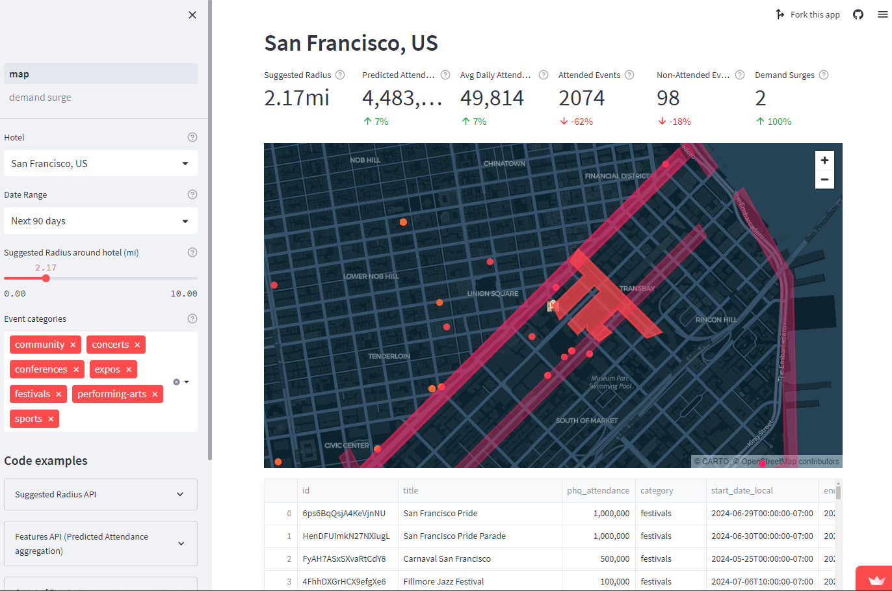

# Visualization and Insights

Many vendors or platforms across industries such as accommodation, travel, retail, food and beverage, and transportation are continually seeking ways to provide their operational teams or end customers with deeper insights into demand trends over time and across various locations.

<figure><figcaption></figcaption></figure>

These insights are delivered through various visualizations, tailored to the size, maturity, unique tech stack, and workflows of the organization. Below are some common examples of how demand data can unlock further insights, efficiency, and improvement for multiple industries."

Accommodation

Custom maps and filtered event lists\
[Accommodation Business Demo App](https://predicthq-accommodation-example.streamlit.app/) or[ get the code from GitHub](https://github.com/predicthq/streamlit-accommodation-demo).

Retail

Custom maps Maps and filtered event lists\
[Retail Demo App](https://predicthq-location-insights-example.streamlit.app/) or[ get the code from GitHub](https://github.com/predicthq/streamlit-location-insights-demo).

Transportation &#x26; Parking

Custom maps with polygon, filtered event lists: [Parking Business Demo App](https://predicthq-parking-example.streamlit.app/) or[ get the code from GitHub](https://github.com/predicthq/streamlit-parking-demo).

