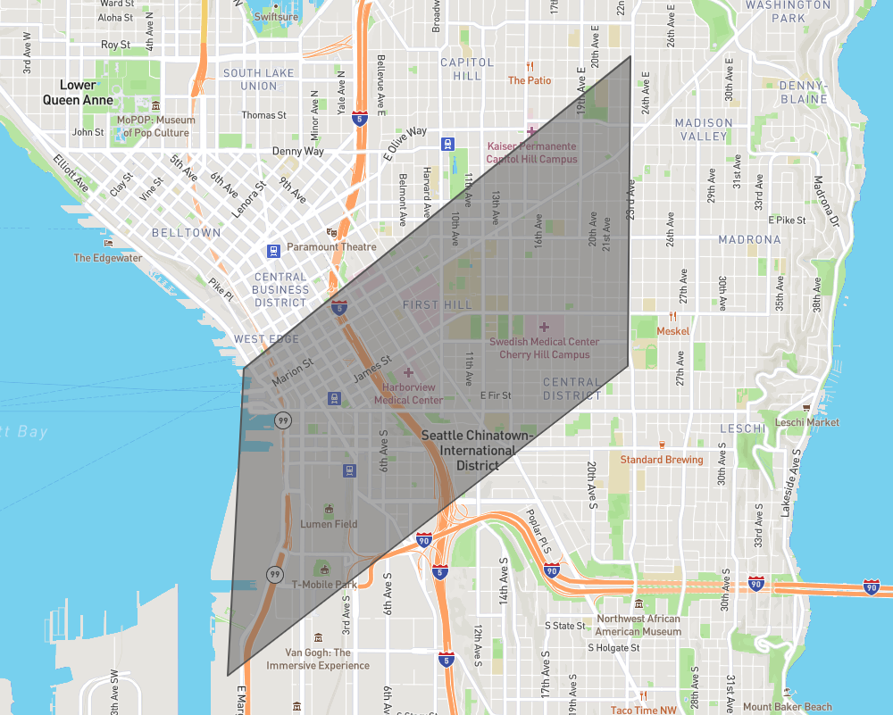
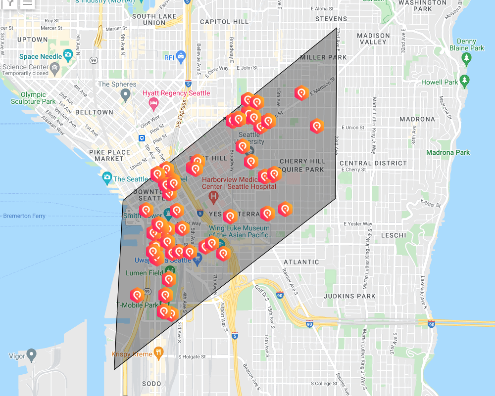

# Example SQL Queries for Snowflake

Using SQL queries in Snowflake the shared data can be manipulated to fit into a variety of tasks. Feeding the data into analyses, dashboards and machine learning models are only a few examples that are easily possible with PredictHQ's data and SQL data manipulation in Snowflake.

The following SQL examples are based on the Sample Data Shares we provide. Here our database name is marketplace but in your account, it would be the custom name that was chosen when the sample data shares were being added to your Snowflake account.

### Filter on Labels

Filtering on the `ARRAY` column `labels`, to find events with a `construction` label, using [ARRAY\_CONTAINS](https://docs.snowflake.com/en/sql-reference/functions/array\_contains.html#array-contains).

```sql
SELECT event_id,
       title,
       category,
       phq_rank,
       labels
FROM   marketplace.predicthq.seattle_attended_events AS EVENTS
WHERE  ARRAY_CONTAINS('construction' :: variant, EVENTS.labels);
```

Example Results:

| **EVENT\_ID**      | **TITLE**                    | **CATEGORY** | **PHQ\_RANK** |                   **LABELS**                  |
| ------------------ | ---------------------------- | ------------ | :-----------: | :-------------------------------------------: |
| 8VmnC4u2qhHiYBnZQ7 | Zak World of Facades Seattle | conferences  |       0       |       \[ "conference", "construction" ]       |
| MPCit98VjwyuLikWZB | TecHome Builder Summit Fall  | conferences  |       42      |       \[ "conference", "construction" ]       |
| 7qmG3u42V3cVxNi9qD | Northwest Remodeling Expo    | expos        |       67      |  \[ "architecture", "construction", "expo" ]  |
| EuGFPmDdpLcHkfZwHa | Northwest Remodeling Expo    | expos        |       64      |     \[ "construction", "expo", "product" ]    |
| GxVVHErJWx83mizc9m | MCAA GreatFutures Forum      | conferences  |       28      | \[ "business", "conference", "construction" ] |

### Filter on Latitude and Longitude

Filtering the `GEOGRAPHY` column geo to find events around a 500-meter radius of [47.623257, -122.336498](https://goo.gl/maps/wxnLAufEpESLCcDj9) using [ST\_DISTANCE](https://docs.snowflake.com/en/sql-reference/functions/st\_distance.html#st-distance) and [ST\_MAKEPOINT](https://docs.snowflake.com/en/sql-reference/functions/st\_makepoint.html#st-makepoint-st-point).

```sql
SELECT event_id,
       title,
       category,
       phq_rank,
       labels,
       phq_rank,
       geo
FROM   marketplace.predicthq.seattle_attended_events AS EVENTS
WHERE  ST_DISTANCE(EVENTS.geo, ST_MAKEPOINT(-122.336498, 47.623257)) <= 500;
```

Example Results:

| **EVENT\_ID**      | **TITLE**                                                    | **CATEGORY**    | **PHQ\_RANK** |                 **LABELS**                 |                                  **GEO**                                 |
| ------------------ | ------------------------------------------------------------ | --------------- | :-----------: | :----------------------------------------: | :----------------------------------------------------------------------: |
| EYL7o5uE65TcQFpmQD | Sarah Christine and Taylor Tuke                              | concerts        |       0       |           \[ "concert", "music" ]          |       { "coordinates": \[ -122.34197, 47.62218 ], "type": "Point" }      |
| E4zrz8MTdb2UfNQfPi | South Lake Union Winter Market                               | festivals       |       54      |               \[ "festival" ]              |      { "coordinates": \[ -122.33621, 47.622634 ], "type": "Point" }      |
| X9rWASDN88DcRWhW8Z | AUG 26! An Evening w/ Sarah Christine The Collective Seattle | concerts        |       0       |           \[ "concert", "music" ]          | { "coordinates": \[ -122.34197340000003, 47.6221728 ], "type": "Point" } |
| FAmiEHQvanW3cfpRzB | Parlor Tricks Comedy Night                                   | performing-arts |       0       | \[ "concert", "music", "performing-arts" ] | { "coordinates": \[ -122.3421581, 47.62294079999999 ], "type": "Point" } |
| B7T6izj2gSJSr6Um5u | The Collective Patio Sets: Sarah Christine                   | community       |       0       |           \[ "concert", "music" ]          | { "coordinates": \[ -122.3421581, 47.62294079999999 ], "type": "Point" } |

### Filter with a Polygon

Using the GEOGRAPHY column geo to find all events within a user defined area (eg: within a polygon) using [ST\_WITHIN](https://docs.snowflake.com/en/sql-reference/functions/st\_within.html), [ST\_MAKEPOLYGON](https://docs.snowflake.com/en/sql-reference/functions/st\_makepolygon.html) and [TO\_GEOGPRAPHY](https://docs.snowflake.com/en/sql-reference/functions/to\_geography.html).

First, we define the shape we are interested in restricting the search to, as shown in the image below.

<figure><figcaption></figcaption></figure>

```sql
SELECT seattle_events.event_id,
       title,
       category,
       phq_rank,
       geo
FROM marketplace.predicthq.seattle_attended_events seattle_events
WHERE st_within(seattle_events.geo, st_makepolygon(to_geography(
 ('LINESTRING(-122.30263710021973 47.62467785241324,-122.33980178833006 47.60442694445526,
  -122.34134674072267 47.58451555263637,-122.27954864501955 47.616925574159424,
  -122.30263710021973 47.62467785241324)'))))
```

Example Results:

| **EVENT\_ID**      | **TITLE**                                     | **CATEGORY** | **PHQ\_RANK** |                                  **GEO**                                 |
| ------------------ | --------------------------------------------- | ------------ | :-----------: | :----------------------------------------------------------------------: |
| 84xmSc634UTHwAkT5b | NWSL - OL Reign vs Kansas City Current        | sports       |       78      | { "coordinates": \[ -122.33163939999997, 47.5951518 ], "type": "Point" } |
| 3y8VCcVthX6dRk88aK | The Antlers                                   | concerts     |       43      |      { "coordinates": \[ -122.31962, 47.613938 ], "type": "Point" }      |
| BH7ffgQGiJx9yux2qd | Boris Brejcha                                 | concerts     |       59      |     { "coordinates": \[ -122.3322862, 47.5933082 ], "type": "Point" }    |
| BaqF5i5yYxBzFUGFLj | Kill The Noise                                | concerts     |       52      |     { "coordinates": \[ -122.3205827, 47.6137242 ], "type": "Point" }    |
| HpuMrnfLhdEgcBJu4q | Convent Bonfires, Bonsai Trees, and Good Job. | concerts     |       36      |     { "coordinates": \[ -122.3343786, 47.6005944 ], "type": "Point" }    |

Using the geo field of the events, these can be plotted on a map as shown below.

<figure><figcaption></figcaption></figure>
