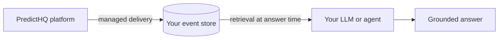
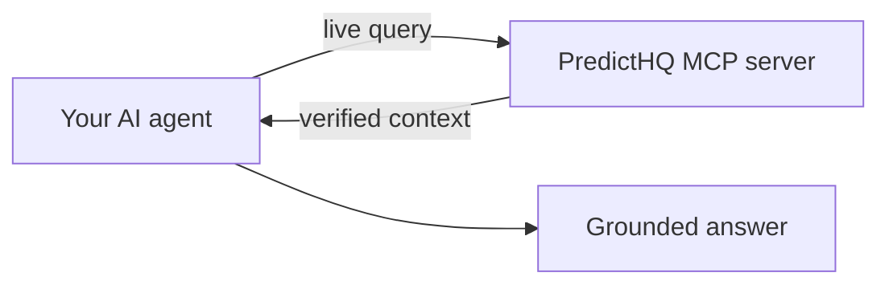

# Grounding LLMs in real-world event data (RAG)

Grounding is giving an AI model facts it does not hold, at the moment it answers, so it responds from what is true instead of what it guesses. Retrieval-augmented generation (RAG) is the most common technique for grounding. PredictHQ grounds LLMs, AI assistants, and agents in verified real-world context: the events, holidays, and demand signals that shape the physical world their decisions run in.

## Why LLMs hallucinate about the real world

An LLM's knowledge is frozen at training time and thin on location-specific detail, so questions like "why are prices elevated in Austin this weekend?" or "what will affect store traffic next month?" sit outside what any model can know from its weights. Asked anyway, a model produces a fluent, plausible answer - generic seasonality, a guessed event, an invented explanation. That is an AI hallucination, and in pricing, staffing, and inventory decisions it carries real cost.

Grounding closes the gap at answer time. The model retrieves verified, location-specific, time-bound facts and reasons from them. With PredictHQ context, the answer names the conference and the concert landing that weekend and quantifies their expected impact, instead of gesturing at "increased demand." PredictHQ does not compete with LLMs - it completes them.

## Grounding, RAG, and fine-tuning

These three are often conflated. They solve different problems:

| | What it is | When it happens | What changes |
| --- | --- | --- | --- |
| **Grounding** | Supplying external facts to a model at answer time | Every inference | The context the model reasons from |
| **RAG** | A technique for grounding: retrieve relevant content from a prepared corpus (typically a vector store) and add it to the model's input | Every inference | The context the model reasons from |
| **Fine-tuning** | Additional training that adjusts a model's weights on domain data | Before deployment | The model itself |

Grounding is the outcome; RAG is one way to achieve it. Tool calling, where an agent queries an API at answer time, achieves the same outcome and suits live data better than embedding static documents. Fine-tuning is not an alternative: real-world context changes daily, and facts baked into weights are stale on arrival. Ground for facts, fine-tune for behavior.

## Two grounding architectures

PredictHQ supports both. Most deployments choose one, and the choice is mostly a governance and maintenance question.

### Internal grounding - retrieval inside your environment

Verified event context is delivered into your environment (Snowflake, AWS Data Exchange, SFTP, or API sync) and your AI systems retrieve from a store you govern. Choose this when data residency, access control, or retrieval scale matter.

* [Internal grounding: retrieval inside your environment](../integrations/integration-guides/internal-grounding.md) - the reference architecture

### External grounding - context on demand

Your agents query the [PredictHQ MCP server](mcp.md) live at decision time and hold no copy of anything. Choose this when speed matters - there is no integration to scope and nothing to wait on from your platform team or roadmap, so an agent can be querying the same day - or when zero pipeline maintenance suits a stack that already speaks tool calling.

* [PredictHQ MCP in agentic workflows](predicthq-mcp-in-agentic-workflows.md) - reference workflows

## Using PredictHQ with AI assistants

Whichever architecture you choose, the request flow an AI assistant follows is the same:

1. A user asks a question or requests a forecast.
2. The assistant determines that external context is required.
3. The assistant retrieves PredictHQ context for a specified location and time range - from your store (internal) or via MCP (external).
4. Structured context is returned.
5. The assistant incorporates that context into its reasoning or response.

PredictHQ APIs are stateless and deterministic - the same request always returns the same result - which suits inference-time use inside AI systems.

AI systems consuming real-world context face the same structural challenges described in [Event-driven demand](../getting-started/core-concepts/event-driven-demand.md), and the APIs map directly to them:

* **Scope** - [Predicted Impact Area](https://app.gitbook.com/s/kEFs8urDbSJqBmXUI3Lv/impact-area/get-impact-area) defines where events matter for a location.
* **Relevance** - [Beam](../getting-started/core-concepts/what-is-beam.md) calibrates which events materially impact demand, using historical demand data.
* **Usability** - the [Features API](https://app.gitbook.com/s/kEFs8urDbSJqBmXUI3Lv/features/get-features) converts events into structured, model-ready signals.
* **Trust** - the [Events API](https://app.gitbook.com/s/kEFs8urDbSJqBmXUI3Lv/events/search-events) provides verifiable event records that can be surfaced in explanations.

This separation lets an assistant retrieve either raw event context or calibrated signals, depending on the workflow. For worked examples, see the [internal grounding workflows](../integrations/integration-guides/internal-grounding.md) and [agentic workflows](predicthq-mcp-in-agentic-workflows.md).

## How grounding reduces AI hallucinations

A hallucination is a confident, plausible answer invented where the model lacks facts. Grounding attacks the cause: the model no longer has to invent, because the facts are in front of it. Three properties of the retrieved context determine how much hallucination it removes:

* **Verified** - the context must be true. PredictHQ events are continuously verified, deduplicated, and enriched. Grounding in unverified content replaces invented errors with retrieved ones.
* **Specific** - the context must match the question's location and time window. PredictHQ context is location and date scoped, and [Beam](../getting-started/core-concepts/what-is-beam.md) calibrates it to the events that actually drive demand at each location, so retrieval returns relevant signal rather than a wall of nearby noise.
* **Current** - real-world context changes daily. Events are announced, cancelled, and revised inside any decision window, which is why grounding retrieves at answer time rather than relying on what a model absorbed in training.

Grounded answers are also explainable: every claim traces back to a specific verified event, which is what makes the answer auditable and defensible - and trust is the bottleneck in AI adoption.

## Grounding is not training

Training improves a model before it runs. Grounding supplies verified context while it runs. The two never mix: you can ground a frozen foundation model without any training rights or retraining, and a model trained on [PredictHQ features](../getting-started/core-concepts/which-api-should-i-use.md) still benefits from grounding when its outputs need explaining. Many production deployments run both side by side.

## Frequently asked questions

### What is grounding in AI?

Grounding is supplying an AI model with external facts at the moment it answers, so it reasons from what is true instead of what it guesses. It reduces hallucinations without changing the model itself - and it only works as well as the facts are trustworthy, which is why verified context matters.

### Is grounding the same as RAG?

No. Grounding is the outcome; retrieval-augmented generation (RAG) is the most common technique for achieving it. Tool calling, where an agent queries an API such as the PredictHQ MCP server at answer time, is grounding that isn't classically RAG.

### How do I reduce LLM hallucinations about real-world demand?

Ground the model in verified, location-specific, current event context. Retrieve from a PredictHQ-fed store in your own environment (internal grounding) or query the PredictHQ MCP server on demand (external grounding), and scope retrieval with Beam so the model sees relevant signal.

### Do I need to retrain my model to ground it?

No. Grounding happens at inference time and never touches model weights. It works with any model, including ones you have no training rights to.

### Should I use internal or external grounding?

It's mostly a governance and maintenance question. If context must live inside your own trust boundary, or retrieval volume is high, run internal grounding over a store you govern. If you'd rather maintain nothing, or want to be querying today without waiting on a platform roadmap, use the MCP server. Some deployments use both.

### Can I use PredictHQ for training and grounding at the same time?

Yes, and the two don't interact: training uses event features to improve your model before it runs, grounding supplies verified context while it runs. See [How to use PredictHQ](../getting-started/how-to-use-predicthq.md).

## Next steps

* [Internal grounding: retrieval inside your environment](../integrations/integration-guides/internal-grounding.md) - the reference architecture
* [MCP server](mcp.md) - set up the MCP server
