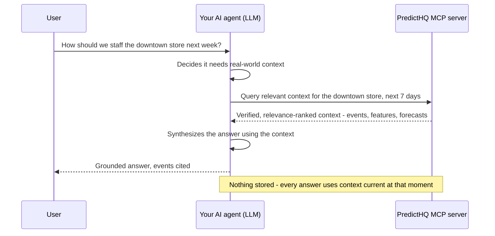

# MCP server

The PredictHQ MCP server connects AI assistants and agent-based systems directly to PredictHQ's APIs using the [Model Context Protocol](https://modelcontextprotocol.io/) (MCP) - an open standard for giving AI systems access to external tools and data at inference time.

This is the **on-demand grounding** path of Grounding with PredictHQ: your agents retrieve verified real-world context at the moment they answer, and hold no copy of anything. Once connected, your AI assistant can search events, retrieve demand intelligence, and access PredictHQ's full API surface through natural language.

MCP is the grounding path, not the bulk path. For training-scale feature retrieval, use the [Features API](https://app.gitbook.com/s/kEFs8urDbSJqBmXUI3Lv/features/get-features). To retrieve from a verified event store inside your own environment instead, see [provisioned grounding](../integrations/integration-guides/provisioned-grounding.md).


PredictHQ MCP is in beta - functionality may change as we continue to develop and refine it.


## How it works

Your agent decides per question whether it needs real-world context, writes its own query, and answers from what comes back:



## Server details

<table><thead><tr><th width="303.16796875"></th><th></th></tr></thead><tbody><tr><td><strong>MCP Server URL</strong></td><td><code>https://mcp.predicthq.com/v1/mcp</code></td></tr><tr><td><strong>Transport</strong></td><td>Streamable HTTP</td></tr><tr><td><strong>Authentication</strong></td><td>OAuth or Bearer token (API key)</td></tr></tbody></table>

## Authentication

The MCP server supports two authentication methods.

**OAuth** - when you connect using a supported client, you will be redirected to PredictHQ to authorise access. No credentials are stored in the client configuration. Best suited for interactive use and multi-user environments.

**Bearer token** - pass your PredictHQ API key in the `Authorization: Bearer $API_TOKEN` header. Well-suited for agent and automation workflows where interactive login is not practical, or for clients that do not support OAuth. You [can create an API key in the PredictHQ WebApp](../getting-started/api-quickstart.md).

## Available tools

The MCP server exposes tools across the full PredictHQ API surface:

* **Events** - search and count events
* **Broadcasts** - search and count live TV broadcasts
* **Features** - retrieve aggregated ML-ready demand intelligence features
* **Saved Locations** - create and manage locations, retrieve insight events, opening hours, and closures
* **Beam** - create and manage analyses and analysis groups, upload demand data, and retrieve feature importance and correlation results
* **Forecasts** - create and manage forecast models, upload demand data, train models, and retrieve forecasts with explainability
* **Predicted Impact Area** - get predicted impact areas by location and industry
* **Places & Geocoding** - search places, look up place hierarchies, and geocode addresses
* **Tech Docs** - search PredictHQ's technical documentation and retrieve individual pages, covering API references, integration guides, tutorials, and conceptual content

## Access & subscription

Access to the MCP server is subject to your PredictHQ subscription. The MCP also enforces the same data access controls as the REST API - if your plan covers a specific set of locations or event categories, those same limits apply when using MCP.

If you don't yet have access to the MCP server, contact your PredictHQ account manager.

## Connect your AI client

### Claude (claude.ai)

Claude has native MCP support via Connectors. This is the lowest-friction setup - no configuration files required.

1. Go to **Settings > Connectors** in Claude.
2. Click **Add connector** and enter the server URL: `https://mcp.predicthq.com/v1/mcp`
3. Follow the OAuth flow to authenticate with your PredictHQ account.

Once connected, PredictHQ tools are available in any Claude conversation.

For full instructions, see [Claude's connector documentation](https://support.claude.com/en/articles/11175166-get-started-with-custom-connectors-using-remote-mcp).

### Claude Code

Claude Code supports MCP via the CLI.

Run the following command to add the PredictHQ MCP server:

```bash
claude mcp add --transport http predicthq https://mcp.predicthq.com/v1/mcp
```

Then authenticate by running `/mcp` inside a Claude Code session and following the OAuth flow.

To use a Bearer token instead:

```bash
claude mcp add --transport http predicthq https://mcp.predicthq.com/v1/mcp \
  --header "Authorization: Bearer $API_TOKEN"
```

For full instructions, see [Claude Code MCP documentation](https://code.claude.com/docs/en/mcp).

### ChatGPT

ChatGPT supports remote MCP servers via Connectors. There are two ways to set this up depending on your plan.

**Individual setup**

Enable Developer Mode under **Settings > Advanced Settings**, then add a connector under **Settings > Connectors > Create**.

**Workspace-wide setup**

Workspace admins enable Developer Mode via **Workspace Settings > Permissions & Roles > Connected Data**, then create and publish connectors for the whole organisation from **Workspace Settings > Connectors**. Once published, the connector is available to all users in the workspace without any individual setup.

**Adding the PredictHQ connector:**

1. Go to **Connectors > Create** (from Settings or Workspace Settings depending on your plan).
2. Enter a name (e.g. `PredictHQ`) and optionally a description.
3. Enter the MCP Server URL: `https://mcp.predicthq.com/v1/mcp`
4. Select your authentication method and click **Create**:
   * **OAuth** - follow the login flow to authenticate with your PredictHQ account.
   * **Access token / API key** - select Bearer as the scheme and enter your PredictHQ API key.

**To use it in a conversation:**

Click `+` in the chat field, then **More**, and select **PredictHQ**.

**Note:** ChatGPT's MCP support is evolving and the exact steps may vary depending on your plan and workspace configuration. If the steps above don't match what you see, refer to [OpenAI's connector documentation](https://developers.openai.com/apps-sdk/deploy/connect-chatgpt) for the latest instructions.

### Other clients

The PredictHQ MCP server works with any MCP-compatible client that supports Streamable HTTP transport, including Cursor, Windsurf, VS Code (GitHub Copilot), Zed, Postman, and others.

Use the following details when configuring your client:

* **Server URL:** `https://mcp.predicthq.com/v1/mcp`
* **Transport:** Streamable HTTP
* **Authentication:** OAuth, or Bearer token via `Authorization: Bearer $API_TOKEN` header

Refer to your client's documentation for specific configuration steps.

## Next steps

* [Grounding with PredictHQ](grounding-with-predicthq.md) - what grounding is and how PredictHQ fits into AI and agent workflows
* [PredictHQ MCP in agentic workflows](predicthq-mcp-in-agentic-workflows.md) - use the MCP in autonomous and multi-agent workflows, where agents call PredictHQ for real-world context and explainability at decision time
* [API quickstart](../getting-started/api-quickstart.md) - create an API key for Bearer token authentication
