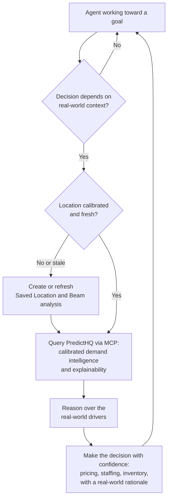

# PredictHQ MCP in Agentic Workflows

The PredictHQ MCP server connects AI agents directly to real-world context at decision time. It's commonly used interactively, through Claude, ChatGPT, or another assistant. It's equally suited to autonomous agentic workflows, where an agent, or a system of agents, works toward a goal and calls PredictHQ for the real-world context it needs to make good decisions along the way.

## The Agentic Pattern

In an agentic workflow, a goal is defined, such as optimising inventory, setting pricing, or scheduling staff. The agent works toward that goal, determining what information it needs, calling the tools required to get it, and acting on the result.

PredictHQ is one of those tools. The agent calls it via MCP whenever a decision depends on what's happening in the real world: understanding the drivers behind a forecast, gauging upcoming demand pressure across a network of locations, or checking whether real-world conditions support a pricing move. The agent gets verified, structured context at the moment the decision is made, not a retrospective report it has to interpret.

The same pattern holds in multi-agent systems. An orchestrator coordinating specialised agents, or a team of agents collaborating toward a shared goal, can treat PredictHQ as a shared source of real-world context. Whichever agent owns the decision that depends on real-world conditions is the one that reaches for it, and it returns the same verified, deterministic context regardless of which agent makes the call.

## Why PredictHQ Fits Agentic Workflows

PredictHQ is the real-world context platform that powers enterprise AI decisions. Several properties make it well-suited to autonomous agent loops.

**Demand intelligence, not a data dump.** PredictHQ explains more than 60 percent of real-world demand variability. Agents receive calibrated demand signals they can act on directly, not a raw list of events they have to make sense of.

**Explainable decisions.** Every signal traces back to the specific real-world activity behind it. An agent can see why demand is moving, act with confidence, and justify the decision it made in terms of observable real-world drivers.

**Deterministic and stateless.** The same request always returns the same result. Agents can rely on consistent, predictable responses without managing state between calls.

**Full workflow coverage.** A single MCP connection gives an agent the complete PredictHQ workflow, from location setup and demand calibration through to model-ready features and demand forecasts, with no separate integration per API.

## Calibration Comes First

PredictHQ's value in an agent loop comes from calibrated demand intelligence, which depends on two things being in place for each location.

**Saved Locations** define geographic scope. Each location is created with an `origin_geojson` point and an `industry`, and PredictHQ automatically calculates a Predicted Impact Area calibrated to that location. Do not use a hardcoded radius.

**Beam** identifies which real-world activity actually drives demand at each location, using historical demand data. Beam is not optional. Without it, category selection is guesswork and the demand signals an agent acts on are weaker for it. Run one Beam analysis per location, and refresh both Saved Locations and Beam at least monthly so calibration tracks PredictHQ's latest models.

An autonomous agent can own this end to end as part of its normal flow. Before querying a location, it checks whether a Saved Location and Beam analysis already exist, creates them if not, and refreshes them if they are more than a month old, then proceeds to query calibrated demand intelligence. There is no separate setup step a human has to run first. It is ordinary conditional logic inside the agent.

When calling the Features API, always pass `beam.analysis_id`. This applies the correct location boundary, event relevance, and rank thresholds automatically, and returns model-ready features. Do not specify individual feature names alongside it, and never use raw event counts as model inputs.

## The Decision Loop

Put together, an agent's use of PredictHQ within its flow looks like this. The calibration check is ordinary conditional logic, not a separate setup step.



## Example Workflows

These examples assume a demand forecast is already in place, ideally one already enriched with PredictHQ context. The agent's job is to act on that forecast, and it uses PredictHQ's real-world context and explainability to make more confident, defensible decisions. Where a location is not yet calibrated, the agent creates or refreshes its Saved Location and Beam analysis first, as described above.

### Revenue Management

A revenue management agent works across a portfolio of hotel properties. A property's forecast shows elevated demand next weekend. Rather than acting on the number alone, the agent pulls the real-world context behind it and finds a major conference and a high-attendance concert over the same dates. Because the drivers are large, scheduled, and high-confidence, it raises rate and records the reason. Where an elevated forecast has no clear real-world driver, it can treat the signal as less certain and hold.

Tools: `forecasts_api_get_forecast` (with `phq_explainability`), `events_api_list_events` (with `beam.analysis_id`), `features_api_get_features` (with `beam.analysis_id`)

### Workforce Scheduling

A workforce scheduling agent sets rosters across hundreds of locations. Several stores show a midweek demand bump. The agent pulls the drivers and sees a mix of school holidays and a regional sports event, letting it distinguish a short, event-driven spike from a sustained shift. It staffs each location accordingly and gives managers a clear, real-world rationale for the change.

Tools: `forecasts_api_get_forecast` (with `phq_explainability`), `saved_locations_api_list_saved_location_insight_events`, `events_api_list_events` (with `beam.analysis_id`)

### Demand Planning

A demand planning agent manages replenishment across a retail network. A forecast spike appears in part of the network. The agent pulls the real-world context and finds it concentrated around specific high-attendance events in a few catchments. It pre-positions inventory where a durable real-world driver justifies it and holds where the spike has no clear cause, avoiding both stockouts and over-ordering.

Tools: `features_api_get_features` (with `beam.analysis_id`), `events_api_list_events` (with `beam.analysis_id`), `forecasts_api_get_forecast` (with `phq_explainability`)

## Setting Up for Agentic Use

### Authentication

For agents running autonomously, use Bearer token authentication. Bearer tokens are configured at agent setup time and need no interactive login flow, which suits headless and scheduled workflows.

```
Authorization: Bearer $API_TOKEN
```

Create an API token in the [PredictHQ WebApp](https://claude.ai/getting-started/api-quickstart). OAuth remains available and is a good fit for interactive, multi-user contexts where a person authenticates at connection time.

### MCP Server URL

```
https://mcp.predicthq.com/v1/mcp
```

Transport: Streamable HTTP. Compatible with any agent framework that supports MCP over HTTP.

## Tool Selection for Agents

The MCP server exposes \~55 tools across the full PredictHQ API surface. Map them to the workflow rather than reaching for any single tool in isolation.

**Managing calibration** (the agent creates or refreshes these as needed):

* `saved_locations_api_create_saved_location` sets up a location with an automatically calculated Predicted Impact Area. Always set `industry`.
* `beam_api_create_analysis` and `beam_api_upload_analysis_demand` calibrate which real-world activity drives demand at that location.

**Querying demand intelligence and explainability:**

* `features_api_get_features` is the primary tool for demand intelligence. Call it with `beam.analysis_id` to get calibrated, model-ready time-series features ready to feed into a decision or model.
* `forecasts_api_get_forecast` returns ready-made, event-driven demand forecasts for agents that want accurate forecasts without building their own model. Pass `phq_explainability` to get the top real-world drivers behind each forecasted date. Beam is applied automatically.
* `events_api_list_events` retrieves the specific real-world activity behind a demand signal, so an agent can explain or validate a decision. Use it with `beam.analysis_id`.
* `saved_locations_api_list_saved_location_insight_events` surfaces the highest-impact upcoming drivers for a known location.
* `saved_locations_api_get_saved_location` returns a location's summary insights, including predicted event spend and attendance for the next 90 days.

### Next Steps

* [MCP Server](mcp.md) - connect your agent to PredictHQ via MCP
* [Agent Skills](build-with-ai.md) - install PredictHQ's integration best practices directly into your coding agent
* [API Quickstart](../getting-started/api-quickstart.md) - create an API token for bearer token authentication
* [Using PredictHQ with AI Assistants](using-predicthq-with-ai-assistants.md) - architectural patterns for AI and agent-based systems
