# Getting Started with Forecasts API

## Overview

The Forecasts API delivers fast, accurate, and scalable demand forecasts—powered by the real-world events that impact your business. Whether you’re starting from scratch or augmenting an existing model, our event-driven forecasting approach improves accuracy, unlocking significant ROI and cutting development time by months.

This API provides ready-to-use, event-optimized forecasts for your business, embedding the impact of sports, concerts, school holidays, and more directly into the forecast output. There’s no need to source or model event effects separately—we handle it for you.

Why Use It?

* Event-aware by default — real-world events are built into every forecast
* Industry-specific performance — designed for demand planners, revenue managers, and ops teams
* Faster and more affordable than building your own system

PredictHQ’s Forecasts API is the only event-driven, fully automated forecasting solution available—built to get you to accurate forecasts without the complexity.

### SageMaker Demo

Forecasts API can be used anywhere you can run code (SageMaker, Snowflake, Databricks etc). The demo here is running in AWS SageMaker.


Forecasts API Notebook Run-Through in AWS SageMaker


### Requirements

1. Before you get started make sure you have an [API Token](../../api-quickstart.md#create-an-access-token).
2. [Use our Notebook](https://github.com/predicthq/phq-data-science-docs/blob/master/forecasts-api/demand_forecasting_with_phq_forecasts_api.ipynb) to run an example yourself and adapt it to your needs.

All code snippets in this guide assume the appropriate config has already been set:

```python
PHQ_API_TOKEN = os.getenv("PHQ_API_TOKEN") or "REPLACE_WITH_YOUR_ACCESS_TOKEN"
API_URL = "https://api.predicthq.com"

headers = {
    "Authorization": f"Bearer {PHQ_API_TOKEN}",
    "Content-Type": "application/json"
}

lat = 51.50396
lon = 0.00476
industry = "restaurants"
name = "Sample Restaurant Location"
```

## Forecasting Workflow

```mermaid
---
title: Initial Setup for Forecasting
---
flowchart LR
    A[Create Saved Location] --> B[Define Model]
    B --> C[Upload Initial Demand]
    C --> D[Train Model]
    D --> E[📈 Forecast]
```



### Prepare Your Data

To generate a forecast, you need to provide a daily time series with two columns:

<table><thead><tr><th width="179.8515625">Column</th><th>Description</th></tr></thead><tbody><tr><td><code>date</code></td><td>The date of the observation, in <code>YYYY-MM-DD</code> format (ISO 8601).</td></tr><tr><td><code>demand</code></td><td>The actual demand value for that date (e.g. units sold, bookings).</td></tr></tbody></table>

Requirements:

* The data must be daily level
* Provide at least 18 months of history for best results
* Demand data will be rejected if it contains duplicated dates, missing values in the demand column, or non-numeric demand values

Example:

```csv
date,demand
2023-02-03,17696
2023-02-04,28718
2023-02-05,24442
2023-02-06,13468
2023-02-07,12600
2023-02-08,13671
2023-02-09,13324
2023-02-10,16589
```

### Create a Model

All forecast models are tied to a Saved Location so you can define the location once and create multiple models for it. For this example we're going to look at a theoretical restaurant located by the O2 Arena in London.

#### Create Saved Location (Using Suggested Radius)

Our Suggested Radius API calculates the optimal area around your business to capture the events that will provide an impact.

```python
# Get suggested radius
response = requests.get(
    url=f"{API_URL}/v1/suggested-radius/",
    headers=headers,
    params={
        "location.origin": f"{lat},{lon}",
        "industry": industry,
        "radius_unit": "mi",
    },
)

data = response.json()
radius = data["radius"]
radius_unit = data["radius_unit"]

print(f"Suggested radius: {radius} {radius_unit}")

# Suggested radius: 1.11 mi
```

```python
# Create Saved Location
response = requests.post(
    url=f"{API_URL}/v1/saved-locations",
    headers=headers,
    data=json.dumps(
        {
            "name": name,
            "geojson": {
                "type": "Feature",
                "properties": {"radius": radius, "radius_unit": radius_unit},
                "geometry": {
                    "type": "Point",
                    "coordinates": [lon, lat],  # GeoJSON order is lon,lat
                },
            },
        }
    ),
)

location_id = response.json()["location_id"]
print(f"Saved location ID: {location_id}")

# Saved location ID: -ErnOilZkeP6P6CPdcXvTg
```

After creating the Saved Location, we can re-use it across as many forecast models as we need.

#### Create a Model

```python
# Define model
response = requests.post(
    url=f"{API_URL}/v1/forecasts/models",
    headers=headers,
    json={
        "name": f"{name} Forecast",
        "location": {"saved_location_id": location_id},
        "algo": "phq-xgboost",
        "forecast_window": "7d",
        "demand_type": {
            "industry": industry,
        },
    },
)

model_id = response.json()["model_id"]
print(f"Model ID: {model_id}")

# Model ID: Oa1D2XvT-IXfFQ_osoTZjQ
```

#### Upload Demand Data

```python
# Upload demand
sample_demand_df = pd.read_csv("data/sample_demand.csv")
sample_demand_json = sample_demand_df.to_json(orient="records")

response = requests.post(
    url=f"{API_URL}/v1/forecasts/models/{model_id}/demand",
    headers=headers,
    json={"demand": json.loads(sample_demand_json)},
)

print(f"Demand upload: {'Successful' if response.status_code == 201 else 'Failed'}")

# Demand upload: Successful
```

#### Train the Model

During the training process the demand will be analyzed by Beam to determine what types of events impact your demand. This includes correlation and feature importance testing. The important features (from Features API) will be used when training your model and when forecasting.

```python
# Train model
response = requests.post(
    url=f"{API_URL}/v1/forecasts/models/{model_id}/train",
    headers=headers,
)

print(f"Model training: {'Successful' if response.status_code == 204 else 'Failed'}")

# Model training: Successful
```

Training usually takes a few minutes.

### Evaluate Forecast Model

Use evaluation metrics such as MAPE to compare the model performance to other models, benchmarks, etc. In this example, the benchmark model had a MAPE of 8.96%.

```python
# Get evaluation results
response = requests.get(
    url=f"{API_URL}/v1/forecasts/models/{model_id}",
    headers=headers,
)

print(f"Evaluation metrics: {response.json()['model']['metrics']}")

"""
Evaluation metrics:
{
    'accuracy': {
        'mape': 8.96,
        'mae': 1708.8,
        'rmse': 2259.08
    },
    'demand_data': {
        'date_range': {
            'start': '2023-02-03',
            'end': '2023-08-02'
        }
    },
    'training_data': {
        'date_range': {
            'start': '2023-02-03',
            'end': '2023-08-02'
        },
        'missing_pct': 0.0,
        'missing_dates': []
    }
}
"""
```

Lower values indicate better accuracy. See the [Understanding Forecast Accuracy Metrics](understanding-forecast-accuracy-metrics.md) guide for help interpreting MAPE, MAE, and RMSE.

### Retrieve Forecast

```python
# Get forecast
response = requests.get(
    url=f"{API_URL}/v1/forecasts/models/{model_id}/forecast",
    headers=headers,
    params={
        "date.gte": "2023-08-03",
        "include": "phq_explainability"
    },
)

results = response.json()["results"]
forecasts_df = pd.DataFrame(results)
```

Visualize the actual demand we uploaded as well as the forecasted demand we just retrieved:

<figure><figcaption><p>Time series chart showing the actual and forecasted demand</p></figcaption></figure>

### Ongoing Forecasting

After you have trained a model you can keep using that model in your ongoing workflow.


## Explainability

Every date in the forecast response includes a `forecast` value—that’s the core output you’ll use. Optionally, you can request explainability to get additional context on why the model predicted that value for a given day. This includes a list of impactful real-world events (e.g. school holidays, concerts) that the model considered significant for that date. There are 2 key pieces of explainability that can be provided:

* `phq_explainability` - Top events the model has determined are impacting your demand on this date.
* `phq_features` - List of features (from Features API) that were identified through Beam's Feature Importance process as relevant to your demand, as well as their values. This field is only available to customers who have also purchase our Features product.


Explainability is optional—use `phq_explainability` in your `include` query param to enable it.


Here's an example truncated response for a single date showing `phq_explainability`:

```json
{
  "date": "2023-08-03",
  "forecast": 18001.67,
  "phq_explainability": {
    "events": [
      {
        "id": "GqQA6oSLn8CGBao3vM",
        "category": "school-holidays",
        "title": "Newham - Summer Holidays",
        "start_local": "2023-07-22T00:00:00",
        "end_local": "2023-08-31T23:59:59",
        "phq_rank": 86,
        "local_rank": 69
      },
      {
        "id": "AZTohndL3PcdjwGjje",
        "category": "performing-arts",
        "title": "Mamma Mia! the Party",
        "start_local": "2023-08-03T18:30:00",
        "end_local": "2023-08-03T18:30:00",
        "phq_rank": 60,
        "local_rank": 69
      },
      ...
    ]
  }
}
```

## Tips for Better Forecasts

To get the most accurate results from the Forecasts API, your input data needs to reflect meaningful demand patterns over time. Here are key tips to improve forecast performance and reliability:

* Include enough history: At least 18 months of daily demand helps the model learn seasonal and event-driven patterns.
* Keep it consistent: Submit clean, continuous daily data—no smoothing, gaps, or placeholder values.
* Avoid over-segmentation: Low-volume or highly granular series often perform worse. Aggregate where possible.
* Watch out for tiny values: Very small but non-zero demand can distort percentage-based metrics like MAPE.
* Exclude outliers if needed: Remove early COVID-19 disruptions or other non-repeating anomalies if they don’t reflect current demand.

For more detailed recommendations, see the [Troubleshooting Guide](troubleshooting.md).

## Troubleshooting

If your forecasts aren’t meeting expectations, don’t worry—there are several common reasons why accuracy might be lower than expected. We’ve put together a dedicated [Troubleshooting Guide](troubleshooting.md) to help you identify and resolve these issues.

The guide covers topics like:

* What to do if your forecast accuracy is poor (e.g. noisy or low-volume data)
* Why not enough history can reduce model performance
* How overly fine-grained series can lead to weak signals
* When to remove early COVID-19 disruptions from your dataset

We also have a guide on [understanding forecast accuracy metrics](understanding-forecast-accuracy-metrics.md) (MAPE, MAE, RMSE) meaningfully.


Before tweaking your inputs or retrying, we strongly recommend reviewing the troubleshooting guide—it can save a lot of time and guesswork.


## Next Steps

* [Forecasts API Reference](../../../api/forecasts/) - Full schema, endpoints and parameters
* [Understanding Forecast Accuracy Metrics](understanding-forecast-accuracy-metrics.md) - Guide to interpreting MAPE, MAE and RMSE
* [Troubleshooting Guide for Forecasts API](troubleshooting.md) - Common causes of low accuracy and how to fix them


