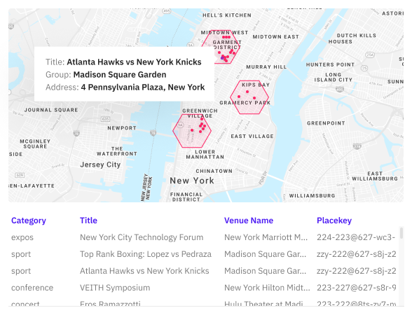
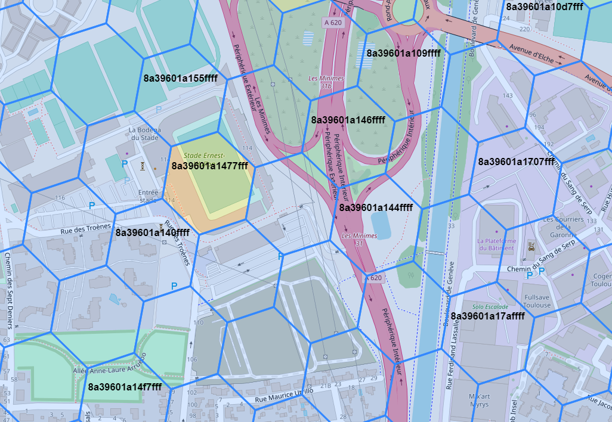

# Join Events using Placekey

Placekey is a free, universal standard identifier for any physical place, which enables the data pertaining to those places to be easily shared across organizations. PredictHQ provides Placekeys for events data to allow organizations to join our events data to other datasets that use Placekeys. See the [Placekey website](https://www.placekey.io/) for more information.

A common use of Placekey and events data is to provide additional information about the  Point of Interest (POI) where the event took place. POI data provides detailed information about a location such as address, latitude/longitude, and open hours, and can also be enriched with data including spend data to reveal what’s happening at a location. The combination of events and POI data helps clarify exactly what is driving demand at a location. For example, combining events data with spend data to identify what is driving a spike in spend at a particular location.

Placekey is attached to PredictHQ events records that happen at a particular location. The PredictHQ pipeline looks at the address and other location information like latitude and longitude and attaches the appropriate Placekey based on these values. An example of a Placekey is `222-22t@5yv-j89-g6k`. This is for the following address “The Mirage Theatre, 3400 Las Vegas Boulevard South, Las Vegas, NV 89109”. Events that happen at the Mirage Theatre will have this Placekey value.

<figure><figcaption></figcaption></figure>

The format of the Placekey is `What@Where`. Take the above example: `222-22t@5yv-j89-g6k`. For the What component, the first three characters refer to the Address Encoding and the second set of three characters refers to the POI Encoding. The Where part, on the other hand, is made up of three unique character sequences, built upon Uber’s open-source H3 grid system. See the [Placekey site ](https://www.placekey.io/how-it-works)for an excellent description of what Placekey is and how it works.

The reason Placekey is useful for joining datasets is because of the general lack of standardization in POI and address data. Addresses are often formatted in different ways. Connecting data by address is difficult, and often inaccurate, and different companies may have different definitions of the latitude, longitude, and area of a location. Using Placekey provides a standard way of representing POI data and makes it easy to join event data with other data sets that also use Placekey.

PredictHQ also [partners with SafeGraph](https://www.predicthq.com/partners/safegraph). Placekey allows you to join events data and SafeGraph data including [SafeGraph Places (POI)](https://www.safegraph.com/products/places), [SafeGraph Geometry](https://www.safegraph.com/products/geometry), and [SafeGraph Spend](https://www.safegraph.com/products/spend).

## Placekey on Events

Placekey is attached to PredictHQ event records. It is returned in the response from the events API. Placekey is also returned via other integrations like Snowflake and ADX.

Below is an example of the response from the Public API showing the Placekey for an event happening in Las Vegas:

```json
{
  "count": 1,
  "results": [
    {
      "id": "FKmCVGdpGMxwcFDF36",
      "title": "Shin Lim",
      "entities": [
        {
          "entity_id": "7jpp8Ha4F7LCz4CqaGDJmZ",
          "name": "The Mirage Theatre",
          "type": "venue",
          "formatted_address": "3400 Las Vegas Boulevard South\nLas Vegas, NV 89109\nUnited States of America"
        }
      ],
      "geo": {
        "geometry": {
          "coordinates": [
            -115.1741201,
            36.1214078
          ],
          "type": "Point"
        },
        "placekey": "222-22t@5yv-j89-g6k"
      },
      ...
    }
  ]
}
```

## Placekey Support

Placekey has address support for the United States, United Kingdom, and Canada (see [supported countries](https://docs.placekey.io/#b0aa86a5-ec33-45a8-aebf-67c25c5ca0a5)). For these countries, PredictHQ events will have both the What@Where part where the events have sufficient address information. Some events that don’t have address information may just have the @Where part of Placekey.

Placekey is supported on attended events from 2020 onwards.

For all other countries where Placekey does not support addresses, these events will have the `@Where` part of Placekey. For example, the [Stade Toulousain vs Perpignan](https://events.predicthq.com/events/FYwLVpWzz7k6SRmiZy) event in Toulouse, France has a Placekey of `@7f7-mcy-ndv`. This is very useful and can also be used to find nearby events and to join with POI data.

See below for the hexagon area covered by `@7f7-mcy-ndv`:

<figure><figcaption></figcaption></figure>


Note that attended events that have a polygon representing an area do not currently use Placekey. For example marathons, parades and festivals have a geojson polygon representing the area impacted by the event. Placekeys are best suited for events that occur at a specific location rather than events that cover a broad area. See our guide to [using polygons events data](working-with-polygons.md) to find polygons events around a location.

