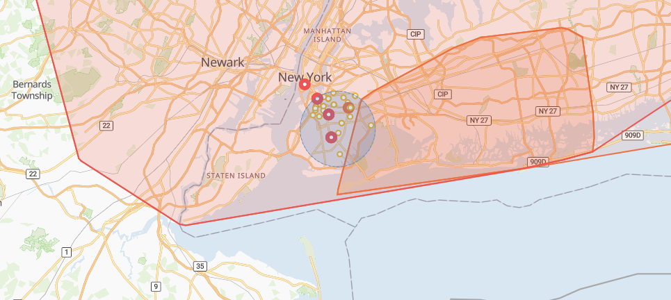

# Searching by Location

Performing a radial search using our Events API's `within` parameter is a common way to find events that impact your locations of interest. See our guide on [radial searches](find-events-by-latitude-longitude-and-radius.md) and the within search parameter.

Which events are returned by a radial search depends on their location and geometry type. The image below shows the result of the example radial search performed in our [WebApp](https://control.predicthq.com/search/events/map?category=public-holidays,observances,politics,conferences,expos,concerts,festivals,performing-arts,sports,community,daylight-savings,airport-delays,severe-weather,disasters,terror,academic\&place.scope=6252001\&active.gte=2020-08-06\&active.lte=2020-09-05\&state=active\&within=4mi%4040.6441,-73.9393): A 4-mile radius around a point in Brooklyn, New York, USA - the search area is the blue circle.

| LOCATION AND GEOMETRY TYPE                       | RADIAL SEARCH MATCHING CRITERION                                                                                                                                                                                                                                                                                                                                                                     |
| ------------------------------------------------ | ---------------------------------------------------------------------------------------------------------------------------------------------------------------------------------------------------------------------------------------------------------------------------------------------------------------------------------------------------------------------------------------------------- |
| Point event with Point geometry                  | Returned if their point falls within the specified radius. In the image below, matching point events are the dots within the blue circle.                                                                                                                                                                                                                                                            |
| Area event with Polygon or MultiPolygon geometry | Returned if any part of the polygons intersect with the specified radius. In the image below, matching events with polygons intersect with the blue circle.                                                                                                                                                                                                                                          |
| Area event with Point geometry                   | Returned if the radial search location (the provided lat,lon coordinates regardless of radius) is a child place of the area event's place. In the image below, the dot outside the blue circle is an area event without a polygon. This event covers all of New York City, and since the radial search's location is in Brooklyn, a child place of New York City, this area event was returned also. |

<figure><figcaption></figcaption></figure>

When searching for events around a specific business location — a store, hotel, or other fixed site — the recommended approach is to use a [Saved Location](https://app.gitbook.com/s/kEFs8urDbSJqBmXUI3Lv/saved-locations). When you create a Saved Location from a lat/lon origin, [Predicted Impact Area](https://app.gitbook.com/s/kEFs8urDbSJqBmXUI3Lv/impact-area/get-impact-area) is calculated automatically and stored as the location boundary. You can then reference that location by `location_id` across the Events API, Features API, and Beam — without managing coordinates or boundaries manually.

If you need a simpler point-and-radius search without a Saved Location, you can use the `within` parameter directly as described above. In that case, see the [Predicted Impact Area API](https://app.gitbook.com/s/kEFs8urDbSJqBmXUI3Lv/impact-area/get-impact-area) with `area_type=radius` to get an appropriate radius for your location and industry.

You can also search for events occurring, in particular, Geonames Places using the `place.scope` parameter with Place ids. In our [Severe-Weather Events Data Engineering notebook](../../events-api-guides/severe-weather-events-data-science-guides.md), we provide code examples to find Place ids for your locations of interest. 
