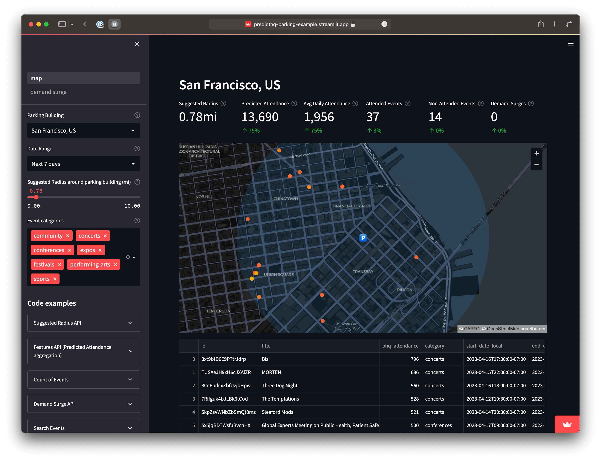

# Streamlit Demo Apps

To demonstrate how quick and easy it is to build extremely powerful apps using our APIs, we put together some Streamlit demos. All the code is available on GitHub and we encourage you to take the code, modify it, and use your own locations of interest to demo our APIs internally to your team or to simply better understand our technology.

* [Parking Business Demo App](https://predicthq-parking-example.streamlit.app/) _**or**_ [get the code from GitHub](https://github.com/predicthq/streamlit-parking-demo).
* [Accommodation Business Demo App](https://predicthq-accommodation-example.streamlit.app/) _**or**_ [get the code from GitHub](https://github.com/predicthq/streamlit-accommodation-demo).
* [Restaurant Business Demo App](https://predicthq-restaurant-example.streamlit.app/) _**or**_ [get the code from GitHub](https://github.com/predicthq/streamlit-restaurant-demo).
* [Location Insights Demo App](https://predicthq-location-insights-example.streamlit.app/) _**or**_ [get the code from GitHub](https://github.com/predicthq/streamlit-location-insights-demo).

<figure><figcaption></figcaption></figure>
