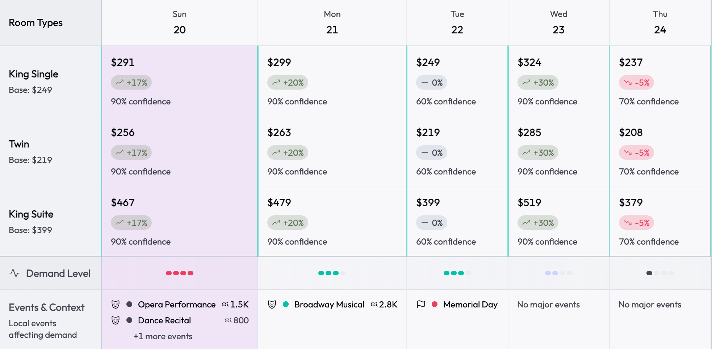
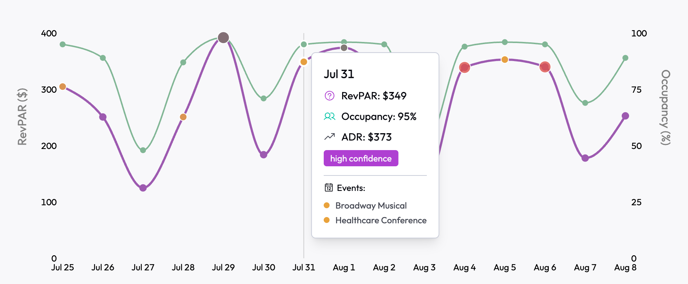

# Accommodation: The Proven Path to Value

Most hotels and platforms know that local events drive demand - but turning that knowledge into actionable insight at scale is hard.

Teams often spend months trying to work out which event types actually impact demand, define the right radius for each hotel, and transform underlying events into data that can power forecasting and pricing models. These are hard, foundational problems - and they’ve already been solved.

This guide shows the proven, fastest path to value - based on what’s worked across thousands of hotels and the platforms that serve them.

## The Fast Path to Value

Two of the most effective ways accommodation businesses get value from PredictHQ are:

* **Calendar Display**: Help hotel teams understand why demand is changing by showing the real-world events driving it. This brings explainability to pricing recommendations, booking patterns, and operational decisions - building trust and improving actionability.
* **Forecasting Accuracy**: Strengthen your demand forecasts with high-quality, time-series features built from real-world event impact. Helps revenue and data teams get ahead of demand - not just react to it.

## Calendar Display

<figure><figcaption></figcaption></figure>

Many accommodation businesses want to show local events in their calendars - to help hoteliers plan ahead, staff smarter, and spot high-demand dates early. It’s a valuable use case. But nearly everyone hits the same challenge:

**There are too many events. How do we show only what matters?**

The challenge isn’t adding event data - it’s helping hotel teams understand which events explain their booking patterns and give them confidence to adjust pricing, staffing, or promotions. Relevance isn’t just about cutting noise - it’s about surfacing the right signals that support human decision-making.

To make a calendar useful - across one hotel or thousands - it needs to:

* Surface demand-driving events, not everything happening nearby
* Scale cleanly across locations and markets without one-off configs
* Build trust by being consistently insightful, not noisy

The challenge is: how do you know which events actually drive demand?

### Use Beam to Identify Impactful Event Types

Beam analyzes historical booking patterns to reveal which types of events consistently influence demand for each hotel or group of hotels. It gives you a data-backed filter that ensures each calendar surfaces the most relevant events - and hides the ones that don’t matter (via Beam’s Feature Importance).

### Filter Event Data Accordingly

Once you know the high-impact event types, filter the events for each hotel or group/cluster accordingly - including only those categories, within a relevant radius or polygon. This dramatically reduces volume and increases signal.

### Sort Events Per Day by Local Rank

To help hotel teams quickly understand what’s driving demand on a given day, sort events by [Local Rank](https://docs.predicthq.com/getting-started/predicthq-data/ranks/local-rank). This makes high-impact events easy to spot and supports confident, explainable decisions.

To enhance explainability and usability, consider displaying:

* Predicted Attendance
* Indication of Local Rank
* Show events on their leading/lagging days using Predicted Impact Patterns
* Event type icons
* Collapse/expand toggles for lower ranked events

By showing only the events that actually affect demand, you give hoteliers clear context for why certain days are different - empowering better decisions on pricing, staffing, and planning.

A well-filtered event calendar isn’t just a feed - it’s an explainability layer that builds trust, supports human decision-making, and drives faster value without needing complex modeling or deep data integration.

### PredictHQ Tools for Calendar Display

* [Events API](https://docs.predicthq.com/api/events/search-events): Core event data, filtered by category, location, date, and more
* [Snowflake / AWS Data Exchange Feeds](https://docs.predicthq.com/integrations/third-party-integrations): Simplified alternative to Events API - get event data delivered directly to your cloud data environment
* [Beam API](https://docs.predicthq.com/api/beam/overview): Identify which event types impact demand using Feature Importance
* [Suggested Radius](https://docs.predicthq.com/api/suggested-radius/get-suggested-radius): Get radius recommendations for each hotel or location
* [Predicted Impact Patterns](https://docs.predicthq.com/getting-started/predicthq-data/impact-patterns): Identify leading and lagging demand days around events
* [Entities](https://docs.predicthq.com/getting-started/predicthq-data/entities): Group related events (e.g. concert residencies)

## Forecasting Accuracy

<figure><figcaption></figcaption></figure>

Most forecasting teams know that events drive demand - the challenge is turning the underlying event data into features that actually work in a time-series model.

While rich and detailed, PredictHQ’s underlying event data isn’t structured for modeling out of the box. It’s high-volume, event-specific, and filled with real-world edge cases that are non-trivial to handle, such as:

* Aggregating attendance for multi-day or overlapping events
* Accounting for leading and lagging demand effects (e.g. shoulder nights around a concert)

Even experienced data science teams can spend weeks or months designing, testing, and iterating on how to best represent events in their forecasting pipelines.

PredictHQ’s Features API generates demand-relevant, time-series signals at request time designed for forecasting - so your teams can skip the foundational complexity of event aggregation and focus on building reliable, explainable, high-performing models faster.

For teams with mature pipelines, or those exploring model comparisons, PredictHQ’s Forecasts API offers another path. Forecasts API provides demand forecasts that already factor in the impact of events, seasonality, and local dynamics. It’s designed for teams that already have forecasting pipelines and want to:

* Use it as a baseline, racehorse, or ensemble component
* Evaluate the isolated contribution of event-aware demand
* Speed up iteration while avoiding premature engineering work

It’s also a low-risk way to prove the value of event-aware forecasting before making larger architectural changes.

### PredictHQ Tools for Forecasting

* [Features API](https://docs.predicthq.com/api/features/get-features): Model-ready, time-series event features for forecasting
* [Forecasts API](https://docs.predicthq.com/api/forecasts/overview): Demand forecasts with event, seasonality, and local dynamics included
* [Beam API](https://docs.predicthq.com/api/beam/overview): Use Feature Importance to select the most predictive event features

## Iterate & Expand

Once the fundamentals are in place, there are simple ways to drive even more value:

* Add alerts to notify your users about new and changed events
* Use [Umbrella Events](https://docs.predicthq.com/getting-started/guides/date-and-time-guides/working-with-multi-day-and-umbrella-events) to simplify multi-day experiences - filter out individual sessions (like each race in an F1 weekend) and focus on the overarching event that actually drives bookings. This reduces clutter and makes calendars more explainable for hotel teams
* Use [Concert Residencies](https://docs.predicthq.com/getting-started/predicthq-data/entities#residencies-entities) to notify on a sequence of upcoming concerts rather than each individual event
* Apply an “onion radius” approach to surface major events beyond the immediate area - e.g. include all relevant events within the Suggested Radius, then expand to 3× with a Local Rank ≥ 95, and optionally 5× with Local Rank = 100 to capture rare, high-impact events.

## Real Examples

* [Lighthouse](https://www.predicthq.com/customers/lighthouse): Replaced brittle manual event feeds and reduced support overhead with trusted event insights at scale.
* [HQ revenue](https://www.predicthq.com/customers/hqrevenue): Automated demand monitoring and increased RevPAR by 10%.
* [Wheelhouse](https://www.predicthq.com/customers/wheelhouse): Boosted nightly rates by up to 800% during major events with dynamic pricing powered by PredictHQ.

## Common Pitfalls

Even well-resourced teams hit the same traps when working with event data:

* Trying to engineer model-ready features from event data - it’s harder than it looks. Features API handles timing, overlap, weighting and more so you get clean, usable signals without the complexity.
* Hardcoding event categories or filters based on assumptions - what drives demand varies by location. Use Beam to validate which event types actually impact bookings in each market.
* Assuming one-size-fits-all radius logic - different locations respond to events differently. Use Suggested Radius and filter by Local Rank to ensure you’re capturing meaningful impact, not noise.

## Final Advice: Start Simple, Scale Smart

Don’t overcomplicate your starting point. High-impact events and demand-aware forecasting unlock fast, measurable wins.

Start small - a focused market, a representative set of hotels, or even one city. Prove the value, then scale with confidence. We’ll help you get there.
