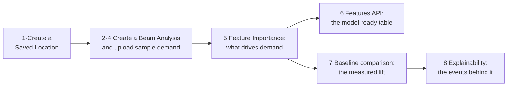

# Measure the forecast lift on sample data

In this tutorial you build the recommended PredictHQ integration end to end, on sample demand data, and finish with a measured accuracy improvement you produced yourself. Along the way you see each piece of the platform do its job: a Saved Location scopes the geography, Beam identifies which events drive the demand, the Features API returns the model-ready features your forecasting model would consume, and a baseline comparison measures what the event features are worth.

It takes about 15 minutes, most of which is waiting for two short processing runs. Every step in this tutorial was run against the live API before publishing - the responses you see are captured from those runs.



## Before you start

You need:

* A PredictHQ account and API token - a free trial account has access to everything this tutorial uses. See the [API quickstart](../api-quickstart.md) to create a token.
* Python with the `requests` library (any recent version), or the HTTP client of your choice - every step is a plain HTTP call.
* The retail sample dataset: download [`sample_demand_retail.csv`](https://raw.githubusercontent.com/predicthq/gitbook-tech-docs/main/assets/sample-demand-data/sample_demand_retail.csv) into your working directory. It contains 18 months of synthetic daily demand for a fictional retail store, modelled on realistic patterns - including holiday closures and demand spikes. [Sample datasets](../guides/beam-guides/sample-demand-data.md) exist for other industries too; this tutorial uses retail throughout so the responses you see match the ones shown.

Set your token once for all the steps:

```python
import requests

TOKEN = "YOUR_API_TOKEN"
HEADERS = {"Authorization": f"Bearer {TOKEN}", "Accept": "application/json"}
```

## Step 1: Create a Saved Location

The tutorial's fictional store is on Lower Broadway in Nashville - a district dense with concerts and live events, chosen so the event effect is easy to see. Create a Saved Location for it, supplying only the origin point and the industry - PredictHQ calculates a Predicted Impact Area automatically, the boundary where events actually affect a retail location there. Don't supply a radius: fixed circles include irrelevant events and miss relevant ones.

```python
response = requests.post(
    "https://api.predicthq.com/v1/saved-locations",
    headers=HEADERS,
    json={
        "name": "Tutorial - Nashville Broadway Retail",
        "industry": "retail",
        "origin_geojson": {
            "type": "Feature",
            "geometry": {"type": "Point", "coordinates": [-86.7775, 36.1612]},
        },
    },
)
location_id = response.json()["location_id"]
print(location_id)  # a short ID like "rfiTpN63KVbeuyZemz0zog"
```

Keep the `location_id` - everything else in this tutorial hangs off it.

## Step 2: Create a Beam Analysis

Beam is PredictHQ's relevancy engine: it analyzes your demand data to determine which event categories materially drive demand at this location. Create an Analysis linked to your Saved Location:

```python
response = requests.post(
    "https://api.predicthq.com/v1/beam/analyses",
    headers=HEADERS,
    json={
        "name": "Tutorial - Nashville Broadway Retail",
        "location": {"saved_location_id": location_id},
        "demand_type": {"industry": "retail", "interval": "day", "unit_descriptor": "Sales"},
    },
)
analysis_id = response.json()["analysis_id"]
print(analysis_id)
```

## Step 3: Upload the sample demand data

Upload the CSV to the Analysis. This is the data Beam correlates against real-world events:

```python
with open("sample_demand_retail.csv", "rb") as f:
    response = requests.post(
        f"https://api.predicthq.com/v1/beam/analyses/{analysis_id}/sink",
        headers={"Authorization": f"Bearer {TOKEN}", "Content-Type": "text/csv"},
        data=f,
    )
print(response.status_code)  # 202 - accepted for processing
```

## Step 4: Wait for Beam to finish

Beam decomposes the demand series and runs feature importance testing. On this dataset it takes about two minutes:

```python
analysis = requests.get(
    f"https://api.predicthq.com/v1/beam/analyses/{analysis_id}", headers=HEADERS
).json()
print(analysis["readiness_status"])  # "pending" while processing, "ready" when complete
```

Run it again until it prints `ready`. If it prints `failed`, or is still `pending` well past five minutes, print the whole `analysis` object - `readiness_checks` reports what the data validation found.

Once it's ready, two things worth noticing in the full `analysis` object:

* `rank` shows Beam set a Local Rank threshold for this location itself - you didn't configure one, and you shouldn't. Manual thresholds override location-specific calibration.
* `readiness_checks` notes four missing dates in the sample data - Thanksgiving and Christmas, when the store was closed. Real demand data has gaps like these, and Beam handles them.

## Step 5: See what drives demand - and what doesn't

Retrieve Beam's Feature Importance results:

```python
response = requests.get(
    f"https://api.predicthq.com/v1/beam/analyses/{analysis_id}/feature-importance",
    headers=HEADERS,
)
for group in response.json()["feature_importance"]:
    print(f'{group["feature_group"]:18} p={group["p_value"]:<8} important={group["important"]}')
```

When we ran this, Beam found eight event groups significant for this location - concerts, conferences, public holidays, performing arts, and severe weather all at p-values of zero - and rejected four. Look at what it rejected:

```text
sports             p=0.9999   important=False
```

Sports events don't drive this store's demand - in Nashville, home of the Titans and the Predators. This is the point of Beam: the categories a person would guess into a model aren't necessarily the ones the demand data supports, and every irrelevant category included adds noise. Your own demand data decides, not intuition.

## Step 6: Retrieve the model-ready features

This is the artifact an enterprise integration is built around. Call the Features API with the `beam.analysis_id` - nothing else. It applies the calibrated location boundary, the significant categories from step 5, and the rank thresholds automatically:

```python
response = requests.post(
    "https://api.predicthq.com/v1/features/",
    headers=HEADERS,
    json={
        "beam": {"analysis_id": analysis_id},
        "active": {"gte": "2026-04-01", "lte": "2026-04-24"},
    },
)
print(response.json()["results"][0])
```

The response contains one row per day - 24 in total for this window. The first row from our run:

```json
{
  "date": "2026-04-01",
  "phq_attendance_concerts_retail": {"stats": {"sum": 3561}},
  "phq_attendance_conferences_retail": {"stats": {"sum": 1137}},
  "phq_attendance_performing_arts_retail": {"stats": {"sum": 0}},
  "phq_impact_academic_exam": {"stats": {"sum": 0}},
  "phq_impact_observances_retail": {"stats": {"sum": 0}},
  "phq_impact_public_holidays_retail": {"stats": {"sum": 12}},
  "phq_impact_school_holidays_retail": {"stats": {"sum": 0}},
  "phq_impact_severe_weather_cold_wave_retail": {"stats": {"max": 0}},
  "phq_impact_severe_weather_cold_wave_storm_retail": {"stats": {"max": 0}},
  "phq_impact_severe_weather_flood_retail": {"stats": {"max": 0}},
  "phq_impact_severe_weather_tornado_retail": {"stats": {"max": 0}}
}
```

Each row is a date with one value per Beam-selected feature: predicted attendance sums for the significant attendance categories, impact values for holidays and severe weather. Scan forward two rows and Friday 2026-04-03 jumps out: 19,290 predicted concert attendees against Wednesday's 3,561 - exactly the kind of swing a model can't see in demand history alone. In production, you join this table to your demand history to train your model, then call the same endpoint with a **future-dated** window at every forecast run - the events behind these features are announced and scheduled in advance, so a future window carries known signals about what's coming rather than extrapolations of your history. That training-and-serving loop lives in your ML pipeline and is out of scope here; the [Features API reference](https://app.gitbook.com/s/kEFs8urDbSJqBmXUI3Lv/features/get-features) covers the window mechanics, and the [demand forecasting notebook](https://github.com/predicthq/phq-data-science-docs/blob/master/demand-forecasting-with-events/demand-forecasting-with-event-features.ipynb) shows a worked ML example.

## Step 7: Measure what the features are worth

You could stop here and take the feature table into your own model - in production, that's exactly what happens. But you don't need to build a model to measure the lift. The Forecasts API can train two models on your uploaded demand - one enhanced with PredictHQ features, one baseline without them - and report the accuracy difference. Create a model with `generate_baseline` enabled, upload the same CSV, and train:

```python
import csv

response = requests.post(
    "https://api.predicthq.com/v1/forecasts/models",
    headers=HEADERS,
    json={
        "name": "Tutorial - Nashville Broadway Retail",
        "location": {"saved_location_id": location_id},
        "demand_type": {"industry": "retail", "interval": "day"},
        "forecast_window": "7d",
        "generate_baseline": True,
    },
)
model_id = response.json()["model_id"]

with open("sample_demand_retail.csv") as f:
    demand = [{"date": row["date"], "demand": float(row["demand"])} for row in csv.DictReader(f)]

response = requests.post(
    f"https://api.predicthq.com/v1/forecasts/models/{model_id}/demand",
    headers=HEADERS,
    json={"demand": demand},
)
print(response.status_code)  # 201 - demand data stored

response = requests.post(
    f"https://api.predicthq.com/v1/forecasts/models/{model_id}/train", headers=HEADERS
)
print(response.status_code)  # 204 - training started
```

Training takes two to three minutes. Check the model until `readiness.status` prints `ready` (if it prints `failed`, the `readiness` object explains why), then read both models' error metrics:

```python
response = requests.get(
    f"https://api.predicthq.com/v1/forecasts/models/{model_id}", headers=HEADERS
)
model = response.json()["model"]
print(model["readiness"]["status"])
print(model["metrics"]["accuracy"])
print(model["metrics"]["baseline_comparison"])
```

From our run:

```json
{
  "accuracy": {"mape": 9.37, "mae": 3661.25, "rmse": 5963.11, "wape": 8.62},
  "baseline_comparison": {"mape_improvement_pct": 26.52, "baseline_mape": 12.75, "baseline_mae": 4415.23, "baseline_rmse": 7169.4, "baseline_wape": 10.39}
}
```

The enhanced model's error (MAPE 9.37) beat the baseline (12.75) - a 26.5% improvement, and the difference is the event features, measured by a like-for-like comparison on the same demand data.

Don't read that number as a benchmark. This store sits in a deliberately event-exposed district, and the demand data is synthetic - the result demonstrates the measurement workflow, not a claim about your business. When we ran this exact workflow on the same demand data at other locations, the measured lift ranged from about 1% to 26%: event exposure is a property of the location. That's the point of measuring instead of assuming - this workflow tells you what events are worth at your locations, on your own demand data.

## Step 8: See the events behind the forecast

The lift has names. Retrieve the forecast with explainability - and note the date range: the sample data ends on 2026-04-24, so the forecast covers the week after that. Without an explicit date range this endpoint defaults to today onward and returns nothing:

```python
response = requests.get(
    f"https://api.predicthq.com/v1/forecasts/models/{model_id}/forecast",
    headers=HEADERS,
    params={
        "date.gte": "2026-04-25",
        "date.lte": "2026-05-01",
        "include": "phq_explainability",
    },
)
for day in response.json()["results"]:
    events = day["phq_explainability"]["events"]
    top = max(events, key=lambda e: e["local_rank"])
    print(day["date"], round(day["forecast"]), "-", top["title"])
```

From our run:

```text
2026-04-25 48119 - Ben Rector with Nashville Symphony
2026-04-26 43662 - Hayley Williams
2026-04-27 40102 - Snarky Puppy
2026-04-28 37587 - Severe Thunderstorm
2026-04-29 37158 - Hayley Williams
2026-04-30 39329 - RAYE
2026-05-01 50026 - Spring Exams
```

The demand drivers are real, verifiable events: concerts with Local Ranks in the high 70s and 80s, a severe thunderstorm at Local Rank 86, and university spring exams. Every forecast traces back to observable real-world activity - the same explainability your operators and stakeholders get in production.

## Clean up

The tutorial resources are yours to keep exploring with, or delete them:

```python
requests.delete(f"https://api.predicthq.com/v1/forecasts/models/{model_id}", headers=HEADERS)
requests.delete(f"https://api.predicthq.com/v1/beam/analyses/{analysis_id}", headers=HEADERS)
requests.delete(f"https://api.predicthq.com/v1/saved-locations/{location_id}", headers=HEADERS)
```

## What you built

You ran the recommended integration workflow end to end: a Saved Location with an automatically calibrated Predicted Impact Area, a Beam Analysis that identified which event categories drive this demand (and which don't), the model-ready feature table your own forecasting model would consume, and a measured, like-for-like accuracy comparison. What that measurement is worth is relative to the business: at enterprise scale, even a fraction of a percent less forecast error can mean millions of dollars in better staffing, inventory, and pricing decisions.

With your own demand data, the path is identical - one Saved Location and one Beam Analysis per location, refreshed monthly. To run it again closer to home first, pick [your industry's sample dataset](../guides/beam-guides/sample-demand-data.md) and change the `industry` value in steps 1, 2, and 7.

## Where to go next

* [How to use PredictHQ](../how-to-use-predicthq.md) - the recommended path for your job, from model training to grounding AI systems
* [Standard integration pattern](../../integrations/integration-guides/standard-integration-pattern.md) - the production architecture: local feature storage, refresh cadences, explainability
* [Which API should I use?](../core-concepts/which-api-should-i-use.md) - per-task API selection
* [Using event features with time series foundation models](../guides/features-api-guides/using-event-features-with-time-series-foundation-models.md) - if your models are pre-trained rather than trained in-house
