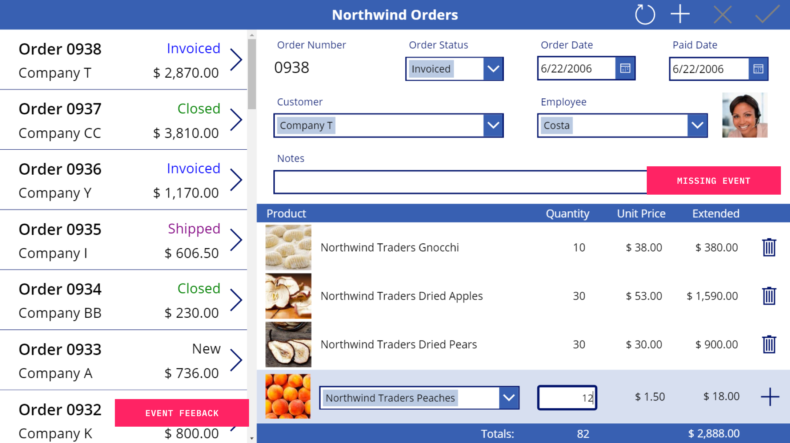
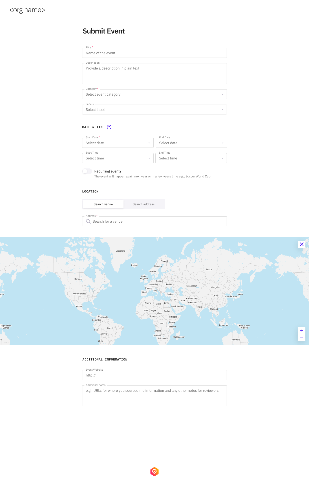
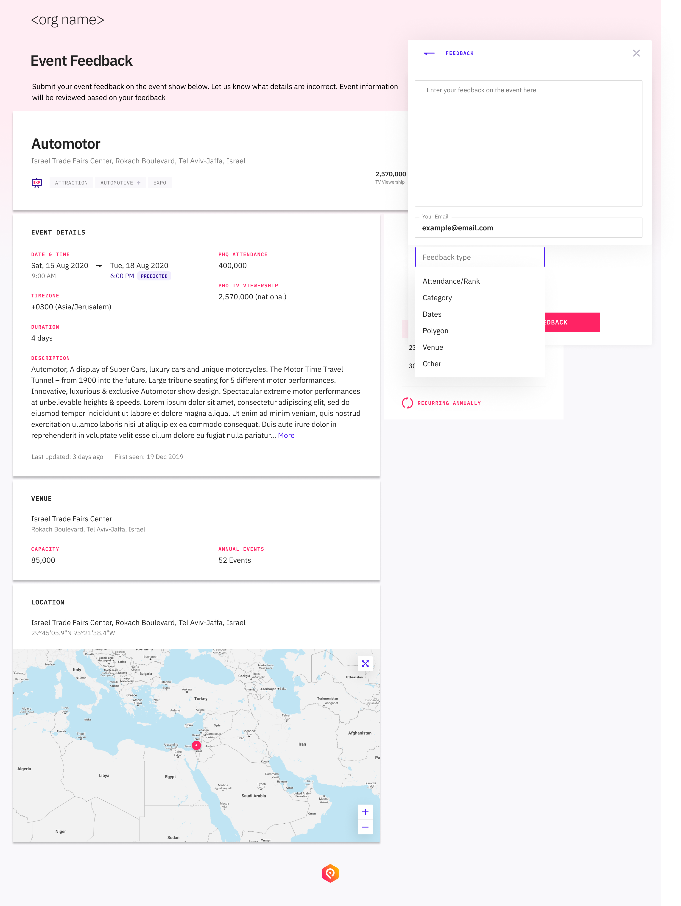
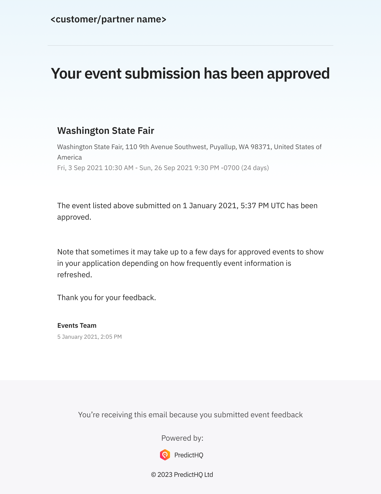
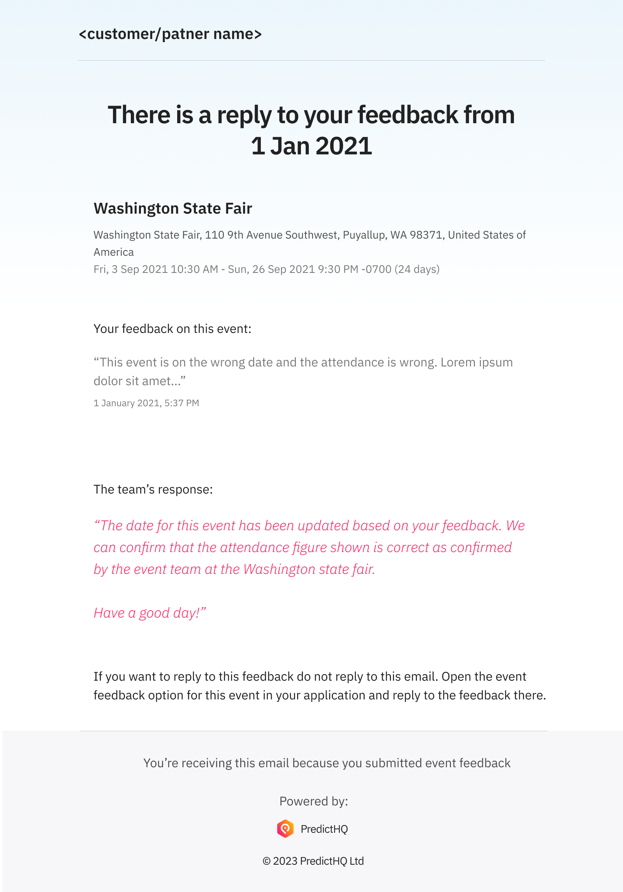

# Integrate with Loop Links

[PredictHQ's Loop tool](https://www.predicthq.com/tools/loop) allows customers to submit feedback on existing events and to submit missing events. PredictHQ has global events data from hundreds of providers, but sometimes our data may not include events such as hyperlocal events. Loop allows customers to report events that appear to be missing. It also allows customers to provide feedback on events if they have updates to details like attendance, times, or location.

Using [Loop ](https://loop.predicthq.com/)requires a PredictHQ login to the WebApp, however, some customers want their users to be able to submit event feedback without needing a PredictHQ login. These customers want a way to integrate the ability to report missing events or event feedback into their product.

**Loop Links** provide a way for customers to integrate with Loop without their users needing a WebApp login, and enable the following:

* Customers can integrate Loop into their products such as a web app, mobile app, or other tool
* Each customer can generate a unique URL to allow their users to submit event feedback and missing event information
* Events are processed by PredictHQ in the normal way and valid events or feedback are updated in the PredictHQ system
* Events that are added and approved via Loop are returned via the Events API

This means you can allow your users to submit feedback on events but your support team doesn't need to spend time managing this feedback. It will go straight to PredictHQ.

To use Loop Links you need to use the API that creates Loop Links. See [**Loop Links Technical Details**](integrate-with-loop-links.md#loop-links-technical-details) below. See also, our [Loop Links API documentation](../../api/loop/loop-links/create-a-loop-link.md) for details on creating Loop Links.

## Overview

Loop Links provide a URL that allows a user to provide event feedback. Customers create Loop Links URLs via the Loop Links API. You must configure your own URLs before you can integrate Loop Links into your application.

The link does not require authentication. It has customer details embedded. For example:

* **Label**: My First Capture Link
* **Link**: `https://phq.link/loop/jG5KnDpad5SAUMkUtR` (note: this is not a valid link, just an example)

Customers can link to the URL from within their application and feedback will go straight into the Loop system.

The advantage is customers don’t need to build a UI. The UI is responsive and works on desktop, tablet, and mobile.

## Loop Links Integration

Customers integrate two functions in their application:

* One for submitting missing events
* Another for feedback on events - event feedback should be linked to a part of your application that displays an event

These buttons link to the screens shown in the following section.

Below is a fictitious example app with examples of adding buttons for the two types of Loop Feedback

<figure><figcaption></figcaption></figure>

The diagram below shows how your app will integrate with the Loop Links event pages:

<figure><figcaption></figcaption></figure>

The heading at the top of the Loop pages defaults to your organization name in the WebApp. You can update it to change it via the API.

**Missing event link**

Opens a PredictHQ web page where users can enter details of a missing event in the browser.

We recommend you open this in a new window.

**Event feedback link**

Opens a PredictHQ web page where users can provide feedback on an existing event. Requires the public event ID of the event.

Integrate this link where you are displaying a PredictHQ event in your app. We recommend you open this in a new window.

### Submitting Missing Events

* Users enter event details
* PredictHQ teams review and approves or reject events
* Approved events show as visible to the customer as active events
* Users receive an email when an event is approved or rejected

<figure><figcaption></figcaption></figure>

### Providing Feedback on Events

* User reviews the event details on the page and can provide feedback
* This requires an event ID to be passed to the loop links' URL
* Feedback is approved or rejected
* Users will receive an email if there are any questions about their feedback

<figure><figcaption></figcaption></figure>

## Loop Links Automated Emails

The Loop Links platform sends automated emails in the following cases:

* When a submitted event is approved
* When a submitted event is rejected
* When there is a reply or comment on event feedback

The email templates contain the organization at the top of the template. This is the same organization name that is shown at the top of the the Loop Link pages for submitting missing events and event feedback. It can be updated by calling `PUT /v1/loop/settings`. See [**Loop Links Technical Details**](integrate-with-loop-links.md#loop-links-technical-details) for more information.

**Note that users cannot reply to these emails. In order to reply to them you need to use the event feedback page for the event in question and send a response in the feedback.**

See below for some example emails:



See an example below of the email template for approved events:

<figure><figcaption></figcaption></figure>



See an example below of the email template for rejected events and replies to event feedback:

<figure><figcaption></figcaption></figure>



## Tracking Loop Feedback

Users with admin access can track Loop feedback at [loop.predicthq.com](https://loop.predicthq.com/) :

* Needs a PredictHQ login
* Shows if Loop submissions are approved or rejected
* Shows details of the discussion about the loop events with responses from PredictHQ
* Allows administrators to track the status of events submitted by their end users

This is typically used by support teams if issues are raised about event feedback and they want to review the feedback.

## Loop Links Technical Details

### Integration Overview

1. Create Loop Links using the API:
   1. Store links in your system, or
   2. Use the link immediately.
2. If required update the **`org_name`** name field via the settings API to set the name displayed at the top of the Loop pages
3. Implement the links in your application.
4. End-user clicks the link which opens the Public Loop UI in a browser.
   1. No login is needed.
   2. The end-user is presented with the form to submit an event (or feedback - depending on which type of link was clicked).
5. End-user fills in the form.
6. End-user receives an email when the event they submitted is approved or rejected.

### Types of links

#### Submit missing event

To **submit a missing event** create a Loop Link and open the Loop Link from your application:

E.g., open the link with /event/ in the URL:

`https://loop.phq.link/event/kt9fJZXpWFGSA5ky1Cunb2` (note: this is not a valid link just an example)

#### Submit event feedback

To **provide feedback on an existing event** - open the /event-feedback/ Loop Link and supply the `event_id` parameter on the URL:

`https://loop.phq.link/event-feedback/kt9fJZXpWFGSA5ky1Cunb2?event_id=BzjFubD5eqvrRA7NSw` (note: this is not a valid link just an example)

Note that the event ID to use is the `id` field from the [Events API](../../api/events/search-events.md). Typically feedback is provided when you are displaying an event from the PredictHQ API in your application. A feedback link or icon is added next to the event to allow users to provide feedback.

#### To pre-fill the user's email address

The Loop forms require a user email address. You can pre-populate the email address by passing it in the query string. The name of the parameter is `email`.

`https://loop.phq.link/event/kt9fJZXpWFGSA5ky1Cunb2?email=example@example.com` (note: this is not a valid link just an example)

### Loop Link expiration and reuse

* Loop Links can be reused unless an expiry date time is set
* If an expiry date time is set they can no longer be used after they expire
* If no expiry date time is set they can be reused indefinitely&#x20;
