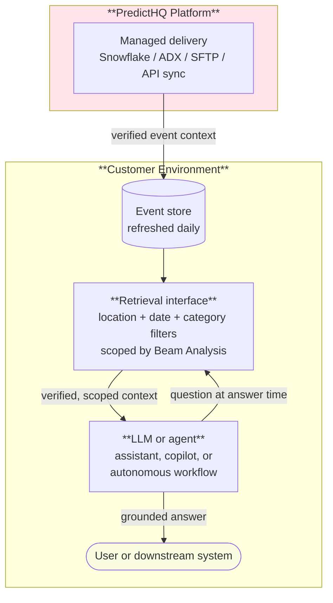
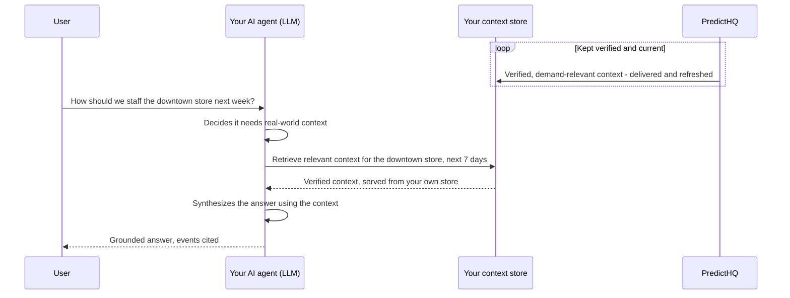

# Provisioned grounding: retrieval inside your environment

Provisioned grounding gives your LLMs and agents verified real-world context from a store inside your own environment - governed by your access controls, resident in your infrastructure, retrieved at the moment a model answers. It is the grounding architecture for teams where data residency, governance, or retrieval scale rule out live external calls.

This page is the reference architecture. If your agents can query externally and you want zero pipeline maintenance, use [on-demand grounding via the MCP server](../../ai/mcp.md) instead. For what grounding is and when to use it at all, see [Grounding with PredictHQ](../../ai/grounding-with-predicthq.md).

## Architecture

Provisioned grounding extends the [Standard integration pattern](standard-integration-pattern.md): the local event store that pattern maintains for explainability is the grounding corpus. If you already run that architecture, provisioned grounding adds a retrieval interface and a consumer - nothing else changes.

The components:

1. **Delivery** - PredictHQ deploys verified event context into your environment via [Snowflake](../third-party-integrations/snowflake/), [AWS Data Exchange](../third-party-integrations/aws-data-exchange/), [SFTP](../third-party-integrations/sftp.md), or [API sync](keep-data-updated-via-api.md). Managed delivery is preferred: no pipeline to build, and the store stays current without sync code.
2. **Event store** - the same store the Standard Integration Pattern maintains. Events are structured records (category, location, dates, predicted attendance, rank), so it lives naturally in the warehouse or lakehouse your AI stack already reads.
3. **Retrieval interface** - the query layer your AI systems call at answer time. Because events are structured, retrieval is structured too: filter by location, date window, and the event categories that matter, rather than embedding everything and hoping vector similarity finds the right concert.
4. **The model** - any LLM, assistant, or agent in your environment. It receives verified, scoped context in its input and answers from retrieved facts, not invented ones.

At answer time, the flow looks like this - the answer path stays inside your environment, and PredictHQ's only runtime role is keeping the store current:

## Retrieval design

Three decisions determine whether grounded answers are relevant or noisy:

* **Scope with Beam.** Retrieval should return the events that drive demand at the location in question, not every event nearby. Store each location's Beam `analysis_id` results (categories, rank thresholds) and apply them as retrieval filters - the same calibration your forecasting path uses. Without it, the model is grounded in noise.
* **Filter structurally first.** Location, date window, and category filters do the heavy lifting on structured event data. If you also embed event descriptions for semantic search, apply it after structural filtering, not instead of it.
* **Return records, not summaries.** Give the model the verified fields (title, category, dates, predicted attendance, venue) and let it reason. Pre-summarized context loses the specifics that make answers explainable, and every claim in a grounded answer should trace back to a specific event record.

## Freshness

Real-world context changes daily: events are announced, revised, cancelled, and postponed inside any decision window. A grounding corpus that lags reality produces answers that are confidently out of date, which reads exactly like a hallucination to the person acting on it.

| Component | Cadence |
| --- | --- |
| Event store | Daily refresh via managed delivery, or [API sync](keep-data-updated-via-api.md) using the `updated` parameter |
| Beam Analysis (retrieval scoping) | Monthly - append new demand data |
| Retrieval | Live against the store at every answer - never cache retrieved context across questions |

## Example workflows

**Forecast explanation.** An operator asks an assistant why demand is forecast to spike next Friday. The assistant retrieves that location's demand-driving events for the date window and answers with the specific festival and its predicted attendance - a claim anyone can verify against the record.

**Operational copilot.** A staffing copilot preparing next week's roster retrieves upcoming high-rank events for each store's location before recommending shift levels, and cites the events behind each recommendation.

**Customer-facing explanations.** A pricing platform explains rate changes to end users from the same store - provisioned grounding keeps the retrieval path inside the platform's own trust boundary, with no external call in the serving path.

## When to choose provisioned over on-demand grounding

| Choose provisioned grounding | Choose [on-demand grounding (MCP)](../../ai/mcp.md) |
| --- | --- |
| Data residency or compliance requires context inside your boundary | Agents can call external tools |
| Retrieval volume is high enough that per-query external calls don't make sense | Query volume is modest and bursty |
| You already run the Standard Integration Pattern - the corpus exists | You want nothing to build or maintain |
| Your AI serving path can't take an external dependency | Always-current context matters more than residency |
| The integration has a place on your platform roadmap | You want to be querying today - no integration to scope, nothing to wait on |

Some deployments run both: provisioned grounding for the high-volume serving path, MCP for ad-hoc agent and analyst queries.

## Next steps

* [Grounding with PredictHQ](../../ai/grounding-with-predicthq.md) - concepts and the two architectures
* [Standard integration pattern](standard-integration-pattern.md) - the architecture this extends
* [Receive data via Snowflake](../third-party-integrations/snowflake/) - the lowest-friction delivery path
