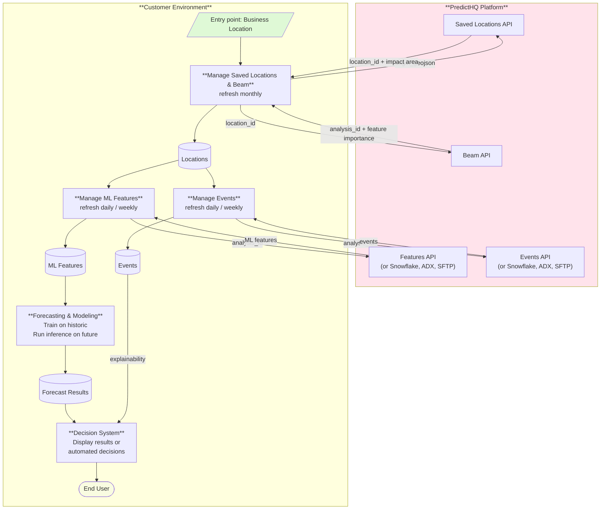

# Standard Integration Pattern

This page describes the recommended architecture for integrating PredictHQ into a production system. It applies to most demand forecasting and operational use cases - staffing, inventory, pricing, scheduling, and similar applications where event-driven features feed into a model or decision system.

## Overview

A PredictHQ integration has four logical components on the customer side:

1. **Location & Beam Management** — creates and maintains Saved Locations and Beam Analyses per location, refreshed monthly
2. **ML Features Management** — fetches pre-built ML features per location using the Beam Analysis, refreshed daily or weekly
3. **Events Management** — fetches relevant events per location for explainability and operational context, refreshed daily or weekly
4. **Forecasting & Decision System** — consumes features for model training and inference and surfaces events alongside results for explainability

The key principle across all of these: **store a local copy and query that, rather than making live API calls at inference time.** This removes API latency from the critical path and gives you full control over refresh cadence.

## Architecture Diagram

The diagram below is PredictHQ's reference architecture for a standard production integration. It shows the recommended system design for ingesting event-driven ML features and events into a forecasting or decision-making pipeline, covering location setup, Beam Analysis, feature and event management, modeling, and end-user explainability.

Use this as the starting point when designing or reviewing a customer integration. The architecture applies across industries and use cases - staffing, inventory, pricing, scheduling, and similar demand forecasting applications. Variations such as bulk data delivery via Snowflake, AWS Data Exchange, or SFTP are noted where applicable.

***

## Component Detail

### Location & Beam Management

**Refresh: monthly**

For each business location:

1. Call the Saved Locations API with `origin_geojson` (a lat/lon Point). This creates a Saved Location and automatically calculates a Predicted Impact Area - an industry and geography-calibrated boundary that determines which events are in scope. Store the returned `location_id`.
2. Create a Beam Analysis for the location using the `location_id` and your historical demand data. Beam identifies which event categories materially drive demand at that specific location. Store the returned `analysis_id` and Feature Importance results (event categories and p-values).
3. **Monthly refresh:** append new demand data to the existing Beam Analysis - do not delete and recreate it. Update your stored Feature Importance results with the latest output.

Saved Locations are also the only way to use polygon-based boundaries with PredictHQ APIs. Polygons are stored once against the location and referenced by `location_id` across all subsequent calls.

### ML Features Management

**Refresh: daily or weekly or other, depending on model cadence**

Using the `analysis_id` from your Location Store, call the Features API to retrieve pre-built ML features for each location. The `analysis_id` automatically applies the correct location boundary, event category filters, rank thresholds, and impact patterns for that location - no manual configuration needed.

Store the results locally. Pull from your local store at training and inference time, not directly from the API.

**Alternative delivery:** PredictHQ can deliver Features API output per Beam Analysis via Snowflake Private Share, AWS Data Exchange, or SFTP. Contact PredictHQ to discuss this option.

### Events Management

**Refresh: daily or weekly**

Using the `analysis_id`, call the Events API to retrieve the specific events driving demand at each location. Store results locally.

Events are used for **explainability** - surfacing to end users or downstream systems which events are responsible for a forecast shift on a given day. This is distinct from the ML features used for modeling. Events give human-readable context to model outputs.

**Alternative delivery:** PredictHQ can deliver events filtered by Beam Analysis or Saved Location via Snowflake Private Share, AWS Data Exchange, or SFTP. For most production use cases, this is the preferred approach over live Events API calls.

### Forecasting & Decision System

The forecasting model pulls ML features from your local store - both historical (for training) and future (for inference). Event features represent demand signal - your model learns the relationship between event magnitude and demand impact at each location.

The decision or end-user system consumes:

* **Forecast results** from the modeling system
* **Events** from your local Events store, used to explain forecast anomalies or expected demand shifts to operators or end users

## Refresh Cadence Summary

| Component       | Cadence              | Notes                                                     |
| --------------- | -------------------- | --------------------------------------------------------- |
| Saved Locations | Monthly or as needed | Refresh monthly or if the location itself changes         |
| Beam Analysis   | Monthly              | Append demand data to existing analysis - do not recreate |
| ML Features     | Daily or weekly      | Align with model training / inference cycle               |
| Events          | Daily or weekly      | Align with operational review cadence                     |

***

### Key Decisions

**Features API vs. Snowflake / ADX / SFTP** For smaller deployments or early integration, the Features API is the simplest path. For production at scale - particularly when feature freshness and API latency are concerns - talk to PredictHQ about bulk delivery options.

**One Beam Analysis per location** Event impact is location-specific. Do not reuse a single Beam Analysis across multiple locations. For fleet-scale deployments with many similar locations, see [Beam Group Analysis](https://app.gitbook.com/s/kEFs8urDbSJqBmXUI3Lv/beam/analysis-groups).
