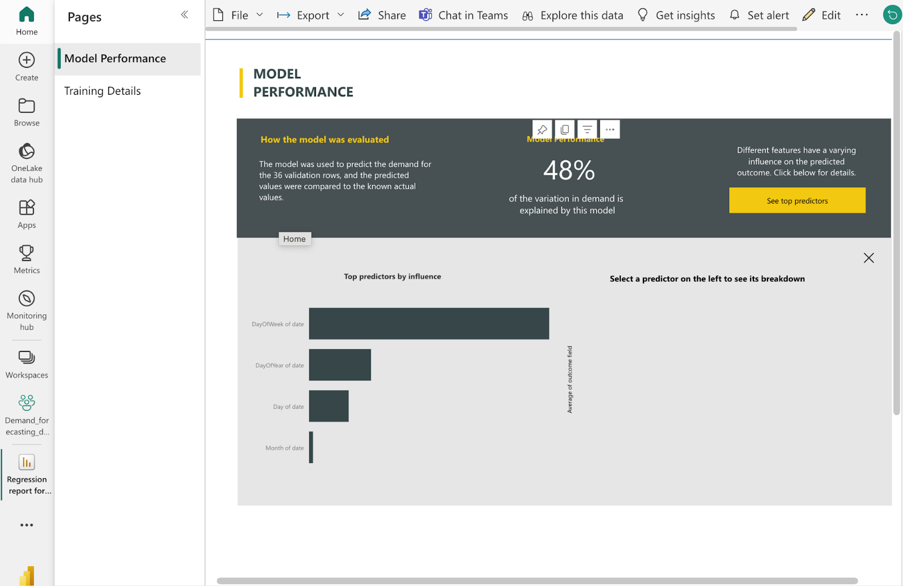
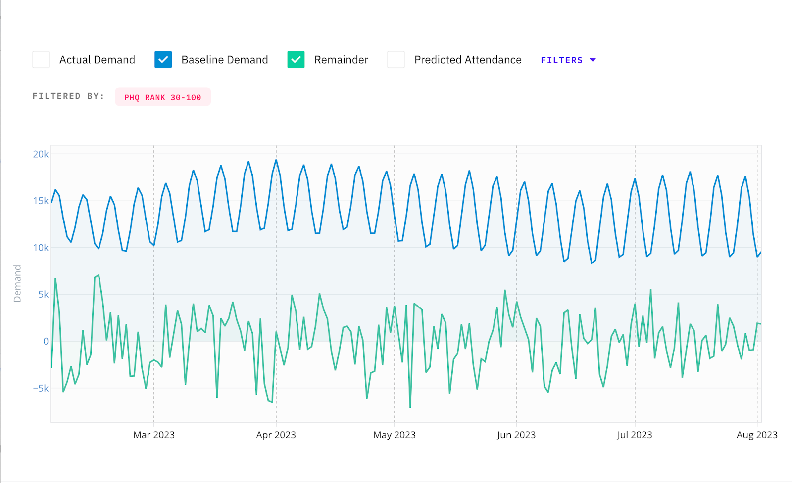
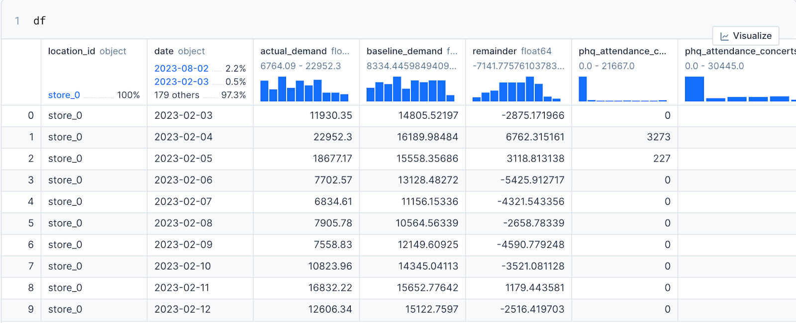
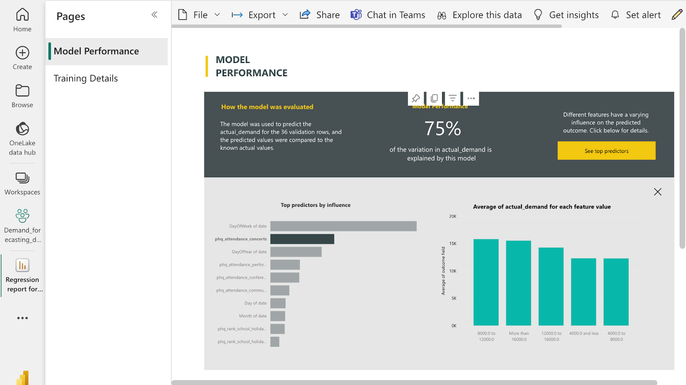

# Integrate with a Demand Forecast in PowerBI

## Tools

### PredictHQ

* [Features API](../../getting-started/guides/features-api-guides/)
* [Beam](../integration-guides/beam-data-science-guide.md)
* [Suggested Radius](broken-reference)
* [WebApp](https://control.predicthq.com)
* Tutorial: [improving-demand-forecasting-models-with-event-features.md](../../getting-started/guides/tutorials/improving-demand-forecasting-models-with-event-features.md "mention")

### Microsoft

* [PowerBI AutoML](https://learn.microsoft.com/en-us/power-bi/transform-model/dataflows/dataflows-machine-learning-integration)

## Guide


Xuxu Wang (CDO) demoing this approach with PowerBI


### Base Model in PowerBI

The starting point is developing a base model in PowerBI (without PredictHQ data). Using a combination of historical data and time trend features, we quickly developed a base model in PowerBI. This initial version yielded a performance of 48%, a good starting point for further enhancement.

<figure><figcaption><p>Base model performance in PowerBI (without PredictHQ data)</p></figcaption></figure>

### Improving Base Model Results with PredictHQ

From here you should follow the [improving-demand-forecasting-models-with-event-features.md](../../getting-started/guides/tutorials/improving-demand-forecasting-models-with-event-features.md "mention") tutorial book which helps you work out a set of PredictHQ features that are most impactful to your demand using [Beam](broken-reference) and [Features API](broken-reference). When we have the relevant PredictHQ features we can enhance the model's accuracy.

### Suggested Radius

When looking for events around a business location (such as a store, a hotel, or another business location) a key question is how far should you look for events. For example, should you look at events in a 0.5-mile radius, a 2-mile radius, or a 10-mile radius from your location? The Suggested Radius API answers this question by returning a radius based on a number of factors that can be used to retrieve events and features around a location.

```python
from predicthq import Client

phq = Client(access_token="YOUR_PREDICTHQ_API_TOKEN")

suggested_radius = phq.radius.search(location__origin="45.5051,-122.6750")
print(suggested_radius.radius, suggested_radius.radius_unit, suggested_radius.location.to_dict())
```

### Demand Decomposition and Anomaly Detection using Beam

Next, the Beam API decomposes our demand data into baseline and remainders. This separation allows us to distinguish regular demand from anomalies and understand the factors driving these demand anomalies, providing a foundation for a more targeted forecasting approach.

<figure><figcaption><p>Beam correlation results shown in the WebApp</p></figcaption></figure>

### Feature Importance using Beam

We then utilized Beam's [Feature Importance API](broken-reference) to evaluate the impact of various events on demand fluctuations. This API helped us identify which events significantly influenced demand, informing our model about the types of events to prioritize in our forecasting.

<figure><figcaption><p>Feature Importance results shown in the WebApp</p></figcaption></figure>

### Forecast-Ready Features using Features API

Finally, using the insights from the Feature Importance API, we employed the Feature API to integrate detailed, relevant event data into our model. This precise merging of event data directly correlated with a notable improvement in our model's performance.

<figure><figcaption><p>Beam and Features API results</p></figcaption></figure>

### Improve Model Performance with PredictHQ Data

Upon integrating this data into PowerBI, we developed an advanced model that combined both historical data and PredictHQ's event data. The outcome was a significant leap in performance, reaching 75%.

<figure><figcaption><p>75% performance in PowerBI using PredictHQ data</p></figcaption></figure>

### Conclusion

This demonstration not only underlines the effectiveness of combining PredictHQ's technology with PowerBI but also opens up new avenues for accurate demand forecasting across various industries.
